# $\color{cyan}{\text{Imports and Setup}}$

## $\color{yellow}{\text{Imports}}$


```python
# Enables automatic reloading of local analysis modules during notebook development
%load_ext autoreload
%autoreload 2
```


```python
# Import required packages
import os
import re
import pandas as pd
import numpy as np
import matplotlib.pyplot as plt
import seaborn as sns

from scripts.sync import run_sync
from scripts.data_loader import load_titan_data
from scripts.setup_functions import run_pel_analysis, run_immob_analysis, run_standard_curve_analysis, four_pl, five_pl, curve_fit, analyse_standard_curves_extra
from scripts.analysis_functions import analyse_pel, analyse_immob_split, plot_pel_layer_shifts, combine_anomalies, analyse_cross_stage_split, cross_stage_correlations, create_interactive_dashboard, generate_at_risk_summary, run_binding_kinetics_analysis
```


```python

```

## $\color{yellow}{\text{Setup}}$


```python
# Configures pandas to show all dataframe columns without truncation
pd.set_option('display.max_columns', None)
```

### $\color{gold}{\text{Database Loading}}$


```python
# Downloads datasets from the remote database (commented out to prevent redundant runs)
run_sync()
```

    Old data cleared
    Downloading table: chip_calibrations
    Saved 170 rows
    Downloading table: experiment_standard_curves
    Saved 17 rows
    Downloading table: experiment_chips
    Saved 12 rows
    Downloading table: chip_status
    Saved 6 rows
    Downloading table: comments
    Saved 15 rows
    Downloading table: standard_curves
    Saved 130 rows
    Downloading table: device
    Saved 11 rows
    Downloading table: flags
    Saved 193 rows
    Downloading table: optical_reference_spectra
    Saved 126 rows
    Downloading table: system_utilization_log
    Saved 547 rows
    Downloading table: backend_event_log
    Saved 1000 rows
    Downloading table: backend_event_log_archive
    Saved 0 rows
    Downloading table: chip_calibration_spetrca
    Saved 91 rows
    Downloading table: users
    Saved 4 rows
    Downloading table: measurements
    Saved 294 rows
    Downloading table: qc_measurements
    Saved 153 rows
    Downloading table: uploads
    Saved 151 rows
    Downloading table: immob
    Saved 44 rows
    Downloading table: pel_upload
    Saved 188 rows
    Downloading table: flagged_items
    Saved 5 rows
    Downloading table: amf_turns
    Saved 9 rows
    Downloading table: sensorgram_history
    Saved 556 rows
    Downloading table: qc_baseline_drift
    Saved 294 rows
    Downloading table: machine
    Saved 9 rows
    Downloading table: standard_curve_history
    Saved 126 rows
    Downloading table: notifications
    Saved 5 rows
    Downloading table: experiments
    Saved 9 rows
    Downloading table: chip_labelling
    Saved 0 rows
    
    Downloading bucket: Spectra
    
    Downloading bucket: Sensorgram
    Downloading file: .emptyFolderPlaceholder
    Downloading file: 20260331_MM_B52501R8033_20260709T100458Z.parquet
    Downloading file: 20260331_MM_B52501R8086_20260709T100456Z.parquet
    Downloading file: 20260401_MM_B52501R8075_20260709T100459Z.parquet
    Downloading file: 20260401_MM_B52501R8139_20260709T101318Z.parquet
    Downloading file: 20260401_MM_B52501R8146_20260709T100501Z.parquet
    Downloading file: 20260401_MM_B52501R8198_20260709T101317Z.parquet
    Downloading file: 20260401_MM_B52501R8206_20260709T101316Z.parquet
    Downloading file: 20260401_MM_B52501R8242_20260709T100459Z.parquet
    Downloading file: 20260409_MM_B52501R8020_20260709T101319Z.parquet
    Downloading file: 20260409_MM_B52501R8030_20260709T100502Z.parquet
    Downloading file: 20260409_MM_B52501R8060_20260709T100503Z.parquet
    Downloading file: 20260409_MM_B52501R8128_20260709T100504Z.parquet
    Downloading file: 20260409_MM_B52501R8147_20260709T101320Z.parquet
    Downloading file: 20260410_MM_B52501R8005_20260709T101321Z.parquet
    Downloading file: 20260410_MM_B52501R8017_20260709T101321Z.parquet
    Downloading file: 20260413_MM_B52501R8022_20260709T101322Z.parquet
    Downloading file: 20260414_MM_B52501R8226_20260709T101323Z.parquet
    Downloading file: 20260415_MM_B52501R8221_20260709T100505Z.parquet
    Downloading file: 20260417_DM_52501R8184_20260709T100506Z.parquet
    Downloading file: 20260417_DM_52501R8184_20260710T070019Z.parquet
    Downloading file: 20260417_MM_52501R8076_20260709T100507Z.parquet
    Downloading file: 20260417_MM_52501R8076_20260710T070020Z.parquet
    Downloading file: 20260421_MM_B52501R8016_20260709T101324Z.parquet
    Downloading file: 20260421_MM_B52501R8047_20260709T100508Z.parquet
    Downloading file: 20260421_MM_B52501R8138_20260709T100507Z.parquet
    Downloading file: 20260421_MM_B52501R8249_20260709T101324Z.parquet
    Downloading file: 20260422_MM_B52501R8049_20260709T100510Z.parquet
    Downloading file: 20260422_MM_B52501R8072_20260709T101325Z.parquet
    Downloading file: 20260422_MM_B52501R8151_20260709T100509Z.parquet
    Downloading file: 20260422_MM_B52501R8176_20260709T101326Z.parquet
    Downloading file: 20260422_MM_B52501R8209_20260709T100511Z.parquet
    Downloading file: 20260422_MM_B52501R8215_20260709T101327Z.parquet
    Downloading file: 20260423_MM_B52501R8073_20260709T100512Z.parquet
    Downloading file: 20260427_MM_B52501R8108_20260709T100513Z.parquet
    Downloading file: 20260427_MM_B52501R8122_20260709T100514Z.parquet
    Downloading file: 20260429_MM_B52501R8064_20260709T100515Z.parquet
    Downloading file: 20260429_MM_B52501R8156_20260709T100516Z.parquet
    Downloading file: 20260501_MM_B52501R80223_20260709T100518Z.parquet
    Downloading file: 20260501_MM_B52501R80246_20260709T100517Z.parquet
    Downloading file: 20260501_MM_B52501R8092_20260709T100516Z.parquet
    Downloading file: 20260505_MM_B52501R8094_20260709T100519Z.parquet
    Downloading file: 20260505_MM_B52501R8137_20260709T100520Z.parquet
    Downloading file: 20260505_MM_B52501R8181_20260709T100521Z.parquet
    Downloading file: 20260505_MM_B52501R8192_20260519T102717Z.parquet
    Downloading file: 20260505_MM_B52501R8192_20260520T085210Z.parquet
    Downloading file: 20260506_MM_B52501R8126_20260709T100522Z.parquet
    Downloading file: 20260508_MK_ABC123_20260519T102724Z.parquet
    Downloading file: 20260508_MK_ABC123_20260520T085213Z.parquet
    Downloading file: 20260508_MK_B52501R8003_20260519T102727Z.parquet
    Downloading file: 20260508_MK_B52501R8003_20260520T085215Z.parquet
    Downloading file: 20260508_MK_B52501R8567_20260519T102721Z.parquet
    Downloading file: 20260508_MK_B52501R8567_20260520T085212Z.parquet
    Downloading file: 20260508_MM_B52501R8070_20260709T100524Z.parquet
    Downloading file: 20260508_MM_B52501R8109_20260709T100523Z.parquet
    Downloading file: 20260508_MM_B52501R8174_20260709T100525Z.parquet
    Downloading file: 20260509_MK_DEV-CHIP-001_20260519T102729Z.parquet
    Downloading file: 20260509_MK_DEV-CHIP-001_20260520T085216Z.parquet
    Downloading file: 20260511_MK_CHIP-001_20260519T102732Z.parquet
    Downloading file: 20260511_MK_CHIP-001_20260520T085217Z.parquet
    Downloading file: 20260512_MM_B52501R8127_20260709T101328Z.parquet
    Downloading file: 20260512_MM_B52501R8149_20260709T101327Z.parquet
    Downloading file: 20260513_MM_B52501R8072_20260709T100526Z.parquet
    Downloading file: 20260518_CV_B53501R8058_20260803T125104Z.parquet
    Downloading file: 20260518_CV_B53501R8196_20260803T125106Z.parquet
    Downloading file: 20260520_MK_ABC-123_20260527T150805Z.parquet
    Downloading file: 20260520_MM_B52501R8089_20260709T100527Z.parquet
    Downloading file: 20260520_MM_B52501R8150_20260709T100528Z.parquet
    Downloading file: 20260521_DM_B52501R8244_20260709T100530Z.parquet
    Downloading file: 20260521_MM_B52501R8021_20260709T100529Z.parquet
    Downloading file: 20260522_MM_B52501R8085_20260709T101330Z.parquet
    Downloading file: 20260522_MM_B52501R8124_20260709T101330Z.parquet
    Downloading file: 20260525_MM_B52501R8173_20260709T100530Z.parquet
    Downloading file: 20260525_MM_B52501R8217_20260709T100531Z.parquet
    Downloading file: 20260526_MM_B52501R8186_20260709T100532Z.parquet
    Downloading file: 20260527_MK_DEF123_20260527T150807Z.parquet
    Downloading file: 20260528_MM_B52501R8115_20260709T100533Z.parquet
    Downloading file: 20260529_MM_B52501R8059_20260709T100534Z.parquet
    Downloading file: 20260529_MM_B52501R8093_20260709T100533Z.parquet
    Downloading file: 20260602_MK_CHIP-003_20260629T081255Z.parquet
    Downloading file: 20260605_CV_R8180_20260709T100536Z.parquet
    Downloading file: 20260605_CV_R8180_20260709T100537Z.parquet
    Downloading file: 20260605_CV_R8234_20260709T100535Z.parquet
    Downloading file: 20260605_DM_B52501R8003_20260709T101332Z.parquet
    Downloading file: 20260605_DM_B52501R8189_20260709T101331Z.parquet
    Downloading file: 20260605_DM_B52501R8231_20260709T101332Z.parquet
    Downloading file: 20260608_CV_R8135_20260709T100537Z.parquet
    Downloading file: 20260608_CV_R8135_20260709T100538Z.parquet
    Downloading file: 20260608_DM_B52501R8019_20260709T101334Z.parquet
    Downloading file: 20260608_DM_B52501R8177_20260709T101333Z.parquet
    Downloading file: 20260609_DM_B52501R8002_20260709T101335Z.parquet
    Downloading file: 20260609_MK_XYZ_20260615T145032Z.parquet
    Downloading file: 20260612_CV_R8182_20260709T101335Z.parquet
    Downloading file: 20260612_CV_R8236_20260709T100539Z.parquet
    Downloading file: 20260615_MK_CHIP-004_20260615T144414Z.parquet
    Downloading file: 20260616_MK_CHIP-888_20260618T153200Z.parquet
    Downloading file: 20260618_MK_B52501R80209_20260618T153204Z.parquet
    Downloading file: 20260618_MK_CHIP-999_20260618T153206Z.parquet
    Downloading file: 20260619_MK_CHIP-123_20260619T095750Z.parquet
    Downloading file: 20260622_CV_B72604R8001_20260709T100540Z.parquet
    Downloading file: 20260622_CV_B72604R813_20260709T100540Z.parquet
    Downloading file: 20260622_MK_CHIP-002_20260622T142539Z.parquet
    Downloading file: 20260622_MK_CHIP567_20260622T142535Z.parquet
    Downloading file: 20260622_MM_B72604R8002_20260803T125107Z.parquet
    Downloading file: 20260622_MM_B72604R8003_20260709T101336Z.parquet
    Downloading file: 20260624_CV_B72604R8009_20260709T100542Z.parquet
    Downloading file: 20260624_CV_B72604R8010_20260709T101337Z.parquet
    Downloading file: 20260624_CV_B72604R8011_20260709T101337Z.parquet
    Downloading file: 20260624_CV_B72604R8012_20260709T100541Z.parquet
    Downloading file: 20260625_DM_B72604R8007_20260709T101338Z.parquet
    Downloading file: 20260625_DM_B72604R8008_20260709T101339Z.parquet
    Downloading file: 20260630_DM_B72604R8004_20260709T101340Z.parquet
    Downloading file: 20260630_DM_B72604R8005_20260709T101340Z.parquet
    Downloading file: 20260630_MM_B72604R8006_20260709T100543Z.parquet
    Downloading file: 20260702_CV_B72604R8016_20260709T100544Z.parquet
    Downloading file: 20260702_DM_B7260RR8014_20260709T101342Z.parquet
    Downloading file: 20260703_DM_B72604R8018_20260709T101343Z.parquet
    Downloading file: 20260703_DM_B72604R8019_20260709T101343Z.parquet
    Downloading file: 20260703_DM_B72604R8020_20260709T101344Z.parquet
    Downloading file: 20260706_CV_B72604R8027_20260709T100547Z.parquet
    Downloading file: 20260706_CV_B72604R8030_20260709T100548Z.parquet
    Downloading file: 20260706_DM_B72604R8026_20260709T101345Z.parquet
    Downloading file: 20260706_DM_B72604R8029_20260709T101346Z.parquet
    Downloading file: 20260707_CV_B72604R8032_20260709T101348Z.parquet
    Downloading file: 20260707_CV_B72604R8034_20260709T101349Z.parquet
    Downloading file: 20260707_CV_B72604R8037_20260709T101350Z.parquet
    Downloading file: 20260707_CV_R72604R8035_20260709T100549Z.parquet
    Downloading file: 20260707_CV_R72604R8035_20260710T070026Z.parquet
    Downloading file: 20260708_EH_B72604R8038_20260709T101351Z.parquet
    Downloading file: 20260708_EQ_B72604R8039_20260709T100550Z.parquet
    Downloading file: 20260708_EQEH_B72604R8040_20260709T100551Z.parquet
    Downloading file: 20260709_DM_B72604R8042_20260710T070021Z.parquet
    Downloading file: 20260709_DM_B72604R8043_20260710T070022Z.parquet
    Downloading file: 20260709_DM_B72604R8044_20260710T070023Z.parquet
    Downloading file: 20260709_MM_B72604R8041_20260710T070028Z.parquet
    Downloading file: 20260710_DM_B72604R8047_20260711T070024Z.parquet
    Downloading file: 20260710_DM_B72604R8048_20260711T070024Z.parquet
    Downloading file: 20260710_DMMM_B72604R8045_20260711T070022Z.parquet
    Downloading file: 20260710_EH_B72604R8049_20260711T070025Z.parquet
    Downloading file: 20260710_EQ_B72604R8046_20260711T070023Z.parquet
    Downloading file: 20260715_EH_B72604R8054_20260716T070022Z.parquet
    Downloading file: 20260715_EH_B72604R8138_20260716T070024Z.parquet
    Downloading file: 20260715_EQ_B72604R8053_20260716T082040Z.parquet
    Downloading file: 20260715_EQ_B72604R8055_20260716T082042Z.parquet
    Downloading file: 20260715_EQ_B72604R8057_20260716T082041Z.parquet
    Downloading file: 20260716_CV_B72604R8058_20260717T070021Z.parquet
    Downloading file: 20260716_EH_B72604R8135_20260717T070019Z.parquet
    Downloading file: 20260720_DM_B72604R8137_20260721T070022Z.parquet
    Downloading file: 20260720_DM_B72604R8146_20260721T070020Z.parquet
    Downloading file: 20260720_EH_B72604R8099_20260727T102302Z.parquet
    Downloading file: 20260720_EH_B72604R8237_20260721T070022Z.parquet
    Downloading file: 20260722_EQ_B72604R8105_20260723T070024Z.parquet
    Downloading file: 20260723_EH_B72604R8125_20260727T102304Z.parquet
    Downloading file: 20260723_MM_B72604R8106_20260724T070023Z.parquet
    Downloading file: 20260724_MM_B72604R8107_20260728T085515Z.parquet
    Downloading file: 20260724_MM_B72604R8110_20260728T085517Z.parquet
    Downloading file: 20260727_DM_B72604R8096_20260727T151921Z.parquet
    Downloading file: 20260727_DM_B72604R8102_20260728T085142Z.parquet
    Downloading file: 20260727_DM_B72604R8121_20260728T085141Z.parquet
    Downloading file: 20260728_EQ_B72604R8090_20260728T144802Z.parquet
    Downloading file: 20260728_EQ_B72604R8103_20260728T144801Z.parquet
    Downloading file: 20260728_MM_B72604R8114_20260729T070016Z.parquet
    Downloading file: 20260729_EH_B72604R8118_20260730T070019Z.parquet
    Downloading file: 20260729_EH_B72604R8119_20260731T070016Z.parquet
    Downloading file: 20260729_EH_B72604R8122_20260730T070017Z.parquet
    Downloading file: 20260730_MM_B72604R8111_20260731T070018Z.parquet
    Downloading file: 20260731_DM_B72604R8092_20260803T124611Z.parquet
    Downloading file: 20260731_DM_B72604R8097_20260803T124610Z.parquet
    Downloading file: 20260731_DM_B72604R8116_20260803T124610Z.parquet
    Downloading file: 20260731_DM_B72604R8R8092_20260731T150024Z.parquet
    Downloading file: 20260731_DM_B72604R8R8097_20260731T150023Z.parquet
    Downloading file: 20260731_DM_B72604R8R8116_20260731T150022Z.parquet
    Downloading file: 20260731_EH_B72604R8094_20260801T070016Z.parquet
    Downloading file: 20260731_EH_B72604R8095_20260801T070015Z.parquet
    Downloading file: 20260731_MM_B72604R8108_20260803T124608Z.parquet
    Downloading file: 20260731_MM_B72604R8115_20260803T125110Z.parquet
    Downloading file: 20260731_MM_B72604R8R8108_20260731T150020Z.parquet
    Downloading file: 20260803_CV_B72604R8117_20260804T070016Z.parquet
    Downloading file: 20260810_DM_B72604R8112_20260813T135355Z.parquet
    Downloading file: 20260810_EH_B72604R8113_20260813T135356Z.parquet
    Downloading file: 20260810_EQ_B72604R8087_20260811T070015Z.parquet
    Downloading file: 20260811_DM_B72604R8120_20260813T135358Z.parquet
    Downloading file: 20260811_DM_B72604R8123_20260813T070020Z.parquet
    Downloading file: 20260811_DM_B72604R8129_20260813T135359Z.parquet
    Downloading file: 20260811_DM_B72604R8134_20260813T070019Z.parquet
    Downloading file: 20260811_EH_B72604R8098_20260813T135357Z.parquet
    Downloading file: 20260811_EH_B72604R8109_20260813T070021Z.parquet
    Downloading file: 20260811_EQ_B72604R8140_20260813T070022Z.parquet
    Downloading file: 20260812_DM_B72604R8143_20260813T135401Z.parquet
    Downloading file: 20260812_EH_B72604R8101_20260813T070025Z.parquet
    Downloading file: 20260812_EH_B72604R8131_20260813T070024Z.parquet
    Downloading file: 20260812_EQ_B72604R8089_20260813T070024Z.parquet
    Downloading file: 20260812_EQ_B72604R8100_20260813T135400Z.parquet
    Downloading file: 20260813_EH_B72604R8065_20260813T135342Z.parquet
    Downloading file: 20260813_EH_B72604R8069_20260813T135340Z.parquet
    Downloading file: 20260813_EH_B72604R8078_20260813T135341Z.parquet
    Downloading file: 20260813_EH_B72604R8246_20260813T135343Z.parquet
    Downloading file: 20260813_EQ_B72604R8075_20260813T135403Z.parquet
    Downloading file: 20260813_EQ_B72604R8086_20260813T135402Z.parquet
    
    Downloading bucket: RefPoly4
    Downloading file: 2026-06-07_B72604R8027_RefPoly4.csv
    Added headers to data\buckets\RefPoly4\2026-06-07_B72604R8027_RefPoly4.csv
    Downloading file: 2026-07-03_B72604R8018_RefPoly4.csv
    Added headers to data\buckets\RefPoly4\2026-07-03_B72604R8018_RefPoly4.csv
    Downloading file: 2026-07-03_B72604R8019_RefPoly4.csv
    Added headers to data\buckets\RefPoly4\2026-07-03_B72604R8019_RefPoly4.csv
    Downloading file: 2026-07-07_B72604R8028_RefPoly4.csv
    Added headers to data\buckets\RefPoly4\2026-07-07_B72604R8028_RefPoly4.csv
    Downloading file: 2026-07-08_B72604R8029_RefPoly4.csv
    Added headers to data\buckets\RefPoly4\2026-07-08_B72604R8029_RefPoly4.csv
    Downloading file: 2026-07-08_B72604R8030_RefPoly4.csv
    Added headers to data\buckets\RefPoly4\2026-07-08_B72604R8030_RefPoly4.csv
    Downloading file: 2026-07-08_B72604R8032_RefPoly4.csv
    Added headers to data\buckets\RefPoly4\2026-07-08_B72604R8032_RefPoly4.csv
    Downloading file: 2026-07-09_B72604R8034_RefPoly4.csv
    Added headers to data\buckets\RefPoly4\2026-07-09_B72604R8034_RefPoly4.csv
    Downloading file: 2026-07-09_B72604R8035_RefPoly4.csv
    Added headers to data\buckets\RefPoly4\2026-07-09_B72604R8035_RefPoly4.csv
    Downloading file: 2026-07-09_B72604R8037_RefPoly4.csv
    Added headers to data\buckets\RefPoly4\2026-07-09_B72604R8037_RefPoly4.csv
    Downloading file: 2026-07-09_B72604R8038_RefPoly4.csv
    Added headers to data\buckets\RefPoly4\2026-07-09_B72604R8038_RefPoly4.csv
    Downloading file: 2026-07-09_B72604R8039_RefPoly4.csv
    Added headers to data\buckets\RefPoly4\2026-07-09_B72604R8039_RefPoly4.csv
    Downloading file: 2026-07-09_B72604R8040_RefPoly4.csv
    Added headers to data\buckets\RefPoly4\2026-07-09_B72604R8040_RefPoly4.csv
    Downloading file: 2026-07-09_B72604R8042_RefPoly4.csv
    Added headers to data\buckets\RefPoly4\2026-07-09_B72604R8042_RefPoly4.csv
    Downloading file: 2026-07-15_B72604R8045_RefPoly4.csv
    Added headers to data\buckets\RefPoly4\2026-07-15_B72604R8045_RefPoly4.csv
    Downloading file: 2026-07-15_B72604R8047_RefPoly4.csv
    Added headers to data\buckets\RefPoly4\2026-07-15_B72604R8047_RefPoly4.csv
    Downloading file: 2026-07-15_B72604R8048_RefPoly4.csv
    Added headers to data\buckets\RefPoly4\2026-07-15_B72604R8048_RefPoly4.csv
    Downloading file: 2026-07-15_B72604R8053_RefPoly4.csv
    Added headers to data\buckets\RefPoly4\2026-07-15_B72604R8053_RefPoly4.csv
    Downloading file: 2026-07-15_B72604R8054_RefPoly4.csv
    Added headers to data\buckets\RefPoly4\2026-07-15_B72604R8054_RefPoly4.csv
    Downloading file: 2026-07-16_B72604R8055_RefPoly4.csv
    Added headers to data\buckets\RefPoly4\2026-07-16_B72604R8055_RefPoly4.csv
    Downloading file: 2026-07-16_B72604R8057_RefPoly4.csv
    Added headers to data\buckets\RefPoly4\2026-07-16_B72604R8057_RefPoly4.csv
    Downloading file: 2026-07-16_B72604R8058_RefPoly4.csv
    Added headers to data\buckets\RefPoly4\2026-07-16_B72604R8058_RefPoly4.csv
    Downloading file: 2026-07-16_B72604R8138_RefPoly4.csv
    Added headers to data\buckets\RefPoly4\2026-07-16_B72604R8138_RefPoly4.csv
    Downloading file: 2026-07-21_B72604R8146_RefPoly4.csv
    Added headers to data\buckets\RefPoly4\2026-07-21_B72604R8146_RefPoly4.csv
    Downloading file: 2026-07-28_B72604R8096_RefPoly4.csv
    Added headers to data\buckets\RefPoly4\2026-07-28_B72604R8096_RefPoly4.csv
    Downloading file: 2026-07-28_B72604R8114_RefPoly4.csv
    Added headers to data\buckets\RefPoly4\2026-07-28_B72604R8114_RefPoly4.csv
    Downloading file: 2026-08-03_B72604R8108_RefPoly4.csv
    Added headers to data\buckets\RefPoly4\2026-08-03_B72604R8108_RefPoly4.csv
    Downloading file: 2026-08-04_B72604R8117_RefPoly4.csv
    Added headers to data\buckets\RefPoly4\2026-08-04_B72604R8117_RefPoly4.csv
    Downloading file: 2026-08-05_B72604R8011_RefPoly4.csv
    Added headers to data\buckets\RefPoly4\2026-08-05_B72604R8011_RefPoly4.csv
    Downloading file: 2026-08-12_B72604R8123_RefPoly4.csv
    Added headers to data\buckets\RefPoly4\2026-08-12_B72604R8123_RefPoly4.csv
    Downloading file: 2026-08-13_B72604R8089_RefPoly4.csv
    Added headers to data\buckets\RefPoly4\2026-08-13_B72604R8089_RefPoly4.csv
    Downloading file: 20260525T131907Z_da017e7a_RefPoly4.csv
    Added headers to data\buckets\RefPoly4\20260525T131907Z_da017e7a_RefPoly4.csv
    Downloading file: 20260525T140411Z_6641d572_RefPoly4.csv
    Added headers to data\buckets\RefPoly4\20260525T140411Z_6641d572_RefPoly4.csv
    Downloading file: 20260525T144718Z_591825c5_RefPoly4.csv
    Added headers to data\buckets\RefPoly4\20260525T144718Z_591825c5_RefPoly4.csv
    Downloading file: 20260525T152126Z_d2c220b0_RefPoly4.csv
    Added headers to data\buckets\RefPoly4\20260525T152126Z_d2c220b0_RefPoly4.csv
    Downloading file: 20260525T152232Z_1e8b69ad_RefPoly4.csv
    Added headers to data\buckets\RefPoly4\20260525T152232Z_1e8b69ad_RefPoly4.csv
    Downloading file: 20260525T152325Z_59a28c48_RefPoly4.csv
    Added headers to data\buckets\RefPoly4\20260525T152325Z_59a28c48_RefPoly4.csv
    Downloading file: 20260525T152352Z_72d6ac14_RefPoly4.csv
    Added headers to data\buckets\RefPoly4\20260525T152352Z_72d6ac14_RefPoly4.csv
    Downloading file: 20260526T125141Z_d4a192c3_RefPoly4.csv
    Added headers to data\buckets\RefPoly4\20260526T125141Z_d4a192c3_RefPoly4.csv
    Downloading file: 20260526T125339Z_92aa7375_RefPoly4.csv
    Added headers to data\buckets\RefPoly4\20260526T125339Z_92aa7375_RefPoly4.csv
    Downloading file: 20260528T084127Z_1b16f95f_RefPoly4.csv
    Added headers to data\buckets\RefPoly4\20260528T084127Z_1b16f95f_RefPoly4.csv
    Downloading file: 20260618T110551Z_023e0819_RefPoly4.csv
    Added headers to data\buckets\RefPoly4\20260618T110551Z_023e0819_RefPoly4.csv
    Downloading file: 20260619T093354Z_a19cb95b_RefPoly4.csv
    Added headers to data\buckets\RefPoly4\20260619T093354Z_a19cb95b_RefPoly4.csv
    Downloading file: 20260619T094222Z_e74d369f_RefPoly4.csv
    Added headers to data\buckets\RefPoly4\20260619T094222Z_e74d369f_RefPoly4.csv
    Downloading file: 20260622T141124Z_58c1cdb0_RefPoly4.csv
    Added headers to data\buckets\RefPoly4\20260622T141124Z_58c1cdb0_RefPoly4.csv
    Downloading file: 20260709T131019Z_RefPoly4.csv
    Added headers to data\buckets\RefPoly4\20260709T131019Z_RefPoly4.csv
    Downloading file: 20260709T131021Z_RefPoly4.csv
    Added headers to data\buckets\RefPoly4\20260709T131021Z_RefPoly4.csv
    
    Downloading bucket: AMF_FLAGS
    Downloading file: 2026-06-07_B72604R8027_ImmobFlags
    Added headers to data\buckets\AMF_FLAGS\2026-06-07_B72604R8027_ImmobFlags
    Downloading file: 2026-07-03_B72604R8018_ImmobFlags
    Added headers to data\buckets\AMF_FLAGS\2026-07-03_B72604R8018_ImmobFlags
    Downloading file: 2026-07-03_B72604R8019_ImmobFlags
    Added headers to data\buckets\AMF_FLAGS\2026-07-03_B72604R8019_ImmobFlags
    Downloading file: 2026-07-07_B72604R8028_ImmobFlags
    Added headers to data\buckets\AMF_FLAGS\2026-07-07_B72604R8028_ImmobFlags
    Downloading file: 2026-07-08_B72604R8029_ImmobFlags
    Added headers to data\buckets\AMF_FLAGS\2026-07-08_B72604R8029_ImmobFlags
    Downloading file: 2026-07-08_B72604R8030_ImmobFlags
    Added headers to data\buckets\AMF_FLAGS\2026-07-08_B72604R8030_ImmobFlags
    Downloading file: 2026-07-08_B72604R8032_ImmobFlags
    Added headers to data\buckets\AMF_FLAGS\2026-07-08_B72604R8032_ImmobFlags
    Downloading file: 2026-07-09_B72604R8034_ImmobFlags
    Added headers to data\buckets\AMF_FLAGS\2026-07-09_B72604R8034_ImmobFlags
    Downloading file: 2026-07-09_B72604R8035_ImmobFlags
    Added headers to data\buckets\AMF_FLAGS\2026-07-09_B72604R8035_ImmobFlags
    Downloading file: 2026-07-09_B72604R8037_ImmobFlags
    Added headers to data\buckets\AMF_FLAGS\2026-07-09_B72604R8037_ImmobFlags
    Downloading file: 2026-07-09_B72604R8038_ImmobFlags
    Added headers to data\buckets\AMF_FLAGS\2026-07-09_B72604R8038_ImmobFlags
    Downloading file: 2026-07-09_B72604R8039_ImmobFlags
    Added headers to data\buckets\AMF_FLAGS\2026-07-09_B72604R8039_ImmobFlags
    Downloading file: 2026-07-09_B72604R8040_ImmobFlags
    Added headers to data\buckets\AMF_FLAGS\2026-07-09_B72604R8040_ImmobFlags
    Downloading file: 2026-07-09_B72604R8042_ImmobFlags
    Added headers to data\buckets\AMF_FLAGS\2026-07-09_B72604R8042_ImmobFlags
    Downloading file: 2026-07-15_B72604R8045_ImmobFlags
    Added headers to data\buckets\AMF_FLAGS\2026-07-15_B72604R8045_ImmobFlags
    Downloading file: 2026-07-15_B72604R8047_ImmobFlags
    Added headers to data\buckets\AMF_FLAGS\2026-07-15_B72604R8047_ImmobFlags
    Downloading file: 2026-07-15_B72604R8048_ImmobFlags
    Added headers to data\buckets\AMF_FLAGS\2026-07-15_B72604R8048_ImmobFlags
    Downloading file: 2026-07-15_B72604R8053_ImmobFlags
    Added headers to data\buckets\AMF_FLAGS\2026-07-15_B72604R8053_ImmobFlags
    Downloading file: 2026-07-15_B72604R8054_ImmobFlags
    Added headers to data\buckets\AMF_FLAGS\2026-07-15_B72604R8054_ImmobFlags
    Downloading file: 2026-07-16_B72604R8055_ImmobFlags
    Added headers to data\buckets\AMF_FLAGS\2026-07-16_B72604R8055_ImmobFlags
    Downloading file: 2026-07-16_B72604R8057_ImmobFlags
    Added headers to data\buckets\AMF_FLAGS\2026-07-16_B72604R8057_ImmobFlags
    Downloading file: 2026-07-16_B72604R8058_ImmobFlags
    Added headers to data\buckets\AMF_FLAGS\2026-07-16_B72604R8058_ImmobFlags
    Downloading file: 2026-07-16_B72604R8138_ImmobFlags
    Added headers to data\buckets\AMF_FLAGS\2026-07-16_B72604R8138_ImmobFlags
    Downloading file: 2026-07-21_B72604R8146_ImmobFlags
    Added headers to data\buckets\AMF_FLAGS\2026-07-21_B72604R8146_ImmobFlags
    Downloading file: 2026-07-28_B72604R8096_ImmobFlags
    Added headers to data\buckets\AMF_FLAGS\2026-07-28_B72604R8096_ImmobFlags
    Downloading file: 2026-07-28_B72604R8114_ImmobFlags
    Added headers to data\buckets\AMF_FLAGS\2026-07-28_B72604R8114_ImmobFlags
    Downloading file: 2026-08-03_B72604R8108_ImmobFlags
    Skipping empty file: data\buckets\AMF_FLAGS\2026-08-03_B72604R8108_ImmobFlags
    Downloading file: 2026-08-04_B72604R8117_ImmobFlags
    Added headers to data\buckets\AMF_FLAGS\2026-08-04_B72604R8117_ImmobFlags
    Downloading file: 2026-08-05_B72604R8011_ImmobFlags
    Added headers to data\buckets\AMF_FLAGS\2026-08-05_B72604R8011_ImmobFlags
    Downloading file: 2026-08-12_B72604R8123_ImmobFlags
    Added headers to data\buckets\AMF_FLAGS\2026-08-12_B72604R8123_ImmobFlags
    Downloading file: 2026-08-13_B72604R8089_ImmobFlags
    Added headers to data\buckets\AMF_FLAGS\2026-08-13_B72604R8089_ImmobFlags
    Downloading file: 20260525T131908Z_b386e206_AMF_FLAGS
    Added headers to data\buckets\AMF_FLAGS\20260525T131908Z_b386e206_AMF_FLAGS
    Downloading file: 20260525T140412Z_f1d7b361_AMF_FLAGS
    Added headers to data\buckets\AMF_FLAGS\20260525T140412Z_f1d7b361_AMF_FLAGS
    Downloading file: 20260525T144719Z_28e0bf5c_Immob_flags
    Added headers to data\buckets\AMF_FLAGS\20260525T144719Z_28e0bf5c_Immob_flags
    Downloading file: 20260525T152127Z_38e47036_AMF_FLAGS
    Added headers to data\buckets\AMF_FLAGS\20260525T152127Z_38e47036_AMF_FLAGS
    Downloading file: 20260525T152233Z_c7c389ba_IMMOB_FLAGS
    Added headers to data\buckets\AMF_FLAGS\20260525T152233Z_c7c389ba_IMMOB_FLAGS
    Downloading file: 20260525T152325Z_bad5b51d_immob_flags
    Added headers to data\buckets\AMF_FLAGS\20260525T152325Z_bad5b51d_immob_flags
    Downloading file: 20260525T152352Z_449ef7ef_Immob_flags
    Added headers to data\buckets\AMF_FLAGS\20260525T152352Z_449ef7ef_Immob_flags
    Downloading file: 20260526T125142Z_de24fdc5_AMF_FLAGS
    Added headers to data\buckets\AMF_FLAGS\20260526T125142Z_de24fdc5_AMF_FLAGS
    Downloading file: 20260526T125340Z_7d17c993_AMF_FLAGS
    Added headers to data\buckets\AMF_FLAGS\20260526T125340Z_7d17c993_AMF_FLAGS
    Downloading file: 20260528T084128Z_4e793063_AMF_FLAGS
    Added headers to data\buckets\AMF_FLAGS\20260528T084128Z_4e793063_AMF_FLAGS
    Downloading file: 20260618T110552Z_bbfd4043_AMF_FLAGS
    Added headers to data\buckets\AMF_FLAGS\20260618T110552Z_bbfd4043_AMF_FLAGS
    Downloading file: 20260619T093355Z_30f6b27e_AMF_FLAGS
    Added headers to data\buckets\AMF_FLAGS\20260619T093355Z_30f6b27e_AMF_FLAGS
    Downloading file: 20260619T094223Z_238ec8b4_AMF_FLAGS
    Added headers to data\buckets\AMF_FLAGS\20260619T094223Z_238ec8b4_AMF_FLAGS
    Downloading file: 20260622T141125Z_c583d5e6_AMF_FLAGS
    Added headers to data\buckets\AMF_FLAGS\20260622T141125Z_c583d5e6_AMF_FLAGS
    
    Downloading bucket: Optical_Reference_Spectra
    Entering folder: F5001BC0-6315C607-AFBB0866-02031020
    Entering folder: F5001BC0-6315C607-AFBB0866-02031020/2026-07-15
    Downloading file: F5001BC0-6315C607-AFBB0866-02031020/2026-07-15/reference_spectra_2026-07-15_07-10-11.parquet
    Downloading file: F5001BC0-6315C607-AFBB0866-02031020/2026-07-15/reference_spectra_2026-07-15_09-16-30.parquet
    Downloading file: F5001BC0-6315C607-AFBB0866-02031020/2026-07-15/reference_spectra_2026-07-15_13-26-34.parquet
    Downloading file: F5001BC0-6315C607-AFBB0866-02031020/2026-07-15/reference_spectra_2026-07-15_13-29-15.parquet
    Entering folder: F5001BC0-6315C607-AFBB0866-02031020/2026-07-16
    Downloading file: F5001BC0-6315C607-AFBB0866-02031020/2026-07-16/reference_spectra_2026-07-16_07-58-23.parquet
    Downloading file: F5001BC0-6315C607-AFBB0866-02031020/2026-07-16/reference_spectra_2026-07-16_08-08-05.parquet
    Downloading file: F5001BC0-6315C607-AFBB0866-02031020/2026-07-16/reference_spectra_2026-07-16_08-10-20.parquet
    Downloading file: F5001BC0-6315C607-AFBB0866-02031020/2026-07-16/reference_spectra_2026-07-16_08-12-05.parquet
    Downloading file: F5001BC0-6315C607-AFBB0866-02031020/2026-07-16/reference_spectra_2026-07-16_08-15-12.parquet
    Entering folder: F5001BC0-6315C607-AFBB0866-02031020/2026-07-17
    Downloading file: F5001BC0-6315C607-AFBB0866-02031020/2026-07-17/reference_spectra_2026-07-17_08-54-39.parquet
    Downloading file: F5001BC0-6315C607-AFBB0866-02031020/2026-07-17/reference_spectra_2026-07-17_10-04-38.parquet
    Entering folder: F5001BC0-6315C607-AFBB0866-02031020/2026-07-23
    Downloading file: F5001BC0-6315C607-AFBB0866-02031020/2026-07-23/reference_spectra_2026-07-23_09-45-56.parquet
    Entering folder: F5001BC0-6315C607-AFBB0866-02031020/2026-08-17
    Downloading file: F5001BC0-6315C607-AFBB0866-02031020/2026-08-17/reference_spectra_2026-08-17_10-30-08.parquet
    Downloading file: F5001BC0-6315C607-AFBB0866-02031020/2026-08-17/reference_spectra_2026-08-17_13-28-54.parquet
    Entering folder: F5001BC1-6315C2D0-AFBB0866-02006014
    Entering folder: F5001BC1-6315C2D0-AFBB0866-02006014/2026-07-02
    Downloading file: F5001BC1-6315C2D0-AFBB0866-02006014/2026-07-02/reference_spectra_2026-07-02_08-42-59.parquet
    Downloading file: F5001BC1-6315C2D0-AFBB0866-02006014/2026-07-02/reference_spectra_2026-07-02_13-04-21.parquet
    Entering folder: F5001BC1-6315C2D0-AFBB0866-02006014/2026-07-03
    Downloading file: F5001BC1-6315C2D0-AFBB0866-02006014/2026-07-03/reference_spectra_2026-07-03_07-59-56.parquet
    Downloading file: F5001BC1-6315C2D0-AFBB0866-02006014/2026-07-03/reference_spectra_2026-07-03_13-24-55.parquet
    Downloading file: F5001BC1-6315C2D0-AFBB0866-02006014/2026-07-03/reference_spectra_2026-07-03_13-25-57.parquet
    Downloading file: F5001BC1-6315C2D0-AFBB0866-02006014/2026-07-03/reference_spectra_2026-07-03_13-26-34.parquet
    Downloading file: F5001BC1-6315C2D0-AFBB0866-02006014/2026-07-03/reference_spectra_2026-07-03_13-28-25.parquet
    Entering folder: F5001BC1-6315C2D0-AFBB0866-02006014/2026-07-06
    Downloading file: F5001BC1-6315C2D0-AFBB0866-02006014/2026-07-06/reference_spectra_2026-07-06_13-19-09.parquet
    Entering folder: F5001BC1-6315C2D0-AFBB0866-02006014/2026-07-07
    Downloading file: F5001BC1-6315C2D0-AFBB0866-02006014/2026-07-07/reference_spectra_2026-07-07_12-57-36.parquet
    Downloading file: F5001BC1-6315C2D0-AFBB0866-02006014/2026-07-07/reference_spectra_2026-07-07_13-01-18.parquet
    Downloading file: F5001BC1-6315C2D0-AFBB0866-02006014/2026-07-07/reference_spectra_2026-07-07_13-04-12.parquet
    Downloading file: F5001BC1-6315C2D0-AFBB0866-02006014/2026-07-07/reference_spectra_2026-07-07_14-22-07.parquet
    Entering folder: F5001BC1-6315C2D0-AFBB0866-02006014/2026-07-08
    Downloading file: F5001BC1-6315C2D0-AFBB0866-02006014/2026-07-08/reference_spectra_2026-07-08_13-03-02.parquet
    Downloading file: F5001BC1-6315C2D0-AFBB0866-02006014/2026-07-08/reference_spectra_2026-07-08_13-17-30.parquet
    Entering folder: F5001BC1-6315C2D0-AFBB0866-02006014/2026-07-09
    Downloading file: F5001BC1-6315C2D0-AFBB0866-02006014/2026-07-09/reference_spectra_2026-07-09_14-35-50.parquet
    Entering folder: F5001BC1-6315C2D0-AFBB0866-02006014/2026-07-15
    Downloading file: F5001BC1-6315C2D0-AFBB0866-02006014/2026-07-15/reference_spectra_2026-07-15_09-03-35.parquet
    Entering folder: F5001BC1-6315C52E-AFBB0866-02038020
    Entering folder: F5001BC1-6315C52E-AFBB0866-02038020/2026-07-03
    Downloading file: F5001BC1-6315C52E-AFBB0866-02038020/2026-07-03/reference_spectra_2026-07-03_13-10-16.parquet
    Downloading file: F5001BC1-6315C52E-AFBB0866-02038020/2026-07-03/reference_spectra_2026-07-03_13-13-39.parquet
    Downloading file: F5001BC1-6315C52E-AFBB0866-02038020/2026-07-03/reference_spectra_2026-07-03_13-14-47.parquet
    Downloading file: F5001BC1-6315C52E-AFBB0866-02038020/2026-07-03/reference_spectra_2026-07-03_13-16-21.parquet
    Downloading file: F5001BC1-6315C52E-AFBB0866-02038020/2026-07-03/reference_spectra_2026-07-03_13-17-34.parquet
    Entering folder: F5001BC1-6315C52E-AFBB0866-02038020/2026-07-06
    Downloading file: F5001BC1-6315C52E-AFBB0866-02038020/2026-07-06/reference_spectra_2026-07-06_09-22-46.parquet
    Entering folder: F5001BC1-6315C52E-AFBB0866-02038020/2026-07-07
    Downloading file: F5001BC1-6315C52E-AFBB0866-02038020/2026-07-07/reference_spectra_2026-07-07_12-52-08.parquet
    Entering folder: F5001BC1-6315C52E-AFBB0866-02038020/2026-07-08
    Downloading file: F5001BC1-6315C52E-AFBB0866-02038020/2026-07-08/reference_spectra_2026-07-08_08-26-16.parquet
    Downloading file: F5001BC1-6315C52E-AFBB0866-02038020/2026-07-08/reference_spectra_2026-07-08_09-48-44.parquet
    Downloading file: F5001BC1-6315C52E-AFBB0866-02038020/2026-07-08/reference_spectra_2026-07-08_12-57-14.parquet
    Downloading file: F5001BC1-6315C52E-AFBB0866-02038020/2026-07-08/reference_spectra_2026-07-08_12-59-13.parquet
    Downloading file: F5001BC1-6315C52E-AFBB0866-02038020/2026-07-08/reference_spectra_2026-07-08_13-57-28.parquet
    Entering folder: F5001BC1-6315C52E-AFBB0866-02038020/2026-07-09
    Downloading file: F5001BC1-6315C52E-AFBB0866-02038020/2026-07-09/reference_spectra_2026-07-09_08-11-52.parquet
    Downloading file: F5001BC1-6315C52E-AFBB0866-02038020/2026-07-09/reference_spectra_2026-07-09_11-00-33.parquet
    Downloading file: F5001BC1-6315C52E-AFBB0866-02038020/2026-07-09/reference_spectra_2026-07-09_11-01-08.parquet
    Downloading file: F5001BC1-6315C52E-AFBB0866-02038020/2026-07-09/reference_spectra_2026-07-09_14-56-23.parquet
    Downloading file: F5001BC1-6315C52E-AFBB0866-02038020/2026-07-09/reference_spectra_2026-07-09_15-00-25.parquet
    Downloading file: F5001BC1-6315C52E-AFBB0866-02038020/2026-07-09/reference_spectra_2026-07-09_15-40-28.parquet
    Entering folder: F5001BC1-6315C52E-AFBB0866-02038020/2026-07-10
    Downloading file: F5001BC1-6315C52E-AFBB0866-02038020/2026-07-10/reference_spectra_2026-07-10_07-46-50.parquet
    Downloading file: F5001BC1-6315C52E-AFBB0866-02038020/2026-07-10/reference_spectra_2026-07-10_11-26-24.parquet
    Downloading file: F5001BC1-6315C52E-AFBB0866-02038020/2026-07-10/reference_spectra_2026-07-10_13-52-50.parquet
    Entering folder: F5001BC4-6315CC4C-AFBB0866-0202C015
    Entering folder: F5001BC4-6315CC4C-AFBB0866-0202C015/2026-07-03
    Downloading file: F5001BC4-6315CC4C-AFBB0866-0202C015/2026-07-03/reference_spectra_2026-07-03_10-52-55.parquet
    Entering folder: F5001BC4-6315CC4C-AFBB0866-0202C015/2026-07-06
    Downloading file: F5001BC4-6315CC4C-AFBB0866-0202C015/2026-07-06/reference_spectra_2026-07-06_07-56-32.parquet
    Entering folder: F5001BC4-6315CC4C-AFBB0866-0202C015/2026-07-09
    Downloading file: F5001BC4-6315CC4C-AFBB0866-0202C015/2026-07-09/reference_spectra_2026-07-09_13-30-57.parquet
    Downloading file: F5001BC4-6315CC4C-AFBB0866-0202C015/2026-07-09/reference_spectra_2026-07-09_16-16-15.parquet
    Entering folder: F5001BC4-6315CC4C-AFBB0866-0202C015/2026-07-10
    Downloading file: F5001BC4-6315CC4C-AFBB0866-0202C015/2026-07-10/reference_spectra_2026-07-10_07-51-23.parquet
    Entering folder: F5001BC4-6315CC4C-AFBB0866-0202C015/2026-07-15
    Downloading file: F5001BC4-6315CC4C-AFBB0866-0202C015/2026-07-15/reference_spectra_2026-07-15_07-09-54.parquet
    Downloading file: F5001BC4-6315CC4C-AFBB0866-0202C015/2026-07-15/reference_spectra_2026-07-15_14-53-00.parquet
    Entering folder: F5001BC4-6315CC4C-AFBB0866-0202C015/2026-07-16
    Downloading file: F5001BC4-6315CC4C-AFBB0866-0202C015/2026-07-16/reference_spectra_2026-07-16_07-56-46.parquet
    Entering folder: F5001BC5-6315C538-AFBB0866-0203701F
    Entering folder: F5001BC5-6315C538-AFBB0866-0203701F/2026-05-18
    Downloading file: F5001BC5-6315C538-AFBB0866-0203701F/2026-05-18/reference_spectra_2026-05-18_09-48-22.parquet
    Entering folder: F5001BC5-631ED707-AFBBA003-0802D027
    Entering folder: F5001BC5-631ED707-AFBBA003-0802D027/2026-04-30
    Downloading file: F5001BC5-631ED707-AFBBA003-0802D027/2026-04-30/reference_spectra_2026-04-30_13-32-20.parquet
    Entering folder: F5001BC5-631ED707-AFBBA003-0802D027/2026-05-01
    Downloading file: F5001BC5-631ED707-AFBBA003-0802D027/2026-05-01/reference_spectra_2026-05-01_08-35-32.parquet
    Downloading file: F5001BC5-631ED707-AFBBA003-0802D027/2026-05-01/reference_spectra_2026-05-01_08-36-43.parquet
    Downloading file: F5001BC5-631ED707-AFBBA003-0802D027/2026-05-01/reference_spectra_2026-05-01_08-38-44.parquet
    Downloading file: F5001BC5-631ED707-AFBBA003-0802D027/2026-05-01/reference_spectra_2026-05-01_08-39-29.parquet
    Downloading file: F5001BC5-631ED707-AFBBA003-0802D027/2026-05-01/reference_spectra_2026-05-01_08-43-33.parquet
    Entering folder: F5001BC5-631ED707-AFBBA003-0802D027/2026-07-07
    Downloading file: F5001BC5-631ED707-AFBBA003-0802D027/2026-07-07/reference_spectra_2026-07-07_12-43-12.parquet
    Entering folder: F5001BC5-631ED707-AFBBA003-0802D027/2026-07-08
    Downloading file: F5001BC5-631ED707-AFBBA003-0802D027/2026-07-08/reference_spectra_2026-07-08_13-20-03.parquet
    Downloading file: F5001BC5-631ED707-AFBBA003-0802D027/2026-07-08/reference_spectra_2026-07-08_13-24-55.parquet
    Entering folder: F5001BC5-631ED707-AFBBA003-0802D027/2026-07-22
    Downloading file: F5001BC5-631ED707-AFBBA003-0802D027/2026-07-22/reference_spectra_2026-07-22_07-51-29.parquet
    Entering folder: F5001BC5-631ED707-AFBBA003-0802D027/2026-07-23
    Downloading file: F5001BC5-631ED707-AFBBA003-0802D027/2026-07-23/reference_spectra_2026-07-23_08-18-04.parquet
    Downloading file: F5001BC5-631ED707-AFBBA003-0802D027/2026-07-23/reference_spectra_2026-07-23_08-20-33.parquet
    Downloading file: F5001BC5-631ED707-AFBBA003-0802D027/2026-07-23/reference_spectra_2026-07-23_10-05-11.parquet
    Entering folder: F5001BC5-631ED707-AFBBA003-0802D027/2026-07-27
    Downloading file: F5001BC5-631ED707-AFBBA003-0802D027/2026-07-27/reference_spectra_2026-07-27_07-16-09.parquet
    Entering folder: F5001BC5-631ED707-AFBBA003-0802D027/2026-07-28
    Downloading file: F5001BC5-631ED707-AFBBA003-0802D027/2026-07-28/reference_spectra_2026-07-28_10-03-03.parquet
    Entering folder: F5001BC5-631ED707-AFBBA003-0802D027/2026-07-31
    Downloading file: F5001BC5-631ED707-AFBBA003-0802D027/2026-07-31/reference_spectra_2026-07-31_10-09-59.parquet
    Entering folder: F5001BC5-631ED707-AFBBA003-0802D027/2026-08-03
    Downloading file: F5001BC5-631ED707-AFBBA003-0802D027/2026-08-03/reference_spectra_2026-08-03_09-10-07.parquet
    Entering folder: F5001BC5-631ED707-AFBBA003-0802D027/2026-08-05
    Downloading file: F5001BC5-631ED707-AFBBA003-0802D027/2026-08-05/reference_spectra_2026-08-05_10-22-44.parquet
    Downloading file: F5001BC5-631ED707-AFBBA003-0802D027/2026-08-05/reference_spectra_2026-08-05_13-07-16.parquet
    Downloading file: F5001BC5-631ED707-AFBBA003-0802D027/2026-08-05/reference_spectra_2026-08-05_13-26-55.parquet
    Entering folder: F5001BC5-631ED707-AFBBA003-0802D027/2026-08-06
    Downloading file: F5001BC5-631ED707-AFBBA003-0802D027/2026-08-06/reference_spectra_2026-08-06_07-38-13.parquet
    Downloading file: F5001BC5-631ED707-AFBBA003-0802D027/2026-08-06/reference_spectra_2026-08-06_08-39-48.parquet
    Entering folder: F5001BC5-631ED707-AFBBA003-0802D027/2026-08-07
    Downloading file: F5001BC5-631ED707-AFBBA003-0802D027/2026-08-07/reference_spectra_2026-08-07_07-59-23.parquet
    Entering folder: F5001BC5-631ED707-AFBBA003-0802D027/2026-08-10
    Downloading file: F5001BC5-631ED707-AFBBA003-0802D027/2026-08-10/reference_spectra_2026-08-10_08-47-54.parquet
    Entering folder: F5001BC5-631ED707-AFBBA003-0802D027/2026-08-13
    Downloading file: F5001BC5-631ED707-AFBBA003-0802D027/2026-08-13/reference_spectra_2026-08-13_08-36-49.parquet
    Entering folder: F5001BC7-6315C96A-AFBB0866-0201901F
    Entering folder: F5001BC7-6315C96A-AFBB0866-0201901F/2026-08-06
    Downloading file: F5001BC7-6315C96A-AFBB0866-0201901F/2026-08-06/reference_spectra_2026-08-06_08-47-33.parquet
    Downloading file: F5001BC7-6315C96A-AFBB0866-0201901F/2026-08-06/reference_spectra_2026-08-06_08-50-06.parquet
    Downloading file: F5001BC7-6315C96A-AFBB0866-0201901F/2026-08-06/reference_spectra_2026-08-06_08-53-24.parquet
    Downloading file: F5001BC7-6315C96A-AFBB0866-0201901F/2026-08-06/reference_spectra_2026-08-06_08-55-21.parquet
    Entering folder: F5001BC7-631EDAB2-AFBBA003-08008025
    Entering folder: F5001BC7-631EDAB2-AFBBA003-08008025/2026-07-01
    Downloading file: F5001BC7-631EDAB2-AFBBA003-08008025/2026-07-01/reference_spectra_2026-07-01_08-28-24.parquet
    Downloading file: F5001BC7-631EDAB2-AFBBA003-08008025/2026-07-01/reference_spectra_2026-07-01_08-29-22.parquet
    Downloading file: F5001BC7-631EDAB2-AFBBA003-08008025/2026-07-01/reference_spectra_2026-07-01_08-30-05.parquet
    Downloading file: F5001BC7-631EDAB2-AFBBA003-08008025/2026-07-01/reference_spectra_2026-07-01_08-53-46.parquet
    Downloading file: F5001BC7-631EDAB2-AFBBA003-08008025/2026-07-01/reference_spectra_2026-07-01_08-57-35.parquet
    Downloading file: F5001BC7-631EDAB2-AFBBA003-08008025/2026-07-01/reference_spectra_2026-07-01_09-18-15.parquet
    Downloading file: F5001BC7-631EDAB2-AFBBA003-08008025/2026-07-01/reference_spectra_2026-07-01_09-22-48.parquet
    Downloading file: F5001BC7-631EDAB2-AFBBA003-08008025/2026-07-01/reference_spectra_2026-07-01_09-55-17.parquet
    Downloading file: F5001BC7-631EDAB2-AFBBA003-08008025/2026-07-01/reference_spectra_2026-07-01_09-56-34.parquet
    Downloading file: F5001BC7-631EDAB2-AFBBA003-08008025/2026-07-01/reference_spectra_2026-07-01_10-00-53.parquet
    Downloading file: F5001BC7-631EDAB2-AFBBA003-08008025/2026-07-01/reference_spectra_2026-07-01_13-21-30.parquet
    Downloading file: F5001BC7-631EDAB2-AFBBA003-08008025/2026-07-01/reference_spectra_2026-07-01_13-22-31.parquet
    Downloading file: F5001BC7-631EDAB2-AFBBA003-08008025/2026-07-01/reference_spectra_2026-07-01_15-36-23.parquet
    Entering folder: F5001BC7-631EDAB2-AFBBA003-08008025/2026-07-02
    Downloading file: F5001BC7-631EDAB2-AFBBA003-08008025/2026-07-02/reference_spectra_2026-07-02_08-11-36.parquet
    Downloading file: F5001BC7-631EDAB2-AFBBA003-08008025/2026-07-02/reference_spectra_2026-07-02_08-15-33.parquet
    Downloading file: F5001BC7-631EDAB2-AFBBA003-08008025/2026-07-02/reference_spectra_2026-07-02_12-59-30.parquet
    Entering folder: F5001BC7-631EDAB2-AFBBA003-08008025/2026-07-03
    Downloading file: F5001BC7-631EDAB2-AFBBA003-08008025/2026-07-03/reference_spectra_2026-07-03_08-18-11.parquet
    Entering folder: F5001BC7-631EDAB2-AFBBA003-08008025/2026-07-20
    Downloading file: F5001BC7-631EDAB2-AFBBA003-08008025/2026-07-20/reference_spectra_2026-07-20_09-30-27.parquet
    Entering folder: TEST-F5001BC5-6315C96A
    Entering folder: TEST-F5001BC5-6315C96A/2026-04-13
    Downloading file: TEST-F5001BC5-6315C96A/2026-04-13/reference_spectra_2026-04-13_14-42-09.parquet
    Entering folder: TEST-F5001BC5-6315C96A/2026-04-14
    Downloading file: TEST-F5001BC5-6315C96A/2026-04-14/reference_spectra_2026-04-14_07-55-16.parquet
    Entering folder: TEST-F5001BC5-6315C96A/2026-04-15
    Downloading file: TEST-F5001BC5-6315C96A/2026-04-15/reference_spectra_2026-04-15_08-03-06.parquet
    Entering folder: TEST-F5001BC5-6315C96A/2026-04-23
    Downloading file: TEST-F5001BC5-6315C96A/2026-04-23/reference_spectra_2026-04-23_14-29-15.parquet
    Entering folder: TEST-F5001BC5-6315C96A/2026-04-24
    Downloading file: TEST-F5001BC5-6315C96A/2026-04-24/reference_spectra_2026-04-24_09-05-31.parquet
    Downloading file: TEST-F5001BC5-6315C96A/2026-04-24/reference_spectra_2026-04-24_09-26-31.parquet
    Downloading file: TEST-F5001BC5-6315C96A/2026-04-24/reference_spectra_2026-04-24_09-39-58.parquet
    Entering folder: TEST-F5001BC5-6315C96A/2026-05-05
    Downloading file: TEST-F5001BC5-6315C96A/2026-05-05/reference_spectra_2026-05-05_11-02-15.parquet
    Entering folder: TEST-F5001BC5-6315C96A/2026-05-06
    Downloading file: TEST-F5001BC5-6315C96A/2026-05-06/reference_spectra_2026-05-06_08-01-53.parquet
    Downloading file: TEST-F5001BC5-6315C96A/2026-05-06/reference_spectra_2026-05-06_14-50-37.parquet
    Entering folder: TEST-F5001BC5-6315C96A/2026-05-13
    Downloading file: TEST-F5001BC5-6315C96A/2026-05-13/reference_spectra_2026-05-13_14-33-51.parquet
    Entering folder: TEST-F5001BC5-6315C96A/2026-05-14
    Downloading file: TEST-F5001BC5-6315C96A/2026-05-14/reference_spectra_2026-05-14_13-34-56.parquet
    Downloading file: TEST-F5001BC5-6315C96A/2026-05-14/reference_spectra_2026-05-14_13-48-44.parquet
    Entering folder: TEST-F5001BC5-6315C96A/2026-05-19
    Downloading file: TEST-F5001BC5-6315C96A/2026-05-19/reference_spectra_2026-05-19_14-04-35.parquet
    Entering folder: TEST-F5001BC5-6315C96A/2026-05-20
    Downloading file: TEST-F5001BC5-6315C96A/2026-05-20/reference_spectra_2026-05-20_14-40-11.parquet
    Entering folder: TEST-F5001BC5-6315C96A/2026-06-03
    Downloading file: TEST-F5001BC5-6315C96A/2026-06-03/reference_spectra_2026-06-03_09-19-12.parquet
    Entering folder: TEST-F5001BC5-6315C96A/2026-06-16
    Downloading file: TEST-F5001BC5-6315C96A/2026-06-16/reference_spectra_2026-06-16_13-04-00.parquet
    Entering folder: TEST-F5001BC5-6315C96A/2026-06-19
    Downloading file: TEST-F5001BC5-6315C96A/2026-06-19/reference_spectra_2026-06-19_09-45-44.parquet
    Downloading file: TEST-F5001BC5-6315C96A/2026-06-19/reference_spectra_2026-06-19_10-08-18.parquet
    
    Downloading bucket: Chip_Calibration
    Entering folder: F5001BC0-6315C607-AFBB0866-02031020
    Entering folder: F5001BC0-6315C607-AFBB0866-02031020/2026-07-15
    Downloading file: F5001BC0-6315C607-AFBB0866-02031020/2026-07-15/B72604R8043_07-25-56.parquet
    Downloading file: F5001BC0-6315C607-AFBB0866-02031020/2026-07-15/B72604R8043_09-23-34.parquet
    Downloading file: F5001BC0-6315C607-AFBB0866-02031020/2026-07-15/Test_13-37-13.parquet
    Entering folder: F5001BC0-6315C607-AFBB0866-02031020/2026-07-16
    Downloading file: F5001BC0-6315C607-AFBB0866-02031020/2026-07-16/B72604R8043_08-24-28.parquet
    Downloading file: F5001BC0-6315C607-AFBB0866-02031020/2026-07-16/B72604R8047_13-24-12.parquet
    Entering folder: F5001BC0-6315C607-AFBB0866-02031020/2026-07-17
    Downloading file: F5001BC0-6315C607-AFBB0866-02031020/2026-07-17/B72604R8057_10-02-06.parquet
    Downloading file: F5001BC0-6315C607-AFBB0866-02031020/2026-07-17/B72604R8057_10-10-38.parquet
    Downloading file: F5001BC0-6315C607-AFBB0866-02031020/2026-07-17/B72604R8057_10-11-39.parquet
    Entering folder: F5001BC0-6315C607-AFBB0866-02031020/2026-07-23
    Downloading file: F5001BC0-6315C607-AFBB0866-02031020/2026-07-23/B72604R8043_10-06-07.parquet
    Entering folder: F5001BC0-6315C607-AFBB0866-02031020/2026-08-17
    Downloading file: F5001BC0-6315C607-AFBB0866-02031020/2026-08-17/B72604R8110_10-45-46.parquet
    Downloading file: F5001BC0-6315C607-AFBB0866-02031020/2026-08-17/B72604R8110_10-46-53.parquet
    Downloading file: F5001BC0-6315C607-AFBB0866-02031020/2026-08-17/B72604R8110_13-35-26.parquet
    Entering folder: F5001BC1-6315C2D0-AFBB0866-02006014
    Entering folder: F5001BC1-6315C2D0-AFBB0866-02006014/2026-07-02
    Downloading file: F5001BC1-6315C2D0-AFBB0866-02006014/2026-07-02/B72604R8007_09-13-53.parquet
    Downloading file: F5001BC1-6315C2D0-AFBB0866-02006014/2026-07-02/B72604R8007_13-10-42.parquet
    Entering folder: F5001BC1-6315C2D0-AFBB0866-02006014/2026-07-03
    Downloading file: F5001BC1-6315C2D0-AFBB0866-02006014/2026-07-03/B72604R8008_08-11-57.parquet
    Downloading file: F5001BC1-6315C2D0-AFBB0866-02006014/2026-07-03/B72604R8016_13-45-56.parquet
    Entering folder: F5001BC1-6315C2D0-AFBB0866-02006014/2026-07-06
    Downloading file: F5001BC1-6315C2D0-AFBB0866-02006014/2026-07-06/B72604R8007_13-25-50.parquet
    Entering folder: F5001BC1-6315C2D0-AFBB0866-02006014/2026-07-07
    Downloading file: F5001BC1-6315C2D0-AFBB0866-02006014/2026-07-07/B72604R8016_13-12-55.parquet
    Downloading file: F5001BC1-6315C2D0-AFBB0866-02006014/2026-07-07/B72604R8016_14-31-43.parquet
    Entering folder: F5001BC1-6315C2D0-AFBB0866-02006014/2026-07-08
    Downloading file: F5001BC1-6315C2D0-AFBB0866-02006014/2026-07-08/B72604R8016_13-15-41.parquet
    Downloading file: F5001BC1-6315C2D0-AFBB0866-02006014/2026-07-08/B72604R8016_13-24-29.parquet
    Entering folder: F5001BC1-6315C2D0-AFBB0866-02006014/2026-07-09
    Downloading file: F5001BC1-6315C2D0-AFBB0866-02006014/2026-07-09/B72604R8042_14-42-05.parquet
    Entering folder: F5001BC1-6315C2D0-AFBB0866-02006014/2026-07-15
    Downloading file: F5001BC1-6315C2D0-AFBB0866-02006014/2026-07-15/B72604R8008_09-56-11.parquet
    Entering folder: F5001BC1-6315C52E-AFBB0866-02038020
    Entering folder: F5001BC1-6315C52E-AFBB0866-02038020/2026-07-03
    Downloading file: F5001BC1-6315C52E-AFBB0866-02038020/2026-07-03/B72604R8008_13-23-50.parquet
    Entering folder: F5001BC1-6315C52E-AFBB0866-02038020/2026-07-06
    Downloading file: F5001BC1-6315C52E-AFBB0866-02038020/2026-07-06/B72604R8008_09-40-51.parquet
    Entering folder: F5001BC1-6315C52E-AFBB0866-02038020/2026-07-07
    Downloading file: F5001BC1-6315C52E-AFBB0866-02038020/2026-07-07/B72604R8027_13-04-25.parquet
    Entering folder: F5001BC1-6315C52E-AFBB0866-02038020/2026-07-08
    Downloading file: F5001BC1-6315C52E-AFBB0866-02038020/2026-07-08/B72604R8028_08-40-36.parquet
    Downloading file: F5001BC1-6315C52E-AFBB0866-02038020/2026-07-08/B72604R8028_09-59-33.parquet
    Downloading file: F5001BC1-6315C52E-AFBB0866-02038020/2026-07-08/B72604R8030_13-09-29.parquet
    Downloading file: F5001BC1-6315C52E-AFBB0866-02038020/2026-07-08/B72604R8030_13-15-37.parquet
    Downloading file: F5001BC1-6315C52E-AFBB0866-02038020/2026-07-08/B72604R8030_14-03-50.parquet
    Entering folder: F5001BC1-6315C52E-AFBB0866-02038020/2026-07-09
    Downloading file: F5001BC1-6315C52E-AFBB0866-02038020/2026-07-09/72604007_15-46-18.parquet
    Downloading file: F5001BC1-6315C52E-AFBB0866-02038020/2026-07-09/B72604R80009_15-13-34.parquet
    Downloading file: F5001BC1-6315C52E-AFBB0866-02038020/2026-07-09/B72604R80009_15-27-44.parquet
    Downloading file: F5001BC1-6315C52E-AFBB0866-02038020/2026-07-09/B72604R80009_15-31-40.parquet
    Downloading file: F5001BC1-6315C52E-AFBB0866-02038020/2026-07-09/B72604R80009_15-33-29.parquet
    Downloading file: F5001BC1-6315C52E-AFBB0866-02038020/2026-07-09/B72604R80009_15-35-00.parquet
    Downloading file: F5001BC1-6315C52E-AFBB0866-02038020/2026-07-09/B72604R8007_15-07-31.parquet
    Downloading file: F5001BC1-6315C52E-AFBB0866-02038020/2026-07-09/B72604R8007_15-09-20.parquet
    Downloading file: F5001BC1-6315C52E-AFBB0866-02038020/2026-07-09/B72604R8007_15-10-31.parquet
    Downloading file: F5001BC1-6315C52E-AFBB0866-02038020/2026-07-09/B72604R8007_15-11-30.parquet
    Downloading file: F5001BC1-6315C52E-AFBB0866-02038020/2026-07-09/B72604R8007_15-12-32.parquet
    Downloading file: F5001BC1-6315C52E-AFBB0866-02038020/2026-07-09/B72604R8029_08-25-41.parquet
    Downloading file: F5001BC1-6315C52E-AFBB0866-02038020/2026-07-09/B72604R8038_11-10-01.parquet
    Entering folder: F5001BC1-6315C52E-AFBB0866-02038020/2026-07-10
    Downloading file: F5001BC1-6315C52E-AFBB0866-02038020/2026-07-10/B72604R8008_07-54-02.parquet
    Downloading file: F5001BC1-6315C52E-AFBB0866-02038020/2026-07-10/B72604R8038_11-42-07.parquet
    Downloading file: F5001BC1-6315C52E-AFBB0866-02038020/2026-07-10/b72604r8044_14-00-15.parquet
    Entering folder: F5001BC4-6315CC4C-AFBB0866-0202C015
    Entering folder: F5001BC4-6315CC4C-AFBB0866-0202C015/2026-07-03
    Downloading file: F5001BC4-6315CC4C-AFBB0866-0202C015/2026-07-03/B72604R8002_12-47-47.parquet
    Entering folder: F5001BC4-6315CC4C-AFBB0866-0202C015/2026-07-06
    Downloading file: F5001BC4-6315CC4C-AFBB0866-0202C015/2026-07-06/B72604R8007_08-10-35.parquet
    Entering folder: F5001BC4-6315CC4C-AFBB0866-0202C015/2026-07-09
    Downloading file: F5001BC4-6315CC4C-AFBB0866-0202C015/2026-07-09/B72604R8007_16-22-38.parquet
    Downloading file: F5001BC4-6315CC4C-AFBB0866-0202C015/2026-07-09/B72604R8034_13-37-52.parquet
    Entering folder: F5001BC4-6315CC4C-AFBB0866-0202C015/2026-07-10
    Downloading file: F5001BC4-6315CC4C-AFBB0866-0202C015/2026-07-10/B72604R8038_13-30-17.parquet
    Downloading file: F5001BC4-6315CC4C-AFBB0866-0202C015/2026-07-10/B72604R8042_08-04-31.parquet
    Entering folder: F5001BC4-6315CC4C-AFBB0866-0202C015/2026-07-15
    Downloading file: F5001BC4-6315CC4C-AFBB0866-0202C015/2026-07-15/B72604R8041_07-44-58.parquet
    Downloading file: F5001BC4-6315CC4C-AFBB0866-0202C015/2026-07-15/B72604R8045_11-09-24.parquet
    Downloading file: F5001BC4-6315CC4C-AFBB0866-0202C015/2026-07-15/B72604R8045_15-01-29.parquet
    Entering folder: F5001BC5-6315C538-AFBB0866-0203701F
    Entering folder: F5001BC5-6315C538-AFBB0866-0203701F/2026-05-18
    Downloading file: F5001BC5-6315C538-AFBB0866-0203701F/2026-05-18/B52501R8061_09-58-05.parquet
    Entering folder: F5001BC7-6315C96A-AFBB0866-0201901F
    Entering folder: F5001BC7-6315C96A-AFBB0866-0201901F/2026-08-06
    Downloading file: F5001BC7-6315C96A-AFBB0866-0201901F/2026-08-06/B72604R8094_09-05-10.parquet
    Downloading file: F5001BC7-6315C96A-AFBB0866-0201901F/2026-08-06/B72604R8094_09-07-19.parquet
    Entering folder: F5001BC7-631EDAB2-AFBBA003-08008025
    Entering folder: F5001BC7-631EDAB2-AFBBA003-08008025/2026-07-02
    Downloading file: F5001BC7-631EDAB2-AFBBA003-08008025/2026-07-02/B72604R8008_08-43-51.parquet
    Downloading file: F5001BC7-631EDAB2-AFBBA003-08008025/2026-07-02/B72604R8008_13-06-34.parquet
    Entering folder: F5001BC7-631EDAB2-AFBBA003-08008025/2026-07-03
    Downloading file: F5001BC7-631EDAB2-AFBBA003-08008025/2026-07-03/B72604R8007_08-33-08.parquet
    Downloading file: F5001BC7-631EDAB2-AFBBA003-08008025/2026-07-03/B72604R8012_13-09-52.parquet
    Entering folder: TEST-F5001BC5-6315C96A
    Entering folder: TEST-F5001BC5-6315C96A/2026-04-13
    Downloading file: TEST-F5001BC5-6315C96A/2026-04-13/ABC123_16-12-52.parquet
    Downloading file: TEST-F5001BC5-6315C96A/2026-04-13/DEV_CHIP_001_15-42-50.parquet
    Entering folder: TEST-F5001BC5-6315C96A/2026-04-14
    Downloading file: TEST-F5001BC5-6315C96A/2026-04-14/ABC123_08-56-08.parquet
    Entering folder: TEST-F5001BC5-6315C96A/2026-04-15
    Downloading file: TEST-F5001BC5-6315C96A/2026-04-15/ABC123_09-04-33.parquet
    Downloading file: TEST-F5001BC5-6315C96A/2026-04-15/ABC123_09-04-45.parquet
    Entering folder: TEST-F5001BC5-6315C96A/2026-04-23
    Downloading file: TEST-F5001BC5-6315C96A/2026-04-23/CHIP567_14-32-51.parquet
    Entering folder: TEST-F5001BC5-6315C96A/2026-04-24
    Downloading file: TEST-F5001BC5-6315C96A/2026-04-24/ABC123_09-26-53.parquet
    Downloading file: TEST-F5001BC5-6315C96A/2026-04-24/DEV-CHIP-006_09-05-56.parquet
    Downloading file: TEST-F5001BC5-6315C96A/2026-04-24/DEV-CHIP-999_09-12-53.parquet
    Downloading file: TEST-F5001BC5-6315C96A/2026-04-24/DEV_CHIP_002_09-40-28.parquet
    Entering folder: TEST-F5001BC5-6315C96A/2026-05-05
    Downloading file: TEST-F5001BC5-6315C96A/2026-05-05/ABC123_11-02-42.parquet
    Entering folder: TEST-F5001BC5-6315C96A/2026-05-06
    Downloading file: TEST-F5001BC5-6315C96A/2026-05-06/CHIP-123_08-02-20.parquet
    Downloading file: TEST-F5001BC5-6315C96A/2026-05-06/CHIP567_14-51-38.parquet
    Entering folder: TEST-F5001BC5-6315C96A/2026-05-19
    Downloading file: TEST-F5001BC5-6315C96A/2026-05-19/ABC123_14-04-54.parquet
    Entering folder: TEST-F5001BC5-6315C96A/2026-05-20
    Downloading file: TEST-F5001BC5-6315C96A/2026-05-20/ABCDEF123_09-41-25.parquet
    Downloading file: TEST-F5001BC5-6315C96A/2026-05-20/CHIP-004_09-19-08.parquet
    Downloading file: TEST-F5001BC5-6315C96A/2026-05-20/TEST_CHIP_1_10-31-24.parquet
    Downloading file: TEST-F5001BC5-6315C96A/2026-05-20/TEST_CHIP_XYZ_11-03-04.parquet
    Downloading file: TEST-F5001BC5-6315C96A/2026-05-20/XYZ123_09-52-13.parquet
    Downloading file: TEST-F5001BC5-6315C96A/2026-05-20/XYZ_14-40-32.parquet
    Entering folder: TEST-F5001BC5-6315C96A/2026-06-03
    Downloading file: TEST-F5001BC5-6315C96A/2026-06-03/XYZ_09-19-34.parquet
    Entering folder: TEST-F5001BC5-6315C96A/2026-06-16
    Downloading file: TEST-F5001BC5-6315C96A/2026-06-16/CHIP-888_13-40-53.parquet
    Downloading file: TEST-F5001BC5-6315C96A/2026-06-16/CHIP-999_13-04-40.parquet
    Entering folder: TEST-F5001BC5-6315C96A/2026-06-19
    Downloading file: TEST-F5001BC5-6315C96A/2026-06-19/B52501R80209_09-46-27.parquet
    Downloading file: TEST-F5001BC5-6315C96A/2026-06-19/CHIP-001_10-39-09.parquet
    Downloading file: TEST-F5001BC5-6315C96A/2026-06-19/DEF123_10-08-52.parquet
    Downloading file: TEST-F5001BC5-6315C96A/2026-06-19/DEF123_10-27-12.parquet
    Downloading file: TEST-F5001BC5-6315C96A/2026-06-19/DEV-CHIP-001_10-33-52.parquet
    
    SYNC COMPLETE
    


```python
# Load the processed Titan tables and storage-bucket datasets
tables, bucket_data = load_titan_data()
```

    Loading database tables...
    Loading table: amf_turns
    Loading table: backend_event_log
    Loading table: backend_event_log_archive
    EMPTY FILE SKIPPED: backend_event_log_archive.csv
    Loading table: chip_calibrations
    Loading table: chip_calibration_spetrca
    Loading table: chip_labelling
    EMPTY FILE SKIPPED: chip_labelling.csv
    Loading table: chip_status
    Loading table: comments
    Loading table: device
    Loading table: experiments
    Loading table: experiment_chips
    Loading table: experiment_standard_curves
    Loading table: flagged_items
    Loading table: flags
    Loading table: immob
    Loading table: machine
    Loading table: measurements
    Loading table: notifications
    Loading table: optical_reference_spectra
    Loading table: pel_upload
    Loading table: qc_baseline_drift
    Loading table: qc_measurements
    Loading table: sensorgram_history
    Loading table: standard_curves
    Loading table: standard_curve_history
    Loading table: system_utilization_log
    Loading table: uploads
    Loading table: users
    Loading and filtering bucket data...
    SKIPPING: Flag file '2026-07-03_B72604R8018_ImmobFlags' contains non-'prg' reagents: ['PrL over chip 1', 'PrL over chip 2', 'PrL over chip 3', 'PrL over chip 4', 'PrL over chip 5', 'PrL over chip 6']
    SKIPPING: Flag file '2026-07-03_B72604R8019_ImmobFlags' contains non-'prg' reagents: ['PrL over chip 1', 'PrL over chip 2', 'PrL over chip 3', 'PrL over chip 4', 'PrL over chip 5', 'PrL over chip 6']
    Failed loading data\buckets\AMF_FLAGS\2026-08-03_B72604R8108_ImmobFlags: No columns to parse from file
    SKIPPING: Flag file '20260525T131908Z_b386e206_AMF_FLAGS' contains non-'prg' reagents: ['Strep over chip 1', 'Strep over chip 2', 'strep over chip 3', 'strep over chip 4', 'strep over chip 5', 'strep over chip 6', 'VHH over chip 1', 'VHH over chip 2', 'VHH over chip 3']
    SKIPPING: Flag file '20260525T140412Z_f1d7b361_AMF_FLAGS' contains non-'prg' reagents: ['Strep over chip 1', 'Strep over chip 2', 'strep over chip 3', 'strep over chip 4', 'strep over chip 5', 'strep over chip 6', 'VHH over chip 1', 'VHH over chip 2', 'VHH over chip 3']
    SKIPPING: Flag file '20260525T144719Z_28e0bf5c_Immob_flags' contains non-'prg' reagents: ['PrL over chip 1', 'PrL over chip 2', 'PrL over chip 3', 'PrL over chip 4', 'PrL over chip 5', 'PrL over chip 6', '5ug/ml-1', '5ug/ml-2', '50ug/ml-1', '50ug/ml-2', '100ug/ml-1', '100ug/ml-2', '250ug/ml-1', '250ug/ml-2', '500ug/ml-1', '500ug/ml-2', '1000ug/ml-1', '1000ug/ml-2', '1500ug/ml-1', '1500ug/ml-2']
    SKIPPING: Flag file '20260525T152127Z_38e47036_AMF_FLAGS' contains non-'prg' reagents: ['strep over chip 1', 'strep over chip 2', 'strep over chip 3', 'strep over chip 4', 'strep over chip 5', 'strep over chip 6', 'PrL over chip 1', 'PrL over chip 2', 'PrL over chip 3', 'PrL over chip 4', 'PrL over chip 5', 'PrL over chip 6', 'A-IgM over chip 1', 'A-IgM over chip 2', 'A-IgM over chip 3', 'PBS over A-IgM FC1']
    SKIPPING: Flag file '20260525T152233Z_c7c389ba_IMMOB_FLAGS' contains non-'prg' reagents: ['strep over chip 1', 'strep over chip 2', 'strep over chip 3', 'strep over chip 4', 'strep over chip 5', 'strep over chip 6', 'PrL over chip 1', 'A-IgM over chip 1', 'PrL over chip 2', 'A-IgM over chip 2', 'PrL over chip 3', 'A-IgM over chip 3', 'PrL over chip 4', 'PBS over A-IgM FC1', 'PrL over chip 5', 'PrL over chip 6']
    SKIPPING: Flag file '20260525T152325Z_bad5b51d_immob_flags' contains non-'prg' reagents: ['strep over chip 1', 'strep over chip 2', 'strep over chip 3', 'strep over chip 4', 'strep over chip 5', 'strep over chip 6', 'PrL over chip 1', 'A-IgM over chip 1', 'PrL over chip 2', 'A-IgM over chip 2', 'PrL over chip 3', 'A-IgM over chip 3', 'PrL over chip 4', 'PBS over A-IgM FC1', 'PrL over chip 5', 'PrL over chip 6']
    SKIPPING: Flag file '20260525T152352Z_449ef7ef_Immob_flags' contains non-'prg' reagents: ['strep over chip 1', 'strep over chip 2', 'strep over chip 3', 'strep over chip 4', 'strep over chip 5', 'strep over chip 6', 'PrL over chip 1', 'A-IgM over chip 1', 'PrL over chip 2', 'A-IgM over chip 2', 'PrL over chip 3', 'A-IgM over chip 3', 'PrL over chip 4', 'PBS over A-IgM FC1', 'PrL over chip 5', 'PrL over chip 6']
    SKIPPING: Flag file '20260526T125142Z_de24fdc5_AMF_FLAGS' contains non-'prg' reagents: ['Strep over chip 1', 'Strep over chip 2', 'strep over chip 3', 'strep over chip 4', 'strep over chip 5', 'strep over chip 6', 'VHH over chip 1', 'VHH over chip 2', 'VHH over chip 3']
    SKIPPING: Flag file '20260526T125340Z_7d17c993_AMF_FLAGS' contains non-'prg' reagents: ['Strep over chip 1', 'Strep over chip 2', 'strep over chip 3', 'strep over chip 4', 'strep over chip 5', 'strep over chip 6', 'VHH over chip 1', 'VHH over chip 2', 'VHH over chip 3']
    SKIPPING: Flag file '20260528T084128Z_4e793063_AMF_FLAGS' contains non-'prg' reagents: ['Strep over chip 1', 'Strep over chip 2', 'strep over chip 3', 'strep over chip 4', 'strep over chip 5', 'strep over chip 6', 'VHH over chip 1', 'VHH over chip 2', 'VHH over chip 3']
    SKIPPING: Flag file '20260618T110552Z_bbfd4043_AMF_FLAGS' contains non-'prg' reagents: ['Strep over chip 1', 'Strep over chip 2', 'strep over chip 3', 'strep over chip 4', 'strep over chip 5', 'strep over chip 6', 'VHH over chip 1', 'VHH over chip 2', 'VHH over chip 3']
    SKIPPING: Flag file '20260619T093355Z_30f6b27e_AMF_FLAGS' contains non-'prg' reagents: ['Strep over chip 1', 'Strep over chip 2', 'strep over chip 3', 'strep over chip 4', 'strep over chip 5', 'strep over chip 6', 'VHH over chip 1', 'VHH over chip 2', 'VHH over chip 3']
    SKIPPING: Flag file '20260619T094223Z_238ec8b4_AMF_FLAGS' contains non-'prg' reagents: ['Strep over chip 1', 'Strep over chip 2', 'strep over chip 3', 'strep over chip 4', 'strep over chip 5', 'strep over chip 6', 'VHH over chip 1', 'VHH over chip 2', 'VHH over chip 3']
    SKIPPING: Flag file '20260622T141125Z_c583d5e6_AMF_FLAGS' contains non-'prg' reagents: ['Strep over chip 1', 'Strep over chip 2', 'strep over chip 3', 'strep over chip 4', 'strep over chip 5', 'strep over chip 6', 'VHH over chip 1', 'VHH over chip 2', 'VHH over chip 3']
    SKIPPING REFPOLY: '2026-07-03_B72604R8018_RefPoly4.csv' (mapped AMF_FLAGS '2026-07-03_B72604R8018_ImmobFlags' is missing or invalid)
    SKIPPING REFPOLY: '2026-07-03_B72604R8019_RefPoly4.csv' (mapped AMF_FLAGS '2026-07-03_B72604R8019_ImmobFlags' is missing or invalid)
    SKIPPING REFPOLY: '2026-08-03_B72604R8108_RefPoly4.csv' (mapped AMF_FLAGS '2026-08-03_B72604R8108_ImmobFlags' is missing or invalid)
    SKIPPING REFPOLY: '20260525T131907Z_da017e7a_RefPoly4.csv' (mapped AMF_FLAGS '20260525T131908Z_b386e206_AMF_FLAGS' is missing or invalid)
    SKIPPING REFPOLY: '20260525T140411Z_6641d572_RefPoly4.csv' (mapped AMF_FLAGS '20260525T140412Z_f1d7b361_AMF_FLAGS' is missing or invalid)
    SKIPPING REFPOLY: '20260525T144718Z_591825c5_RefPoly4.csv' (mapped AMF_FLAGS '20260525T144719Z_28e0bf5c_Immob_flags' is missing or invalid)
    SKIPPING REFPOLY: '20260525T152126Z_d2c220b0_RefPoly4.csv' (mapped AMF_FLAGS '20260525T152127Z_38e47036_AMF_FLAGS' is missing or invalid)
    SKIPPING REFPOLY: '20260525T152232Z_1e8b69ad_RefPoly4.csv' (mapped AMF_FLAGS '20260525T152233Z_c7c389ba_IMMOB_FLAGS' is missing or invalid)
    SKIPPING REFPOLY: '20260525T152325Z_59a28c48_RefPoly4.csv' (mapped AMF_FLAGS '20260525T152325Z_bad5b51d_immob_flags' is missing or invalid)
    SKIPPING REFPOLY: '20260525T152352Z_72d6ac14_RefPoly4.csv' (mapped AMF_FLAGS '20260525T152352Z_449ef7ef_Immob_flags' is missing or invalid)
    SKIPPING REFPOLY: '20260526T125141Z_d4a192c3_RefPoly4.csv' (mapped AMF_FLAGS '20260526T125142Z_de24fdc5_AMF_FLAGS' is missing or invalid)
    SKIPPING REFPOLY: '20260526T125339Z_92aa7375_RefPoly4.csv' (mapped AMF_FLAGS '20260526T125340Z_7d17c993_AMF_FLAGS' is missing or invalid)
    SKIPPING REFPOLY: '20260528T084127Z_1b16f95f_RefPoly4.csv' (mapped AMF_FLAGS 'None' is missing or invalid)
    SKIPPING REFPOLY: '20260618T110551Z_023e0819_RefPoly4.csv' (mapped AMF_FLAGS '20260618T110552Z_bbfd4043_AMF_FLAGS' is missing or invalid)
    SKIPPING REFPOLY: '20260619T093354Z_a19cb95b_RefPoly4.csv' (mapped AMF_FLAGS '20260619T093355Z_30f6b27e_AMF_FLAGS' is missing or invalid)
    SKIPPING REFPOLY: '20260619T094222Z_e74d369f_RefPoly4.csv' (mapped AMF_FLAGS '20260619T094223Z_238ec8b4_AMF_FLAGS' is missing or invalid)
    SKIPPING REFPOLY: '20260622T141124Z_58c1cdb0_RefPoly4.csv' (mapped AMF_FLAGS '20260622T141125Z_c583d5e6_AMF_FLAGS' is missing or invalid)
    SKIPPING REFPOLY: '20260709T131019Z_RefPoly4.csv' (mapped AMF_FLAGS 'None' is missing or invalid)
    SKIPPING REFPOLY: '20260709T131021Z_RefPoly4.csv' (mapped AMF_FLAGS 'None' is missing or invalid)
    Failed loading data\buckets\Sensorgram\.emptyFolderPlaceholder: No columns to parse from file
    Titan data load complete.
    

### $\color{gold}{\text{Fixing Flags}}$


```python
def preprocess_PEL_flags(flags_PEL_df):
    '''Fills missing Finish flags using the last timestamp from the linked sensorgram.

    Args:
        flags_PEL_df (pd.DataFrame): The dataframe containing PEL flag records.

    Returns:
        pd.DataFrame: The processed dataframe with updated Finish flags.
    '''

    # Creates a copy of the PEL flags dataframe to preserve the original data
    flags_PEL_df = flags_PEL_df.copy()

    # Loops through each row in the dataframe
    for idx, flag_row in flags_PEL_df.iterrows():

        # Skips the current row if the Finish value is already populated
        if pd.notna(flag_row['Finish']):
            continue

        # Assigns the Final flag value to the missing Finish flag
        flags_PEL_df.at[idx, 'Finish'] = flags_PEL_df.at[idx, 'Final']

    # Returns the updated dataframe
    return flags_PEL_df
```


```python
# Replace the raw PEL flag table with the processed version
tables['flags'] = preprocess_PEL_flags(tables['flags'])
```


```python
# Creates an empty dictionary for averaged immobilisation flags if it does not already exist
if 'averaged_flags' not in bucket_data:
    bucket_data['averaged_flags'] = {}
```

# $\color{cyan}{\text{Initial Checks}}$

## $\color{yellow}{\text{Setup}}$


```python
def evaluate_and_fix_swaps(tables, bucket_data, fix_mistakes=False):
    '''Validates matched PEL and immobilisation data for channel-order swaps.

    Args:
        tables (dict): Loaded database tables containing experiment metadata.
        bucket_data (dict): Loaded sensorgram and RefPoly4 file data.
        fix_mistakes (bool, optional): Whether detected swaps should be corrected in memory. Defaults to False.

    Returns:
        None: Results are reported to standard output and optional corrections are applied in place.
    '''

    # Initialises total variables for the channel-order comparison
    total_less_more = 0
    total_more_less = 0
    total_less = 0
    total_more = 0

    # Initialises variables to count PEL channel ordering
    all_pel_ch1_less = 0
    all_pel_ch2_less = 0
    all_pel_equal = 0
    total_pel_processed = 0

    # Initialises variables to count immobilisation channel ordering
    all_immob_ch1_less = 0
    all_immob_ch2_less = 0
    all_immob_equal = 0
    total_immob_processed = 0

    # Initialises variables to count matched PEL channel ordering
    matched_pel_ch1_less = 0
    matched_pel_ch2_less = 0
    matched_pel_equal = 0

    # Initialises variables to count matched immobilisation channel ordering
    matched_immob_ch1_less = 0
    matched_immob_ch2_less = 0
    matched_immob_equal = 0
    total_matched = 0

    # Initialises variables to count explained and unexplained channel swaps
    crossovers_explained_by_chemistry = 0
    crossovers_unexplained_true_swaps = 0

    # Initialises lists to store affected chip identifiers
    ch1_chemistry_chips = []
    ch1_unexplained_chips = []
    ch1_same_chips = []

    # Loops through each row in the PEL upload dataframe
    for index, pel_row in tables['pel_upload'].iterrows():

        # Extracts the flag and sensorgram identifiers for the current chip
        flags_id = pel_row['flags_id']
        sensorgram_file = pel_row['sensorgram']

        # Skips to the next record if the sensorgram file is not found in the bucket data
        if sensorgram_file not in bucket_data.get('Sensorgram', {}):
            continue
            
        pel_flags = tables['flags'][tables['flags']['flags_id'] == flags_id]

        # Checks whether the extracted flag dataframe contains data
        if pel_flags.empty:
            continue

        # Extracts the PEL signal values using the sensorgram data
        file_data = bucket_data['Sensorgram'][sensorgram_file]
        
        pel_start_time = pel_flags['Initial'].iloc[0] if isinstance(pel_flags['Initial'], pd.Series) else pel_flags['Initial']
        
        pel_start_1 = np.interp(pel_start_time, file_data['t'], file_data['quad_ch1'])
        pel_start_2 = np.interp(pel_start_time, file_data['t'], file_data['quad_ch2'])
        
        # Evaluates the initial channel order for the PEL record
        if pel_start_1 < pel_start_2:
            all_pel_ch1_less += 1
        elif pel_start_1 > pel_start_2:
            all_pel_ch2_less += 1
        else:
            all_pel_equal += 1
            
        total_pel_processed += 1

    # Loops through each row in the immobilisation dataframe
    for index, immob_row in tables['immob'].iterrows():

        chip_id = immob_row['chip_id']
        immob_flags_file = immob_row['amfFlags']
        refpoly4_file = immob_row['refPoly4']

        # Skips to the next record if the required files are missing from the bucket data
        if immob_flags_file not in bucket_data.get('AMF_FLAGS', {}) or refpoly4_file not in bucket_data.get('RefPoly4', {}):
            continue

        # Extracts the relevant flag and data tables for immobilisation
        immob_flags = bucket_data['AMF_FLAGS'][immob_flags_file]
        immob_data = bucket_data['RefPoly4'][refpoly4_file]

        # Checks whether the immobilisation flags dataframe contains valid information
        if immob_flags.empty or 'information' not in immob_flags.columns:
            continue

        initial_flags = immob_flags[immob_flags['information'].astype(str).str.contains('initial', case=False, na=False)]

        # Checks whether initial flags were successfully found
        if initial_flags.empty:
            continue
            
        # Calculates the starting values for the immobilisation channels
        immob_initial_time = initial_flags['time'].iloc[0]
        immob_start_1 = np.interp(immob_initial_time, immob_data['time'], immob_data['channel1'])
        immob_start_2 = np.interp(immob_initial_time, immob_data['time'], immob_data['channel2'])

        # Evaluates the initial channel order for the immobilisation record
        if immob_start_1 < immob_start_2:
            all_immob_ch1_less += 1
        elif immob_start_1 > immob_start_2:
            all_immob_ch2_less += 1
        else:
            all_immob_equal += 1
            
        total_immob_processed += 1

        # Searches for a corresponding PEL record using the chip identifier
        pel_match = tables['pel_upload'][tables['pel_upload']['chip_id'] == chip_id]
        
        # Skips to the next record if no matching PEL data exists
        if pel_match.empty:
            continue

        # Extracts the matched PEL metadata
        pel_row = pel_match.iloc[0]
        flags_id = pel_row['flags_id']
        sensorgram_file = pel_row['sensorgram']

        # Skips to the next record if the matched sensorgram file is not found
        if sensorgram_file not in bucket_data.get('Sensorgram', {}):
            continue

        # Retrieves the associated PEL flags
        pel_flags = tables['flags'][tables['flags']['flags_id'] == flags_id]

        # Checks whether the matched PEL flag dataframe contains data
        if pel_flags.empty:
            continue

        # Retrieves the associated PEL sensorgram data
        file_data = bucket_data['Sensorgram'][sensorgram_file]
    
        total_matched += 1

        # Extracts and calculates final comparative values across both experimental stages
        pel_start_time = pel_flags['Initial'].iloc[0] if isinstance(pel_flags['Initial'], pd.Series) else pel_flags['Initial']
        pel_final_time = pel_flags['Final'].iloc[0] if isinstance(pel_flags['Final'], pd.Series) else pel_flags['Final']
        
        pel_start_1 = np.interp(pel_start_time, file_data['t'], file_data['quad_ch1'])
        pel_start_2 = np.interp(pel_start_time, file_data['t'], file_data['quad_ch2'])
        
        pel_end_1 = np.interp(pel_final_time, file_data['t'], file_data['quad_ch1'])
        pel_end_2 = np.interp(pel_final_time, file_data['t'], file_data['quad_ch2'])

        # Increments counters for the matched PEL channel order
        if pel_start_1 < pel_start_2:
            matched_pel_ch1_less += 1
        elif pel_start_1 > pel_start_2:
            matched_pel_ch2_less += 1
        else:
            matched_pel_equal += 1

        # Increments counters for the matched immobilisation channel order
        if immob_start_1 < immob_start_2:
            matched_immob_ch1_less += 1
        elif immob_start_1 > immob_start_2:
            matched_immob_ch2_less += 1
        else:
            matched_immob_equal += 1

        # Analyses instances where Channel 1 starts lower in PEL but higher in immobilisation
        if pel_start_1 < pel_start_2 and immob_start_1 > immob_start_2:

            total_less_more += 1

            # Checks if the crossover is explained by the chemistry (channels crossed during PEL)
            if pel_end_1 > pel_end_2:

                crossovers_explained_by_chemistry += 1
                ch1_chemistry_chips.append(chip_id)
            elif pel_end_1 < pel_end_2:

                crossovers_unexplained_true_swaps += 1
                ch1_unexplained_chips.append(chip_id)

                # Fixes the channel swap in memory if requested
                if fix_mistakes:
                    bucket_data['RefPoly4'][refpoly4_file][['channel1', 'channel2']] = bucket_data['RefPoly4'][refpoly4_file][['channel2', 'channel1']]
            else:
                ch1_same_chips.append(chip_id)
                
        # Analyses instances where Channel 1 starts higher in PEL but lower in immobilisation
        elif pel_start_1 > pel_start_2 and immob_start_1 < immob_start_2:

            total_more_less += 1

            # Checks if the crossover is explained by the chemistry
            if pel_end_1 < pel_end_2:
                crossovers_explained_by_chemistry += 1
                ch1_chemistry_chips.append(chip_id)
            elif pel_end_1 > pel_end_2:
                crossovers_unexplained_true_swaps += 1
                ch1_unexplained_chips.append(chip_id)

                # Fixes the channel swap in memory if requested
                if fix_mistakes:
                    bucket_data['RefPoly4'][refpoly4_file][['channel1', 'channel2']] = bucket_data['RefPoly4'][refpoly4_file][['channel2', 'channel1']]
            else:
                ch1_same_chips.append(chip_id)
                
        # Logs cases where the channel order is consistent across stages
        elif pel_start_1 < pel_start_2 and immob_start_1 < immob_start_2:
            total_less += 1
        else:
            total_more += 1

    # Prints summary output regarding processed records and potential swaps
    print(f'Total Valid PEL Records Processed: {total_pel_processed}')
    print(f'Total Valid Immob Records Processed: {total_immob_processed}')
    print(f'Number of those successfully matched together: {total_matched}')

    print('\n1. PEL (at Start Flag for ALL valid PEL records)')
    print(f'Ch1 < Ch2: {all_pel_ch1_less}')
    print(f'Ch1 > Ch2: {all_pel_ch2_less}')
    print(f'Ch1 = Ch2: {all_pel_equal}')

    print('\n2. Immob (at Initial Flag for ALL valid Immob records)')
    print(f'Ch1 < Ch2: {all_immob_ch1_less}')
    print(f'Ch1 > Ch2: {all_immob_ch2_less}')
    print(f'Ch1 = Ch2: {all_immob_equal}')

    print('\n3. PEL (at Start Flag for MATCHED records only)')
    print(f'Ch1 < Ch2: {matched_pel_ch1_less}')
    print(f'Ch1 > Ch2: {matched_pel_ch2_less}')
    print(f'Ch1 = Ch2: {matched_pel_equal}')

    print('\n4. Immob (at Initial Flag for MATCHED records only)')
    print(f'Ch1 < Ch2: {matched_immob_ch1_less}')
    print(f'Ch1 > Ch2: {matched_immob_ch2_less}')
    print(f'Ch1 = Ch2: {matched_immob_equal}')

    print('\nComparison (for matched records only)')
    print(f'Ch1 < → Ch1 >: {total_less_more}')
    print(f'Ch1 > → Ch1 <: {total_more_less}')
    print(f'Ch1 < → Ch1 <: {total_less}')
    print(f'Ch1 > → Ch1 >: {total_more}')

    print('\nCrossover Verification')
    print(f'Total Crossovers (Ch1 and Ch2 flipped between PEL and Immob): {total_less_more + total_more_less}')
    print(f'Explained by Chemistry (Channels correctly overtook each other by end of PEL): {crossovers_explained_by_chemistry}')
    print(ch1_chemistry_chips)
    print(f'Unexplained True Swaps (Channels stayed physically swapped): {crossovers_unexplained_true_swaps}')
    print(ch1_unexplained_chips)

    print(f'Converged (Channels ended at the exact same value in PEL, making crossover ambiguous): {len(ch1_same_chips)}')
    print(ch1_same_chips)
    
    if fix_mistakes:
        print(f'\nSTATUS: FIXED {crossovers_unexplained_true_swaps} TRUE SWAPS IN RefPoly4 DATA')
```

## $\color{yellow}{\text{Checking Channels}}$


```python
# Runs the channel-swap validation in report-only mode without changing the source data
evaluate_and_fix_swaps(tables, bucket_data, fix_mistakes=False)
```

    Total Valid PEL Records Processed: 188
    Total Valid Immob Records Processed: 0
    Number of those successfully matched together: 0
    
    1. PEL (at Start Flag for ALL valid PEL records)
    Ch1 < Ch2: 182
    Ch1 > Ch2: 6
    Ch1 = Ch2: 0
    
    2. Immob (at Initial Flag for ALL valid Immob records)
    Ch1 < Ch2: 0
    Ch1 > Ch2: 0
    Ch1 = Ch2: 0
    
    3. PEL (at Start Flag for MATCHED records only)
    Ch1 < Ch2: 0
    Ch1 > Ch2: 0
    Ch1 = Ch2: 0
    
    4. Immob (at Initial Flag for MATCHED records only)
    Ch1 < Ch2: 0
    Ch1 > Ch2: 0
    Ch1 = Ch2: 0
    
    Comparison (for matched records only)
    Ch1 < → Ch1 >: 0
    Ch1 > → Ch1 <: 0
    Ch1 < → Ch1 <: 0
    Ch1 > → Ch1 >: 0
    
    Crossover Verification
    Total Crossovers (Ch1 and Ch2 flipped between PEL and Immob): 0
    Explained by Chemistry (Channels correctly overtook each other by end of PEL): 0
    []
    Unexplained True Swaps (Channels stayed physically swapped): 0
    []
    Converged (Channels ended at the exact same value in PEL, making crossover ambiguous): 0
    []
    

## $\color{yellow}{\text{Fixing Channels}}$


```python
# Optionally reruns channel-swap validation while applying approved corrections
#evaluate_and_fix_swaps(tables, bucket_data, fix_mistakes=True)
```

# $\color{orange}{\text{Basic Analysis}}$

## $\color{yellow}{\text{PEL}}$


```python
# Runs the PEL analysis workflow and stores its derived datasets
pel_analysis = run_pel_analysis(tables['pel_upload'], bucket_data['Sensorgram'], tables['flags'])
```


    VBox(children=(Button(description='[>] Quality Checks', layout=Layout(border_bottom='none', border_left='none'…


<style>
    .custom-clean-output, 
    .custom-clean-output .jp-RenderedText, 
    .custom-clean-output pre, 
    .custom-clean-output .output_area {
        color: black !important;
    }

    .custom-clean-output .output_area {
        display: flex;
        justify-content: flex-start !important;
        align-items: flex-start !important;
    }

    .custom-clean-output table {
        margin-left: 0 !important;
    }

    .jupyter-widgets.jupyter-button:hover,
    .jupyter-widgets.jupyter-button:focus {
        background-color: transparent !important;
        outline: none !important;
        box-shadow: none !important;
    }
</style>


    VBox(children=(Button(description='[>] Sensorgram Plots', layout=Layout(border_bottom='none', border_left='non…


<style>
    .custom-clean-output, 
    .custom-clean-output .jp-RenderedText, 
    .custom-clean-output pre, 
    .custom-clean-output .output_area {
        color: black !important;
    }

    .custom-clean-output .output_area {
        display: flex;
        justify-content: flex-start !important;
        align-items: flex-start !important;
    }

    .custom-clean-output table {
        margin-left: 0 !important;
    }

    .jupyter-widgets.jupyter-button:hover,
    .jupyter-widgets.jupyter-button:focus {
        background-color: transparent !important;
        outline: none !important;
        box-shadow: none !important;
    }
</style>


    VBox(children=(Button(description='[>] Sensorgram Flag Plots', layout=Layout(border_bottom='none', border_left…


<style>
    .custom-clean-output, 
    .custom-clean-output .jp-RenderedText, 
    .custom-clean-output pre, 
    .custom-clean-output .output_area {
        color: black !important;
    }

    .custom-clean-output .output_area {
        display: flex;
        justify-content: flex-start !important;
        align-items: flex-start !important;
    }

    .custom-clean-output table {
        margin-left: 0 !important;
    }

    .jupyter-widgets.jupyter-button:hover,
    .jupyter-widgets.jupyter-button:focus {
        background-color: transparent !important;
        outline: none !important;
        box-shadow: none !important;
    }
</style>


    VBox(children=(Button(description='[>] PEL Stage Metrics Summary', layout=Layout(border_bottom='none', border_…


<style>
    .custom-clean-output, 
    .custom-clean-output .jp-RenderedText, 
    .custom-clean-output pre, 
    .custom-clean-output .output_area {
        color: black !important;
    }

    .custom-clean-output .output_area {
        display: flex;
        justify-content: flex-start !important;
        align-items: flex-start !important;
    }

    .custom-clean-output table {
        margin-left: 0 !important;
    }

    .jupyter-widgets.jupyter-button:hover,
    .jupyter-widgets.jupyter-button:focus {
        background-color: transparent !important;
        outline: none !important;
        box-shadow: none !important;
    }
</style>


    VBox(children=(Button(description='[>] PEL Stage Normalised Metrics Summary', layout=Layout(border_bottom='non…


<style>
    .custom-clean-output, 
    .custom-clean-output .jp-RenderedText, 
    .custom-clean-output pre, 
    .custom-clean-output .output_area {
        color: black !important;
    }

    .custom-clean-output .output_area {
        display: flex;
        justify-content: flex-start !important;
        align-items: flex-start !important;
    }

    .custom-clean-output table {
        margin-left: 0 !important;
    }

    .jupyter-widgets.jupyter-button:hover,
    .jupyter-widgets.jupyter-button:focus {
        background-color: transparent !important;
        outline: none !important;
        box-shadow: none !important;
    }
</style>


    VBox(children=(Button(description='[>] PEL Stage Change Metrics Summary', layout=Layout(border_bottom='none', …


<style>
    .custom-clean-output, 
    .custom-clean-output .jp-RenderedText, 
    .custom-clean-output pre, 
    .custom-clean-output .output_area {
        color: black !important;
    }

    .custom-clean-output .output_area {
        display: flex;
        justify-content: flex-start !important;
        align-items: flex-start !important;
    }

    .custom-clean-output table {
        margin-left: 0 !important;
    }

    .jupyter-widgets.jupyter-button:hover,
    .jupyter-widgets.jupyter-button:focus {
        background-color: transparent !important;
        outline: none !important;
        box-shadow: none !important;
    }
</style>


    VBox(children=(Button(description='[>] Statistical Plots (quad_ch1)', layout=Layout(border_bottom='none', bord…


<style>
    .custom-clean-output, 
    .custom-clean-output .jp-RenderedText, 
    .custom-clean-output pre, 
    .custom-clean-output .output_area {
        color: black !important;
    }

    .custom-clean-output .output_area {
        display: flex;
        justify-content: flex-start !important;
        align-items: flex-start !important;
    }

    .custom-clean-output table {
        margin-left: 0 !important;
    }

    .jupyter-widgets.jupyter-button:hover,
    .jupyter-widgets.jupyter-button:focus {
        background-color: transparent !important;
        outline: none !important;
        box-shadow: none !important;
    }
</style>


    VBox(children=(Button(description='[>] Statistical Plots (quad_ch2)', layout=Layout(border_bottom='none', bord…


<style>
    .custom-clean-output, 
    .custom-clean-output .jp-RenderedText, 
    .custom-clean-output pre, 
    .custom-clean-output .output_area {
        color: black !important;
    }

    .custom-clean-output .output_area {
        display: flex;
        justify-content: flex-start !important;
        align-items: flex-start !important;
    }

    .custom-clean-output table {
        margin-left: 0 !important;
    }

    .jupyter-widgets.jupyter-button:hover,
    .jupyter-widgets.jupyter-button:focus {
        background-color: transparent !important;
        outline: none !important;
        box-shadow: none !important;
    }
</style>


    VBox(children=(Button(description='[>] Overall Pooled Summaries (Normalised & Change)', layout=Layout(border_b…


<style>
    .custom-clean-output, 
    .custom-clean-output .jp-RenderedText, 
    .custom-clean-output pre, 
    .custom-clean-output .output_area {
        color: black !important;
    }

    .custom-clean-output .output_area {
        display: flex;
        justify-content: flex-start !important;
        align-items: flex-start !important;
    }

    .custom-clean-output table {
        margin-left: 0 !important;
    }

    .jupyter-widgets.jupyter-button:hover,
    .jupyter-widgets.jupyter-button:focus {
        background-color: transparent !important;
        outline: none !important;
        box-shadow: none !important;
    }
</style>


    VBox(children=(Button(description='[>] Statistical Plots (Overall Combined Channels)', layout=Layout(border_bo…


<style>
    .custom-clean-output, 
    .custom-clean-output .jp-RenderedText, 
    .custom-clean-output pre, 
    .custom-clean-output .output_area {
        color: black !important;
    }

    .custom-clean-output .output_area {
        display: flex;
        justify-content: flex-start !important;
        align-items: flex-start !important;
    }

    .custom-clean-output table {
        margin-left: 0 !important;
    }

    .jupyter-widgets.jupyter-button:hover,
    .jupyter-widgets.jupyter-button:focus {
        background-color: transparent !important;
        outline: none !important;
        box-shadow: none !important;
    }
</style>


## $\color{yellow}{\text{Immobilisation}}$


```python
# Runs the immobilisation analysis workflow and stores its derived datasets
immob_analysis = run_immob_analysis(tables['immob'], bucket_data['RefPoly4'], bucket_data['AMF_FLAGS'], bucket_data['averaged_flags'])
```


    VBox(children=(Button(description='[>] Quality Checks', layout=Layout(border_bottom='none', border_left='none'…


<style>
    .custom-clean-output, 
    .custom-clean-output .jp-RenderedText, 
    .custom-clean-output pre, 
    .custom-clean-output .output_area {
        color: black !important;
    }

    .custom-clean-output .output_area {
        display: flex;
        justify-content: flex-start !important;
        align-items: flex-start !important;
    }

    .custom-clean-output table {
        margin-left: 0 !important;
    }

    .jupyter-widgets.jupyter-button:hover,
    .jupyter-widgets.jupyter-button:focus {
        background-color: transparent !important;
        outline: none !important;
        box-shadow: none !important;
    }
</style>


    VBox(children=(Button(description='[>] Sensorgram Plots', layout=Layout(border_bottom='none', border_left='non…


<style>
    .custom-clean-output, 
    .custom-clean-output .jp-RenderedText, 
    .custom-clean-output pre, 
    .custom-clean-output .output_area {
        color: black !important;
    }

    .custom-clean-output .output_area {
        display: flex;
        justify-content: flex-start !important;
        align-items: flex-start !important;
    }

    .custom-clean-output table {
        margin-left: 0 !important;
    }

    .jupyter-widgets.jupyter-button:hover,
    .jupyter-widgets.jupyter-button:focus {
        background-color: transparent !important;
        outline: none !important;
        box-shadow: none !important;
    }
</style>


    VBox(children=(Button(description='[>] Flag Calculations', layout=Layout(border_bottom='none', border_left='no…


<style>
    .custom-clean-output, 
    .custom-clean-output .jp-RenderedText, 
    .custom-clean-output pre, 
    .custom-clean-output .output_area {
        color: black !important;
    }

    .custom-clean-output .output_area {
        display: flex;
        justify-content: flex-start !important;
        align-items: flex-start !important;
    }

    .custom-clean-output table {
        margin-left: 0 !important;
    }

    .jupyter-widgets.jupyter-button:hover,
    .jupyter-widgets.jupyter-button:focus {
        background-color: transparent !important;
        outline: none !important;
        box-shadow: none !important;
    }
</style>


    VBox(children=(Button(description='[>] Sensorgram Flag Plots', layout=Layout(border_bottom='none', border_left…


<style>
    .custom-clean-output, 
    .custom-clean-output .jp-RenderedText, 
    .custom-clean-output pre, 
    .custom-clean-output .output_area {
        color: black !important;
    }

    .custom-clean-output .output_area {
        display: flex;
        justify-content: flex-start !important;
        align-items: flex-start !important;
    }

    .custom-clean-output table {
        margin-left: 0 !important;
    }

    .jupyter-widgets.jupyter-button:hover,
    .jupyter-widgets.jupyter-button:focus {
        background-color: transparent !important;
        outline: none !important;
        box-shadow: none !important;
    }
</style>


    VBox(children=(Button(description='[>] Averaged Window Plots', layout=Layout(border_bottom='none', border_left…


<style>
    .custom-clean-output, 
    .custom-clean-output .jp-RenderedText, 
    .custom-clean-output pre, 
    .custom-clean-output .output_area {
        color: black !important;
    }

    .custom-clean-output .output_area {
        display: flex;
        justify-content: flex-start !important;
        align-items: flex-start !important;
    }

    .custom-clean-output table {
        margin-left: 0 !important;
    }

    .jupyter-widgets.jupyter-button:hover,
    .jupyter-widgets.jupyter-button:focus {
        background-color: transparent !important;
        outline: none !important;
        box-shadow: none !important;
    }
</style>


    VBox(children=(Button(description='[>] Immediate: Metrics by Stage', layout=Layout(border_bottom='none', borde…


<style>
    .custom-clean-output, 
    .custom-clean-output .jp-RenderedText, 
    .custom-clean-output pre, 
    .custom-clean-output .output_area {
        color: black !important;
    }

    .custom-clean-output .output_area {
        display: flex;
        justify-content: flex-start !important;
        align-items: flex-start !important;
    }

    .custom-clean-output table {
        margin-left: 0 !important;
    }

    .jupyter-widgets.jupyter-button:hover,
    .jupyter-widgets.jupyter-button:focus {
        background-color: transparent !important;
        outline: none !important;
        box-shadow: none !important;
    }
</style>


    VBox(children=(Button(description='[>] Immediate: Normalised Metrics by Stage', layout=Layout(border_bottom='n…


<style>
    .custom-clean-output, 
    .custom-clean-output .jp-RenderedText, 
    .custom-clean-output pre, 
    .custom-clean-output .output_area {
        color: black !important;
    }

    .custom-clean-output .output_area {
        display: flex;
        justify-content: flex-start !important;
        align-items: flex-start !important;
    }

    .custom-clean-output table {
        margin-left: 0 !important;
    }

    .jupyter-widgets.jupyter-button:hover,
    .jupyter-widgets.jupyter-button:focus {
        background-color: transparent !important;
        outline: none !important;
        box-shadow: none !important;
    }
</style>


    VBox(children=(Button(description='[>] Immediate: Stage Changes', layout=Layout(border_bottom='none', border_l…


<style>
    .custom-clean-output, 
    .custom-clean-output .jp-RenderedText, 
    .custom-clean-output pre, 
    .custom-clean-output .output_area {
        color: black !important;
    }

    .custom-clean-output .output_area {
        display: flex;
        justify-content: flex-start !important;
        align-items: flex-start !important;
    }

    .custom-clean-output table {
        margin-left: 0 !important;
    }

    .jupyter-widgets.jupyter-button:hover,
    .jupyter-widgets.jupyter-button:focus {
        background-color: transparent !important;
        outline: none !important;
        box-shadow: none !important;
    }
</style>


    VBox(children=(Button(description='[>] Combined Reagents: Metrics by Stage', layout=Layout(border_bottom='none…


<style>
    .custom-clean-output, 
    .custom-clean-output .jp-RenderedText, 
    .custom-clean-output pre, 
    .custom-clean-output .output_area {
        color: black !important;
    }

    .custom-clean-output .output_area {
        display: flex;
        justify-content: flex-start !important;
        align-items: flex-start !important;
    }

    .custom-clean-output table {
        margin-left: 0 !important;
    }

    .jupyter-widgets.jupyter-button:hover,
    .jupyter-widgets.jupyter-button:focus {
        background-color: transparent !important;
        outline: none !important;
        box-shadow: none !important;
    }
</style>


    VBox(children=(Button(description='[>] Combined Reagents: Normalised Metrics by Stage', layout=Layout(border_b…


<style>
    .custom-clean-output, 
    .custom-clean-output .jp-RenderedText, 
    .custom-clean-output pre, 
    .custom-clean-output .output_area {
        color: black !important;
    }

    .custom-clean-output .output_area {
        display: flex;
        justify-content: flex-start !important;
        align-items: flex-start !important;
    }

    .custom-clean-output table {
        margin-left: 0 !important;
    }

    .jupyter-widgets.jupyter-button:hover,
    .jupyter-widgets.jupyter-button:focus {
        background-color: transparent !important;
        outline: none !important;
        box-shadow: none !important;
    }
</style>


    VBox(children=(Button(description='[>] Combined Reagents: Stage Changes', layout=Layout(border_bottom='none', …


<style>
    .custom-clean-output, 
    .custom-clean-output .jp-RenderedText, 
    .custom-clean-output pre, 
    .custom-clean-output .output_area {
        color: black !important;
    }

    .custom-clean-output .output_area {
        display: flex;
        justify-content: flex-start !important;
        align-items: flex-start !important;
    }

    .custom-clean-output table {
        margin-left: 0 !important;
    }

    .jupyter-widgets.jupyter-button:hover,
    .jupyter-widgets.jupyter-button:focus {
        background-color: transparent !important;
        outline: none !important;
        box-shadow: none !important;
    }
</style>


    VBox(children=(Button(description='[>] 5s Avg: Metrics by Stage', layout=Layout(border_bottom='none', border_l…


<style>
    .custom-clean-output, 
    .custom-clean-output .jp-RenderedText, 
    .custom-clean-output pre, 
    .custom-clean-output .output_area {
        color: black !important;
    }

    .custom-clean-output .output_area {
        display: flex;
        justify-content: flex-start !important;
        align-items: flex-start !important;
    }

    .custom-clean-output table {
        margin-left: 0 !important;
    }

    .jupyter-widgets.jupyter-button:hover,
    .jupyter-widgets.jupyter-button:focus {
        background-color: transparent !important;
        outline: none !important;
        box-shadow: none !important;
    }
</style>


    VBox(children=(Button(description='[>] 5s Avg: Normalised Metrics by Stage', layout=Layout(border_bottom='none…


<style>
    .custom-clean-output, 
    .custom-clean-output .jp-RenderedText, 
    .custom-clean-output pre, 
    .custom-clean-output .output_area {
        color: black !important;
    }

    .custom-clean-output .output_area {
        display: flex;
        justify-content: flex-start !important;
        align-items: flex-start !important;
    }

    .custom-clean-output table {
        margin-left: 0 !important;
    }

    .jupyter-widgets.jupyter-button:hover,
    .jupyter-widgets.jupyter-button:focus {
        background-color: transparent !important;
        outline: none !important;
        box-shadow: none !important;
    }
</style>


    VBox(children=(Button(description='[>] 5s Avg: Stage Changes', layout=Layout(border_bottom='none', border_left…


<style>
    .custom-clean-output, 
    .custom-clean-output .jp-RenderedText, 
    .custom-clean-output pre, 
    .custom-clean-output .output_area {
        color: black !important;
    }

    .custom-clean-output .output_area {
        display: flex;
        justify-content: flex-start !important;
        align-items: flex-start !important;
    }

    .custom-clean-output table {
        margin-left: 0 !important;
    }

    .jupyter-widgets.jupyter-button:hover,
    .jupyter-widgets.jupyter-button:focus {
        background-color: transparent !important;
        outline: none !important;
        box-shadow: none !important;
    }
</style>


    VBox(children=(Button(description='[>] 5s Avg Combined Reagents: Metrics by Stage', layout=Layout(border_botto…


<style>
    .custom-clean-output, 
    .custom-clean-output .jp-RenderedText, 
    .custom-clean-output pre, 
    .custom-clean-output .output_area {
        color: black !important;
    }

    .custom-clean-output .output_area {
        display: flex;
        justify-content: flex-start !important;
        align-items: flex-start !important;
    }

    .custom-clean-output table {
        margin-left: 0 !important;
    }

    .jupyter-widgets.jupyter-button:hover,
    .jupyter-widgets.jupyter-button:focus {
        background-color: transparent !important;
        outline: none !important;
        box-shadow: none !important;
    }
</style>


    VBox(children=(Button(description='[>] 5s Avg Combined Reagents: Normalised Metrics by Stage', layout=Layout(b…


<style>
    .custom-clean-output, 
    .custom-clean-output .jp-RenderedText, 
    .custom-clean-output pre, 
    .custom-clean-output .output_area {
        color: black !important;
    }

    .custom-clean-output .output_area {
        display: flex;
        justify-content: flex-start !important;
        align-items: flex-start !important;
    }

    .custom-clean-output table {
        margin-left: 0 !important;
    }

    .jupyter-widgets.jupyter-button:hover,
    .jupyter-widgets.jupyter-button:focus {
        background-color: transparent !important;
        outline: none !important;
        box-shadow: none !important;
    }
</style>


    VBox(children=(Button(description='[>] 5s Avg Combined Reagents: Stage Changes', layout=Layout(border_bottom='…


<style>
    .custom-clean-output, 
    .custom-clean-output .jp-RenderedText, 
    .custom-clean-output pre, 
    .custom-clean-output .output_area {
        color: black !important;
    }

    .custom-clean-output .output_area {
        display: flex;
        justify-content: flex-start !important;
        align-items: flex-start !important;
    }

    .custom-clean-output table {
        margin-left: 0 !important;
    }

    .jupyter-widgets.jupyter-button:hover,
    .jupyter-widgets.jupyter-button:focus {
        background-color: transparent !important;
        outline: none !important;
        box-shadow: none !important;
    }
</style>


    VBox(children=(Button(description='[>] Statistical Plots (channel1)', layout=Layout(border_bottom='none', bord…


<style>
    .custom-clean-output, 
    .custom-clean-output .jp-RenderedText, 
    .custom-clean-output pre, 
    .custom-clean-output .output_area {
        color: black !important;
    }

    .custom-clean-output .output_area {
        display: flex;
        justify-content: flex-start !important;
        align-items: flex-start !important;
    }

    .custom-clean-output table {
        margin-left: 0 !important;
    }

    .jupyter-widgets.jupyter-button:hover,
    .jupyter-widgets.jupyter-button:focus {
        background-color: transparent !important;
        outline: none !important;
        box-shadow: none !important;
    }
</style>


    VBox(children=(Button(description='[>] Statistical Plots (channel2)', layout=Layout(border_bottom='none', bord…


<style>
    .custom-clean-output, 
    .custom-clean-output .jp-RenderedText, 
    .custom-clean-output pre, 
    .custom-clean-output .output_area {
        color: black !important;
    }

    .custom-clean-output .output_area {
        display: flex;
        justify-content: flex-start !important;
        align-items: flex-start !important;
    }

    .custom-clean-output table {
        margin-left: 0 !important;
    }

    .jupyter-widgets.jupyter-button:hover,
    .jupyter-widgets.jupyter-button:focus {
        background-color: transparent !important;
        outline: none !important;
        box-shadow: none !important;
    }
</style>


    VBox(children=(Button(description='[>] Overall Pooled Summaries (Normalised & Change)', layout=Layout(border_b…


<style>
    .custom-clean-output, 
    .custom-clean-output .jp-RenderedText, 
    .custom-clean-output pre, 
    .custom-clean-output .output_area {
        color: black !important;
    }

    .custom-clean-output .output_area {
        display: flex;
        justify-content: flex-start !important;
        align-items: flex-start !important;
    }

    .custom-clean-output table {
        margin-left: 0 !important;
    }

    .jupyter-widgets.jupyter-button:hover,
    .jupyter-widgets.jupyter-button:focus {
        background-color: transparent !important;
        outline: none !important;
        box-shadow: none !important;
    }
</style>


    VBox(children=(Button(description='[>] Statistical Plots (Overall Combined Channels)', layout=Layout(border_bo…


<style>
    .custom-clean-output, 
    .custom-clean-output .jp-RenderedText, 
    .custom-clean-output pre, 
    .custom-clean-output .output_area {
        color: black !important;
    }

    .custom-clean-output .output_area {
        display: flex;
        justify-content: flex-start !important;
        align-items: flex-start !important;
    }

    .custom-clean-output table {
        margin-left: 0 !important;
    }

    .jupyter-widgets.jupyter-button:hover,
    .jupyter-widgets.jupyter-button:focus {
        background-color: transparent !important;
        outline: none !important;
        box-shadow: none !important;
    }
</style>


## $\color{yellow}{\text{Standard Curve}}$


```python
# Runs standard-curve fitting and quality analysis
sc_analysis = run_standard_curve_analysis(tables['standard_curves'])
```


    VBox(children=(Button(description='[>] Standard Curve Quality Checks', layout=Layout(border_bottom='none', bor…


<style>
    .custom-clean-output, 
    .custom-clean-output .jp-RenderedText, 
    .custom-clean-output pre, 
    .custom-clean-output .output_area {
        color: black !important;
    }

    .custom-clean-output .output_area {
        display: flex;
        justify-content: flex-start !important;
        align-items: flex-start !important;
    }

    .custom-clean-output table {
        margin-left: 0 !important;
    }

    .jupyter-widgets.jupyter-button:hover,
    .jupyter-widgets.jupyter-button:focus {
        background-color: transparent !important;
        outline: none !important;
        box-shadow: none !important;
    }
</style>


    VBox(children=(Button(description='[>] Standard Curve Plots (Stored Parameters)', layout=Layout(border_bottom=…


<style>
    .custom-clean-output, 
    .custom-clean-output .jp-RenderedText, 
    .custom-clean-output pre, 
    .custom-clean-output .output_area {
        color: black !important;
    }

    .custom-clean-output .output_area {
        display: flex;
        justify-content: flex-start !important;
        align-items: flex-start !important;
    }

    .custom-clean-output table {
        margin-left: 0 !important;
    }

    .jupyter-widgets.jupyter-button:hover,
    .jupyter-widgets.jupyter-button:focus {
        background-color: transparent !important;
        outline: none !important;
        box-shadow: none !important;
    }
</style>


    VBox(children=(Button(description='[>] Standard Curve Plots (Calculated Parameters)', layout=Layout(border_bot…


<style>
    .custom-clean-output, 
    .custom-clean-output .jp-RenderedText, 
    .custom-clean-output pre, 
    .custom-clean-output .output_area {
        color: black !important;
    }

    .custom-clean-output .output_area {
        display: flex;
        justify-content: flex-start !important;
        align-items: flex-start !important;
    }

    .custom-clean-output table {
        margin-left: 0 !important;
    }

    .jupyter-widgets.jupyter-button:hover,
    .jupyter-widgets.jupyter-button:focus {
        background-color: transparent !important;
        outline: none !important;
        box-shadow: none !important;
    }
</style>


# $\color{orange}{\text{Per Stage Summary}}$

## $\color{yellow}{\text{Data Extraction}}$


```python
# Unpacks the PEL analysis outputs into separate dataframes
pel_events, pel_changes, pel_intra, pel_events_norm, pel_pooled_norm, pel_pooled_change, pel_pooled_intra = pel_analysis
```


```python
# Unpacks the immobilisation outputs for each sampling and reagent split
(imp_events, imp_changes, imp_intra, imp_norm, imp_pooled_norm, imp_pooled_change, imp_pooled_intra,
 comb_events, comb_changes, comb_intra, comb_norm, comb_pooled_norm, comb_pooled_change, comb_pooled_intra,
 avg_imp_events, avg_imp_changes, avg_imp_intra, avg_imp_norm, avg_imp_pooled_norm, avg_imp_pooled_change, avg_imp_pooled_intra,
 avg_comb_events, avg_comb_changes, avg_comb_intra, avg_comb_norm, avg_comb_pooled_norm, avg_comb_pooled_change, avg_comb_pooled_intra) = immob_analysis
```


```python
# Extracts standard-curve metrics and indexes them by chip ID
sc_dict, sc_metrics = sc_analysis
sc_metrics = sc_metrics.set_index('chip_id')
```

## $\color{yellow}{\text{PEL Stage Analysis}}$

### $\color{red}{\text{Correlation Analysis}}$


```python
# Analyses pooled PEL signals to identify stage-level anomalies
pel_wide, pel_change_wide, pel_intra_wide, outlier_chips_abs_pel, outlier_chips_delta_pel, outlier_chips_intra_pel = analyse_pel(pel_pooled_norm, pel_pooled_change, pel_pooled_intra, val_col='Norm_Signal', change_col='Delta_Signal', intra_val_col='pooled_signal', title='PEL (Pooled Channels)')
```


    VBox(children=(Button(description='[>] PEL (Pooled Channels) - Absolute Signal', layout=Layout(border_bottom='…


<style>
    .custom-clean-output, 
    .custom-clean-output .jp-RenderedText, 
    .custom-clean-output pre, 
    .custom-clean-output .output_area {
        color: black !important;
    }

    .custom-clean-output .output_area {
        display: flex;
        justify-content: flex-start !important;
        align-items: flex-start !important;
    }

    .custom-clean-output table {
        margin-left: 0 !important;
    }

    .jupyter-widgets.jupyter-button:hover,
    .jupyter-widgets.jupyter-button:focus {
        background-color: transparent !important;
        outline: none !important;
        box-shadow: none !important;
    }
</style>


    VBox(children=(Button(description='[>] PEL (Pooled Channels) - Stage Delta', layout=Layout(border_bottom='none…


<style>
    .custom-clean-output, 
    .custom-clean-output .jp-RenderedText, 
    .custom-clean-output pre, 
    .custom-clean-output .output_area {
        color: black !important;
    }

    .custom-clean-output .output_area {
        display: flex;
        justify-content: flex-start !important;
        align-items: flex-start !important;
    }

    .custom-clean-output table {
        margin-left: 0 !important;
    }

    .jupyter-widgets.jupyter-button:hover,
    .jupyter-widgets.jupyter-button:focus {
        background-color: transparent !important;
        outline: none !important;
        box-shadow: none !important;
    }
</style>


    VBox(children=(Button(description='[>] PEL (Pooled Channels) - Intra-stage Kinetics', layout=Layout(border_bot…


<style>
    .custom-clean-output, 
    .custom-clean-output .jp-RenderedText, 
    .custom-clean-output pre, 
    .custom-clean-output .output_area {
        color: black !important;
    }

    .custom-clean-output .output_area {
        display: flex;
        justify-content: flex-start !important;
        align-items: flex-start !important;
    }

    .custom-clean-output table {
        margin-left: 0 !important;
    }

    .jupyter-widgets.jupyter-button:hover,
    .jupyter-widgets.jupyter-button:focus {
        background-color: transparent !important;
        outline: none !important;
        box-shadow: none !important;
    }
</style>


### $\color{red}{\text{Shift per Layer Plot}}$


```python
# Visualises PEL signal shifts across layer transitions
plot_pel_layer_shifts(pel_changes)
```


    VBox(children=(Button(description='[>] PEL Layer Shifts: Channel 1', layout=Layout(border_bottom='none', borde…


<style>
    .custom-clean-output, 
    .custom-clean-output .jp-RenderedText, 
    .custom-clean-output pre, 
    .custom-clean-output .output_area {
        color: black !important;
    }

    .custom-clean-output .output_area {
        display: flex;
        justify-content: flex-start !important;
        align-items: flex-start !important;
    }

    .custom-clean-output table {
        margin-left: 0 !important;
    }

    .jupyter-widgets.jupyter-button:hover,
    .jupyter-widgets.jupyter-button:focus {
        background-color: transparent !important;
        outline: none !important;
        box-shadow: none !important;
    }
</style>


    VBox(children=(Button(description='[>] PEL Layer Shifts: Channel 2', layout=Layout(border_bottom='none', borde…


<style>
    .custom-clean-output, 
    .custom-clean-output .jp-RenderedText, 
    .custom-clean-output pre, 
    .custom-clean-output .output_area {
        color: black !important;
    }

    .custom-clean-output .output_area {
        display: flex;
        justify-content: flex-start !important;
        align-items: flex-start !important;
    }

    .custom-clean-output table {
        margin-left: 0 !important;
    }

    .jupyter-widgets.jupyter-button:hover,
    .jupyter-widgets.jupyter-button:focus {
        background-color: transparent !important;
        outline: none !important;
        box-shadow: none !important;
    }
</style>


## $\color{yellow}{\text{Immobilisation Stage Analysis}}$

### $\color{red}{\text{Immediate (Non-Combined)}}$


```python
# Analyses immediate non-combined immobilisation measurements for anomalies
wide_imp, wide_changes_imp, wide_intra_imp, outliers_imp_abs, outliers_imp_delta, outliers_imp_intra = analyse_immob_split(imp_pooled_norm, imp_pooled_change, imp_pooled_intra, split_name='Immediate (Non-Combined)', val_col='Norm_Signal', change_col='Delta_Signal', intra_val_col='pooled_signal', title='Immob Immediate Non-Comb (Pooled)')
```


    VBox(children=(Button(description='[>] Immob Immediate Non-Comb (Pooled) - Absolute Signal', layout=Layout(bor…


<style>
    .custom-clean-output, 
    .custom-clean-output .jp-RenderedText, 
    .custom-clean-output pre, 
    .custom-clean-output .output_area {
        color: black !important;
    }

    .custom-clean-output .output_area {
        display: flex;
        justify-content: flex-start !important;
        align-items: flex-start !important;
    }

    .custom-clean-output table {
        margin-left: 0 !important;
    }

    .jupyter-widgets.jupyter-button:hover,
    .jupyter-widgets.jupyter-button:focus {
        background-color: transparent !important;
        outline: none !important;
        box-shadow: none !important;
    }
</style>


    VBox(children=(Button(description='[>] Immob Immediate Non-Comb (Pooled) - Stage Delta', layout=Layout(border_…


<style>
    .custom-clean-output, 
    .custom-clean-output .jp-RenderedText, 
    .custom-clean-output pre, 
    .custom-clean-output .output_area {
        color: black !important;
    }

    .custom-clean-output .output_area {
        display: flex;
        justify-content: flex-start !important;
        align-items: flex-start !important;
    }

    .custom-clean-output table {
        margin-left: 0 !important;
    }

    .jupyter-widgets.jupyter-button:hover,
    .jupyter-widgets.jupyter-button:focus {
        background-color: transparent !important;
        outline: none !important;
        box-shadow: none !important;
    }
</style>


    VBox(children=(Button(description='[>] Immob Immediate Non-Comb (Pooled) - Intra-stage Kinetics', layout=Layou…


<style>
    .custom-clean-output, 
    .custom-clean-output .jp-RenderedText, 
    .custom-clean-output pre, 
    .custom-clean-output .output_area {
        color: black !important;
    }

    .custom-clean-output .output_area {
        display: flex;
        justify-content: flex-start !important;
        align-items: flex-start !important;
    }

    .custom-clean-output table {
        margin-left: 0 !important;
    }

    .jupyter-widgets.jupyter-button:hover,
    .jupyter-widgets.jupyter-button:focus {
        background-color: transparent !important;
        outline: none !important;
        box-shadow: none !important;
    }
</style>


### $\color{red}{\text{Immediate (Combined)}}$


```python
# Analyses immediate combined immobilisation measurements for anomalies
wide_comb, wide_changes_comb, wide_intra_comb, outliers_comb_abs, outliers_comb_delta, outliers_comb_intra = analyse_immob_split(comb_pooled_norm, comb_pooled_change, comb_pooled_intra, split_name='Immediate (Combined)', val_col='Norm_Signal', change_col='Delta_Signal', intra_val_col='pooled_signal', title='Immob Immediate Comb (Pooled)')
```


    VBox(children=(Button(description='[>] Immob Immediate Comb (Pooled) - Absolute Signal', layout=Layout(border_…


<style>
    .custom-clean-output, 
    .custom-clean-output .jp-RenderedText, 
    .custom-clean-output pre, 
    .custom-clean-output .output_area {
        color: black !important;
    }

    .custom-clean-output .output_area {
        display: flex;
        justify-content: flex-start !important;
        align-items: flex-start !important;
    }

    .custom-clean-output table {
        margin-left: 0 !important;
    }

    .jupyter-widgets.jupyter-button:hover,
    .jupyter-widgets.jupyter-button:focus {
        background-color: transparent !important;
        outline: none !important;
        box-shadow: none !important;
    }
</style>


    VBox(children=(Button(description='[>] Immob Immediate Comb (Pooled) - Stage Delta', layout=Layout(border_bott…


<style>
    .custom-clean-output, 
    .custom-clean-output .jp-RenderedText, 
    .custom-clean-output pre, 
    .custom-clean-output .output_area {
        color: black !important;
    }

    .custom-clean-output .output_area {
        display: flex;
        justify-content: flex-start !important;
        align-items: flex-start !important;
    }

    .custom-clean-output table {
        margin-left: 0 !important;
    }

    .jupyter-widgets.jupyter-button:hover,
    .jupyter-widgets.jupyter-button:focus {
        background-color: transparent !important;
        outline: none !important;
        box-shadow: none !important;
    }
</style>


    VBox(children=(Button(description='[>] Immob Immediate Comb (Pooled) - Intra-stage Kinetics', layout=Layout(bo…


<style>
    .custom-clean-output, 
    .custom-clean-output .jp-RenderedText, 
    .custom-clean-output pre, 
    .custom-clean-output .output_area {
        color: black !important;
    }

    .custom-clean-output .output_area {
        display: flex;
        justify-content: flex-start !important;
        align-items: flex-start !important;
    }

    .custom-clean-output table {
        margin-left: 0 !important;
    }

    .jupyter-widgets.jupyter-button:hover,
    .jupyter-widgets.jupyter-button:focus {
        background-color: transparent !important;
        outline: none !important;
        box-shadow: none !important;
    }
</style>


### $\color{red}{\text{5s Average (Non-Combined)}}$


```python
# Analyses five-second averaged non-combined immobilisation measurements for anomalies
wide_avg_imp, wide_changes_avg_imp, wide_intra_avg_imp, outliers_avg_imp_abs, outliers_avg_imp_delta, outliers_avg_imp_intra = analyse_immob_split(avg_imp_pooled_norm, avg_imp_pooled_change, avg_imp_pooled_intra, split_name='5s Average (Non-Combined)', val_col='Norm_Signal', change_col='Delta_Signal', intra_val_col='pooled_signal', title='Immob 5s Avg Non-Comb (Pooled)')
```


    VBox(children=(Button(description='[>] Immob 5s Avg Non-Comb (Pooled) - Absolute Signal', layout=Layout(border…


<style>
    .custom-clean-output, 
    .custom-clean-output .jp-RenderedText, 
    .custom-clean-output pre, 
    .custom-clean-output .output_area {
        color: black !important;
    }

    .custom-clean-output .output_area {
        display: flex;
        justify-content: flex-start !important;
        align-items: flex-start !important;
    }

    .custom-clean-output table {
        margin-left: 0 !important;
    }

    .jupyter-widgets.jupyter-button:hover,
    .jupyter-widgets.jupyter-button:focus {
        background-color: transparent !important;
        outline: none !important;
        box-shadow: none !important;
    }
</style>


    VBox(children=(Button(description='[>] Immob 5s Avg Non-Comb (Pooled) - Stage Delta', layout=Layout(border_bot…


<style>
    .custom-clean-output, 
    .custom-clean-output .jp-RenderedText, 
    .custom-clean-output pre, 
    .custom-clean-output .output_area {
        color: black !important;
    }

    .custom-clean-output .output_area {
        display: flex;
        justify-content: flex-start !important;
        align-items: flex-start !important;
    }

    .custom-clean-output table {
        margin-left: 0 !important;
    }

    .jupyter-widgets.jupyter-button:hover,
    .jupyter-widgets.jupyter-button:focus {
        background-color: transparent !important;
        outline: none !important;
        box-shadow: none !important;
    }
</style>


    VBox(children=(Button(description='[>] Immob 5s Avg Non-Comb (Pooled) - Intra-stage Kinetics', layout=Layout(b…


<style>
    .custom-clean-output, 
    .custom-clean-output .jp-RenderedText, 
    .custom-clean-output pre, 
    .custom-clean-output .output_area {
        color: black !important;
    }

    .custom-clean-output .output_area {
        display: flex;
        justify-content: flex-start !important;
        align-items: flex-start !important;
    }

    .custom-clean-output table {
        margin-left: 0 !important;
    }

    .jupyter-widgets.jupyter-button:hover,
    .jupyter-widgets.jupyter-button:focus {
        background-color: transparent !important;
        outline: none !important;
        box-shadow: none !important;
    }
</style>


### $\color{red}{\text{5s Average (Combined)}}$


```python
# Analyses five-second averaged combined immobilisation measurements for anomalies
wide_avg_comb, wide_changes_avg_comb, wide_intra_avg_comb, outliers_avg_comb_abs, outliers_avg_comb_delta, outliers_avg_comb_intra = analyse_immob_split(avg_comb_pooled_norm, avg_comb_pooled_change, avg_comb_pooled_intra, split_name='5s Average (Combined)', val_col='Norm_Signal', change_col='Delta_Signal', intra_val_col='pooled_signal', title='Immob 5s Avg Comb (Pooled)')
```


    VBox(children=(Button(description='[>] Immob 5s Avg Comb (Pooled) - Absolute Signal', layout=Layout(border_bot…


<style>
    .custom-clean-output, 
    .custom-clean-output .jp-RenderedText, 
    .custom-clean-output pre, 
    .custom-clean-output .output_area {
        color: black !important;
    }

    .custom-clean-output .output_area {
        display: flex;
        justify-content: flex-start !important;
        align-items: flex-start !important;
    }

    .custom-clean-output table {
        margin-left: 0 !important;
    }

    .jupyter-widgets.jupyter-button:hover,
    .jupyter-widgets.jupyter-button:focus {
        background-color: transparent !important;
        outline: none !important;
        box-shadow: none !important;
    }
</style>


    VBox(children=(Button(description='[>] Immob 5s Avg Comb (Pooled) - Stage Delta', layout=Layout(border_bottom=…


<style>
    .custom-clean-output, 
    .custom-clean-output .jp-RenderedText, 
    .custom-clean-output pre, 
    .custom-clean-output .output_area {
        color: black !important;
    }

    .custom-clean-output .output_area {
        display: flex;
        justify-content: flex-start !important;
        align-items: flex-start !important;
    }

    .custom-clean-output table {
        margin-left: 0 !important;
    }

    .jupyter-widgets.jupyter-button:hover,
    .jupyter-widgets.jupyter-button:focus {
        background-color: transparent !important;
        outline: none !important;
        box-shadow: none !important;
    }
</style>


    VBox(children=(Button(description='[>] Immob 5s Avg Comb (Pooled) - Intra-stage Kinetics', layout=Layout(borde…


<style>
    .custom-clean-output, 
    .custom-clean-output .jp-RenderedText, 
    .custom-clean-output pre, 
    .custom-clean-output .output_area {
        color: black !important;
    }

    .custom-clean-output .output_area {
        display: flex;
        justify-content: flex-start !important;
        align-items: flex-start !important;
    }

    .custom-clean-output table {
        margin-left: 0 !important;
    }

    .jupyter-widgets.jupyter-button:hover,
    .jupyter-widgets.jupyter-button:focus {
        background-color: transparent !important;
        outline: none !important;
        box-shadow: none !important;
    }
</style>


## $\color{yellow}{\text{Combined Anomalies}}$

### $\color{red}{\text{Combined Anomalies (Pooled)}}$


```python
# Combines anomaly lists for each PEL and immobilisation analysis stream
pel_anomalies = combine_anomalies(outlier_chips_abs_pel, outlier_chips_delta_pel, outlier_chips_intra_pel, title='Combined Anomalies: PEL (Pooled)')

imp_anomalies = combine_anomalies(outliers_imp_abs, outliers_imp_delta, outliers_imp_intra, title='Combined Anomalies: Immob Immediate Non-Comb (Pooled)')

comb_anomalies = combine_anomalies(outliers_comb_abs, outliers_comb_delta, outliers_comb_intra, title='Combined Anomalies: Immob Immediate Comb (Pooled)')

avg_imp_anomalies = combine_anomalies(outliers_avg_imp_abs, outliers_avg_imp_delta, outliers_avg_imp_intra, title='Combined Anomalies: Immob 5s Avg Non-Comb (Pooled)')

avg_comb_anomalies = combine_anomalies(outliers_avg_comb_abs, outliers_avg_comb_delta, outliers_avg_comb_intra, title='Combined Anomalies: Immob 5s Avg Comb (Pooled)')
```


    VBox(children=(Button(description='[>] Combined Anomalies: PEL (Pooled)', layout=Layout(border_bottom='none', …


<style>
    .custom-clean-output, 
    .custom-clean-output .jp-RenderedText, 
    .custom-clean-output pre, 
    .custom-clean-output .output_area {
        color: black !important;
    }

    .custom-clean-output .output_area {
        display: flex;
        justify-content: flex-start !important;
        align-items: flex-start !important;
    }

    .custom-clean-output table {
        margin-left: 0 !important;
    }

    .jupyter-widgets.jupyter-button:hover,
    .jupyter-widgets.jupyter-button:focus {
        background-color: transparent !important;
        outline: none !important;
        box-shadow: none !important;
    }
</style>


    VBox(children=(Button(description='[>] Combined Anomalies: Immob Immediate Non-Comb (Pooled)', layout=Layout(b…


<style>
    .custom-clean-output, 
    .custom-clean-output .jp-RenderedText, 
    .custom-clean-output pre, 
    .custom-clean-output .output_area {
        color: black !important;
    }

    .custom-clean-output .output_area {
        display: flex;
        justify-content: flex-start !important;
        align-items: flex-start !important;
    }

    .custom-clean-output table {
        margin-left: 0 !important;
    }

    .jupyter-widgets.jupyter-button:hover,
    .jupyter-widgets.jupyter-button:focus {
        background-color: transparent !important;
        outline: none !important;
        box-shadow: none !important;
    }
</style>


    VBox(children=(Button(description='[>] Combined Anomalies: Immob Immediate Comb (Pooled)', layout=Layout(borde…


<style>
    .custom-clean-output, 
    .custom-clean-output .jp-RenderedText, 
    .custom-clean-output pre, 
    .custom-clean-output .output_area {
        color: black !important;
    }

    .custom-clean-output .output_area {
        display: flex;
        justify-content: flex-start !important;
        align-items: flex-start !important;
    }

    .custom-clean-output table {
        margin-left: 0 !important;
    }

    .jupyter-widgets.jupyter-button:hover,
    .jupyter-widgets.jupyter-button:focus {
        background-color: transparent !important;
        outline: none !important;
        box-shadow: none !important;
    }
</style>


    VBox(children=(Button(description='[>] Combined Anomalies: Immob 5s Avg Non-Comb (Pooled)', layout=Layout(bord…


<style>
    .custom-clean-output, 
    .custom-clean-output .jp-RenderedText, 
    .custom-clean-output pre, 
    .custom-clean-output .output_area {
        color: black !important;
    }

    .custom-clean-output .output_area {
        display: flex;
        justify-content: flex-start !important;
        align-items: flex-start !important;
    }

    .custom-clean-output table {
        margin-left: 0 !important;
    }

    .jupyter-widgets.jupyter-button:hover,
    .jupyter-widgets.jupyter-button:focus {
        background-color: transparent !important;
        outline: none !important;
        box-shadow: none !important;
    }
</style>


    VBox(children=(Button(description='[>] Combined Anomalies: Immob 5s Avg Comb (Pooled)', layout=Layout(border_b…


<style>
    .custom-clean-output, 
    .custom-clean-output .jp-RenderedText, 
    .custom-clean-output pre, 
    .custom-clean-output .output_area {
        color: black !important;
    }

    .custom-clean-output .output_area {
        display: flex;
        justify-content: flex-start !important;
        align-items: flex-start !important;
    }

    .custom-clean-output table {
        margin-left: 0 !important;
    }

    .jupyter-widgets.jupyter-button:hover,
    .jupyter-widgets.jupyter-button:focus {
        background-color: transparent !important;
        outline: none !important;
        box-shadow: none !important;
    }
</style>


### $\color{red}{\text{Combined Immobilisation Anomalies}}$


```python
# Combines immediate and averaged immobilisation anomaly results
imd_anomalies = combine_anomalies(imp_anomalies, comb_anomalies, title='Combined Anomalies: All Immediate Immobilisation')
avg_anomalies = combine_anomalies(avg_imp_anomalies, avg_comb_anomalies, title='Combined Anomalies: All 5s Avg Immobilisation')
immob_anomalies = combine_anomalies(imd_anomalies, avg_anomalies, title='Combined Anomalies: All Immobilisation (Overall)')
```


    VBox(children=(Button(description='[>] Combined Anomalies: All Immediate Immobilisation', layout=Layout(border…


<style>
    .custom-clean-output, 
    .custom-clean-output .jp-RenderedText, 
    .custom-clean-output pre, 
    .custom-clean-output .output_area {
        color: black !important;
    }

    .custom-clean-output .output_area {
        display: flex;
        justify-content: flex-start !important;
        align-items: flex-start !important;
    }

    .custom-clean-output table {
        margin-left: 0 !important;
    }

    .jupyter-widgets.jupyter-button:hover,
    .jupyter-widgets.jupyter-button:focus {
        background-color: transparent !important;
        outline: none !important;
        box-shadow: none !important;
    }
</style>


    VBox(children=(Button(description='[>] Combined Anomalies: All 5s Avg Immobilisation', layout=Layout(border_bo…


<style>
    .custom-clean-output, 
    .custom-clean-output .jp-RenderedText, 
    .custom-clean-output pre, 
    .custom-clean-output .output_area {
        color: black !important;
    }

    .custom-clean-output .output_area {
        display: flex;
        justify-content: flex-start !important;
        align-items: flex-start !important;
    }

    .custom-clean-output table {
        margin-left: 0 !important;
    }

    .jupyter-widgets.jupyter-button:hover,
    .jupyter-widgets.jupyter-button:focus {
        background-color: transparent !important;
        outline: none !important;
        box-shadow: none !important;
    }
</style>


    VBox(children=(Button(description='[>] Combined Anomalies: All Immobilisation (Overall)', layout=Layout(border…


<style>
    .custom-clean-output, 
    .custom-clean-output .jp-RenderedText, 
    .custom-clean-output pre, 
    .custom-clean-output .output_area {
        color: black !important;
    }

    .custom-clean-output .output_area {
        display: flex;
        justify-content: flex-start !important;
        align-items: flex-start !important;
    }

    .custom-clean-output table {
        margin-left: 0 !important;
    }

    .jupyter-widgets.jupyter-button:hover,
    .jupyter-widgets.jupyter-button:focus {
        background-color: transparent !important;
        outline: none !important;
        box-shadow: none !important;
    }
</style>


### $\color{red}{\text{Combined PEL \& Immobilisation Anomalies}}$


```python
# Combines PEL and immobilisation anomalies into an overall result
overall_anomalies = combine_anomalies(pel_anomalies, immob_anomalies, title='Overall Total Anomalies (PEL + Immobilisation)')
```


    VBox(children=(Button(description='[>] Overall Total Anomalies (PEL + Immobilisation)', layout=Layout(border_b…


<style>
    .custom-clean-output, 
    .custom-clean-output .jp-RenderedText, 
    .custom-clean-output pre, 
    .custom-clean-output .output_area {
        color: black !important;
    }

    .custom-clean-output .output_area {
        display: flex;
        justify-content: flex-start !important;
        align-items: flex-start !important;
    }

    .custom-clean-output table {
        margin-left: 0 !important;
    }

    .jupyter-widgets.jupyter-button:hover,
    .jupyter-widgets.jupyter-button:focus {
        background-color: transparent !important;
        outline: none !important;
        box-shadow: none !important;
    }
</style>


## $\color{yellow}{\text{Standard Curve R² Validation}}$


```python
# Evaluates standard-curve quality against the selected R-squared threshold
# Sets the minimum acceptable goodness-of-fit score for a standard curve
r2_threshold = 0.95

# Plots the distribution of standard-curve R-squared scores against the quality threshold
plt.figure(figsize=(10, 6))
sns.histplot(sc_metrics['r2'], bins=30, kde=True, color='purple')
plt.axvline(r2_threshold, color='red', linestyle='--', label=f'Threshold ({r2_threshold})')
plt.title('Distribution of Standard Curve R² Values')
plt.xlabel('R2 Score')
plt.ylabel('Frequency')
plt.legend()
plt.show()

# Identifies curves and chips that fall below the selected R-squared threshold
failing_curves = sc_metrics[sc_metrics['r2'] < r2_threshold]
failing_chips = failing_curves.index.unique().tolist()

print(f'Total Standard Curves evaluated: {len(sc_metrics)}')
print(f"Average R² Score: {sc_metrics['r2'].mean():.4f}")
print(f'Curves failing R² threshold (<{r2_threshold}): {len(failing_curves)}')

# Displays detailed diagnostics only when one or more curves fail the quality check
if failing_chips:
    print(f'\nChips associated with failed curves: {failing_chips}')

    print('-' * 80)
    print('FAILED CURVE DETAILS & PLOTS')
    print('-' * 80)
    
    # Plots the measured points and fitted curve for every failed standard curve
    for chip_id, row in failing_curves.iterrows():

        print(f"Chip ID: {chip_id} | Curve UUID: {row['standard_curve_uuid']} | R²: {row['r2']:.4f}")
        
        pts = np.array(row['points'])
        x_data, y_data = pts[:, 0], pts[:, 1]
        
        xfit = np.logspace(np.log10(min(x_data)), np.log10(max(x_data)), 1000)
        
        if row['fit_model'] == '5PL':
            yfit = five_pl(xfit, *row['parameters'])
        else:
            yfit = four_pl(xfit, *row['parameters'])
            
        # Plots the failed curve to show where the fitted model differs from the measured response
        plt.figure(figsize=(10, 6))
        plt.scatter(x_data, y_data, color='red', label='Data Points (Failed)', zorder=5)
        plt.plot(xfit, yfit, color='black', linestyle='--', label=f"{row['fit_model']} Fit")
        
        plt.xscale('log')
        plt.title(f"Failed Standard Curve\nChip: {chip_id} | UUID: {row['standard_curve_uuid']}")
        plt.xlabel('Concentration')
        plt.ylabel('Signal')
        plt.legend()
        plt.grid(True, alpha=0.3)
        plt.show()
```


    
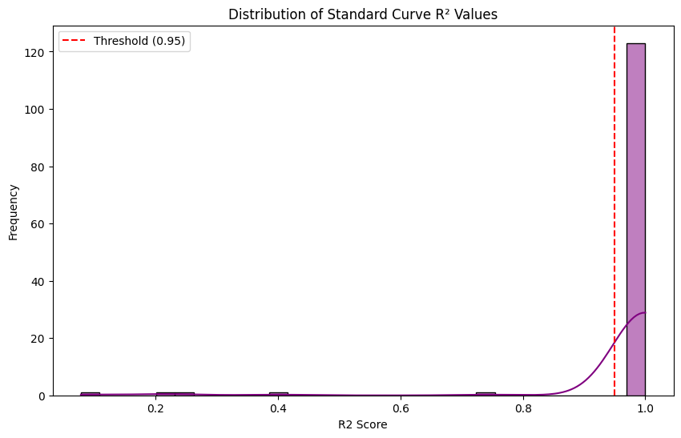
    


    Total Standard Curves evaluated: 128
    Average R² Score: 0.9730
    Curves failing R² threshold (<0.95): 5
    
    Chips associated with failed curves: ['B72604R8016', 'B72604R8030', 'B52501R8061', 'B72604R8038', 'B72604R8043']
    --------------------------------------------------------------------------------
    FAILED CURVE DETAILS & PLOTS
    --------------------------------------------------------------------------------
    Chip ID: B72604R8016 | Curve UUID: csb562a | R²: 0.2006
    


    
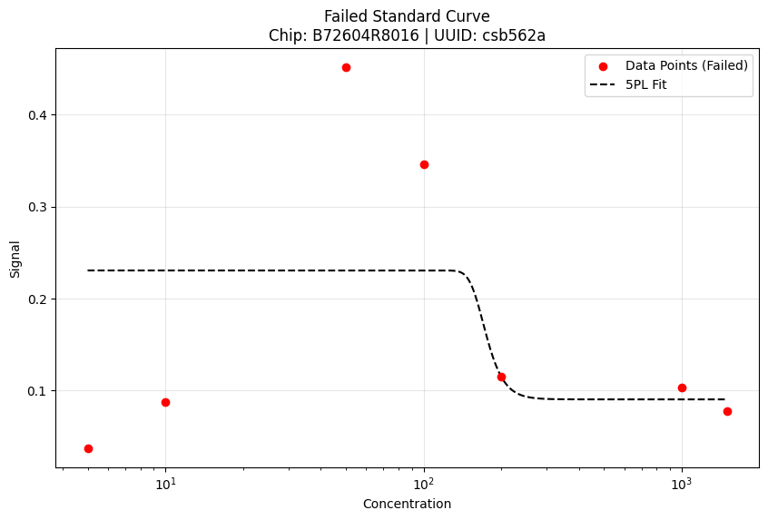
    


    Chip ID: B72604R8030 | Curve UUID: cs36353 | R²: 0.4011
    


    
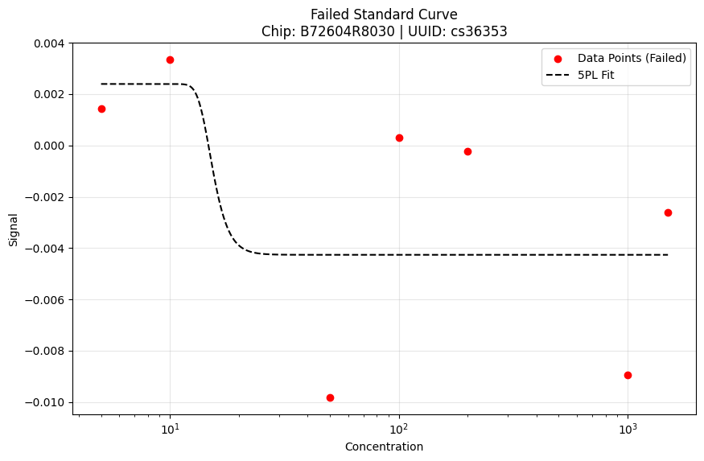
    


    Chip ID: B52501R8061 | Curve UUID: cs84a80 | R²: 0.7446
    


    
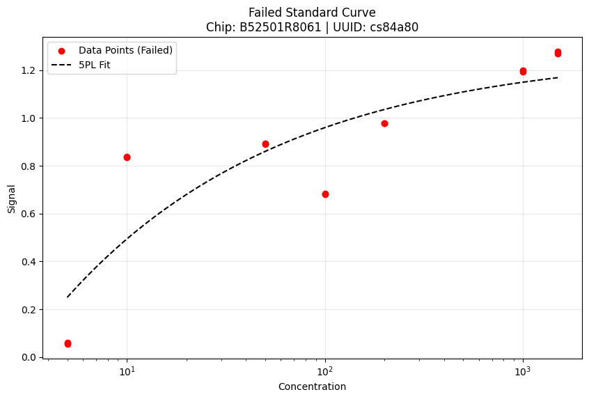
    


    Chip ID: B72604R8038 | Curve UUID: cs2de12 | R²: 0.0775
    


    
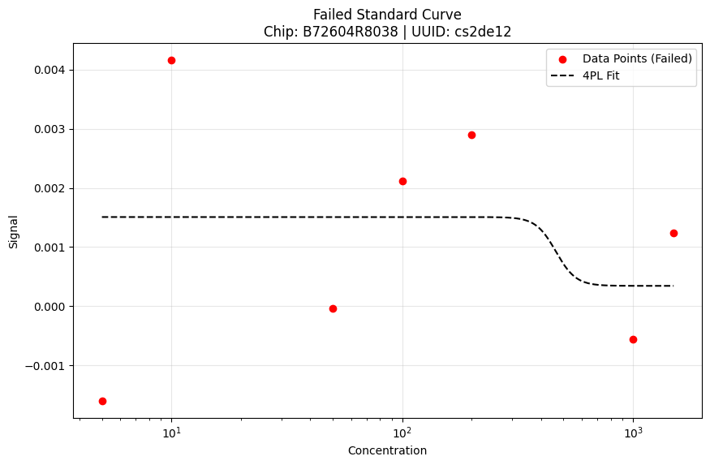
    


    Chip ID: B72604R8043 | Curve UUID: cs419e1 | R²: 0.2325
    


    
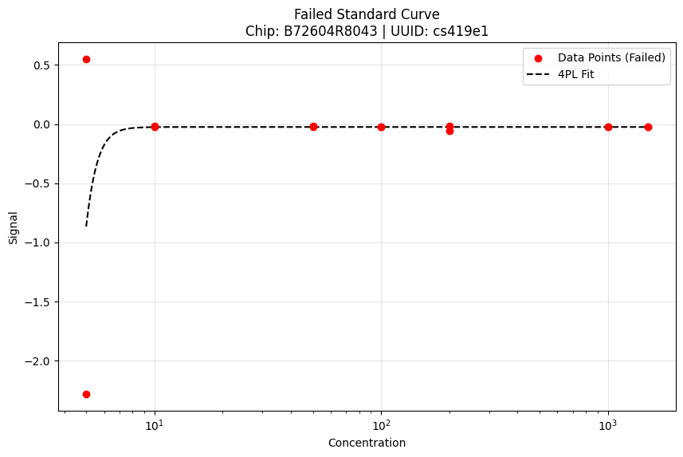
    


## $\color{yellow}{\text{Cross-Stage (PEL + Immob) Analysis}}$

### $\color{red}{\text{Anomalies Analysis}}$

#### $\color{lime}{\text{Immediate (Non-Combined)}}$


```python
# Compares PEL and immediate non-combined immobilisation signals using PCA
analyse_cross_stage_split(pel_wide, wide_imp, 'Immediate (Non-Combined)', pel_anomalies, imp_anomalies, sc_metrics, title='Cross-Stage PCA: Imm (Non-Comb)')
```


    VBox(children=(Button(description='[>] Cross-Stage PCA: Imm (Non-Comb) - Channel 1', layout=Layout(border_bott…


<style>
    .custom-clean-output, 
    .custom-clean-output .jp-RenderedText, 
    .custom-clean-output pre, 
    .custom-clean-output .output_area {
        color: black !important;
    }

    .custom-clean-output .output_area {
        display: flex;
        justify-content: flex-start !important;
        align-items: flex-start !important;
    }

    .custom-clean-output table {
        margin-left: 0 !important;
    }

    .jupyter-widgets.jupyter-button:hover,
    .jupyter-widgets.jupyter-button:focus {
        background-color: transparent !important;
        outline: none !important;
        box-shadow: none !important;
    }
</style>


    VBox(children=(Button(description='[>] Cross-Stage PCA: Imm (Non-Comb) - Channel 2', layout=Layout(border_bott…


<style>
    .custom-clean-output, 
    .custom-clean-output .jp-RenderedText, 
    .custom-clean-output pre, 
    .custom-clean-output .output_area {
        color: black !important;
    }

    .custom-clean-output .output_area {
        display: flex;
        justify-content: flex-start !important;
        align-items: flex-start !important;
    }

    .custom-clean-output table {
        margin-left: 0 !important;
    }

    .jupyter-widgets.jupyter-button:hover,
    .jupyter-widgets.jupyter-button:focus {
        background-color: transparent !important;
        outline: none !important;
        box-shadow: none !important;
    }
</style>


    VBox(children=(Button(description='[>] Cross-Stage PCA: Imm (Non-Comb) - Overall (Pooled)', layout=Layout(bord…


<style>
    .custom-clean-output, 
    .custom-clean-output .jp-RenderedText, 
    .custom-clean-output pre, 
    .custom-clean-output .output_area {
        color: black !important;
    }

    .custom-clean-output .output_area {
        display: flex;
        justify-content: flex-start !important;
        align-items: flex-start !important;
    }

    .custom-clean-output table {
        margin-left: 0 !important;
    }

    .jupyter-widgets.jupyter-button:hover,
    .jupyter-widgets.jupyter-button:focus {
        background-color: transparent !important;
        outline: none !important;
        box-shadow: none !important;
    }
</style>


```python
# Compares PEL and immediate non-combined stage changes using PCA
analyse_cross_stage_split(pel_change_wide, wide_changes_imp, 'Immediate (Non-Combined) [Delta]', outlier_chips_delta_pel, outliers_imp_delta, sc_metrics, title='Cross-Stage PCA: Imm Non-Comb (Delta)')
```


    VBox(children=(Button(description='[>] Cross-Stage PCA: Imm Non-Comb (Delta) - Channel 1', layout=Layout(borde…


<style>
    .custom-clean-output, 
    .custom-clean-output .jp-RenderedText, 
    .custom-clean-output pre, 
    .custom-clean-output .output_area {
        color: black !important;
    }

    .custom-clean-output .output_area {
        display: flex;
        justify-content: flex-start !important;
        align-items: flex-start !important;
    }

    .custom-clean-output table {
        margin-left: 0 !important;
    }

    .jupyter-widgets.jupyter-button:hover,
    .jupyter-widgets.jupyter-button:focus {
        background-color: transparent !important;
        outline: none !important;
        box-shadow: none !important;
    }
</style>


    VBox(children=(Button(description='[>] Cross-Stage PCA: Imm Non-Comb (Delta) - Channel 2', layout=Layout(borde…


<style>
    .custom-clean-output, 
    .custom-clean-output .jp-RenderedText, 
    .custom-clean-output pre, 
    .custom-clean-output .output_area {
        color: black !important;
    }

    .custom-clean-output .output_area {
        display: flex;
        justify-content: flex-start !important;
        align-items: flex-start !important;
    }

    .custom-clean-output table {
        margin-left: 0 !important;
    }

    .jupyter-widgets.jupyter-button:hover,
    .jupyter-widgets.jupyter-button:focus {
        background-color: transparent !important;
        outline: none !important;
        box-shadow: none !important;
    }
</style>


    VBox(children=(Button(description='[>] Cross-Stage PCA: Imm Non-Comb (Delta) - Overall (Pooled)', layout=Layou…


<style>
    .custom-clean-output, 
    .custom-clean-output .jp-RenderedText, 
    .custom-clean-output pre, 
    .custom-clean-output .output_area {
        color: black !important;
    }

    .custom-clean-output .output_area {
        display: flex;
        justify-content: flex-start !important;
        align-items: flex-start !important;
    }

    .custom-clean-output table {
        margin-left: 0 !important;
    }

    .jupyter-widgets.jupyter-button:hover,
    .jupyter-widgets.jupyter-button:focus {
        background-color: transparent !important;
        outline: none !important;
        box-shadow: none !important;
    }
</style>


```python
# Compares PEL and immediate non-combined kinetic features using PCA
analyse_cross_stage_split(pel_intra_wide, wide_intra_imp, 'Immediate (Non-Combined) [Intra]', outlier_chips_intra_pel, outliers_imp_intra, sc_metrics, title='Cross-Stage PCA: Imm Non-Comb (Intra)')
```


    VBox(children=(Button(description='[>] Cross-Stage PCA: Imm Non-Comb (Intra) - Channel 1', layout=Layout(borde…


<style>
    .custom-clean-output, 
    .custom-clean-output .jp-RenderedText, 
    .custom-clean-output pre, 
    .custom-clean-output .output_area {
        color: black !important;
    }

    .custom-clean-output .output_area {
        display: flex;
        justify-content: flex-start !important;
        align-items: flex-start !important;
    }

    .custom-clean-output table {
        margin-left: 0 !important;
    }

    .jupyter-widgets.jupyter-button:hover,
    .jupyter-widgets.jupyter-button:focus {
        background-color: transparent !important;
        outline: none !important;
        box-shadow: none !important;
    }
</style>


    VBox(children=(Button(description='[>] Cross-Stage PCA: Imm Non-Comb (Intra) - Channel 2', layout=Layout(borde…


<style>
    .custom-clean-output, 
    .custom-clean-output .jp-RenderedText, 
    .custom-clean-output pre, 
    .custom-clean-output .output_area {
        color: black !important;
    }

    .custom-clean-output .output_area {
        display: flex;
        justify-content: flex-start !important;
        align-items: flex-start !important;
    }

    .custom-clean-output table {
        margin-left: 0 !important;
    }

    .jupyter-widgets.jupyter-button:hover,
    .jupyter-widgets.jupyter-button:focus {
        background-color: transparent !important;
        outline: none !important;
        box-shadow: none !important;
    }
</style>


    VBox(children=(Button(description='[>] Cross-Stage PCA: Imm Non-Comb (Intra) - Overall (Pooled)', layout=Layou…


<style>
    .custom-clean-output, 
    .custom-clean-output .jp-RenderedText, 
    .custom-clean-output pre, 
    .custom-clean-output .output_area {
        color: black !important;
    }

    .custom-clean-output .output_area {
        display: flex;
        justify-content: flex-start !important;
        align-items: flex-start !important;
    }

    .custom-clean-output table {
        margin-left: 0 !important;
    }

    .jupyter-widgets.jupyter-button:hover,
    .jupyter-widgets.jupyter-button:focus {
        background-color: transparent !important;
        outline: none !important;
        box-shadow: none !important;
    }
</style>


#### $\color{lime}{\text{Immediate (Combined)}}$


```python
# Compares PEL and immediate combined immobilisation signals using PCA
analyse_cross_stage_split(pel_wide, wide_comb, 'Immediate (Combined)', pel_anomalies, comb_anomalies, sc_metrics, title='Cross-Stage PCA: Immob Immediate Comb')
```


    VBox(children=(Button(description='[>] Cross-Stage PCA: Immob Immediate Comb - Channel 1', layout=Layout(borde…


<style>
    .custom-clean-output, 
    .custom-clean-output .jp-RenderedText, 
    .custom-clean-output pre, 
    .custom-clean-output .output_area {
        color: black !important;
    }

    .custom-clean-output .output_area {
        display: flex;
        justify-content: flex-start !important;
        align-items: flex-start !important;
    }

    .custom-clean-output table {
        margin-left: 0 !important;
    }

    .jupyter-widgets.jupyter-button:hover,
    .jupyter-widgets.jupyter-button:focus {
        background-color: transparent !important;
        outline: none !important;
        box-shadow: none !important;
    }
</style>


    VBox(children=(Button(description='[>] Cross-Stage PCA: Immob Immediate Comb - Channel 2', layout=Layout(borde…


<style>
    .custom-clean-output, 
    .custom-clean-output .jp-RenderedText, 
    .custom-clean-output pre, 
    .custom-clean-output .output_area {
        color: black !important;
    }

    .custom-clean-output .output_area {
        display: flex;
        justify-content: flex-start !important;
        align-items: flex-start !important;
    }

    .custom-clean-output table {
        margin-left: 0 !important;
    }

    .jupyter-widgets.jupyter-button:hover,
    .jupyter-widgets.jupyter-button:focus {
        background-color: transparent !important;
        outline: none !important;
        box-shadow: none !important;
    }
</style>


    VBox(children=(Button(description='[>] Cross-Stage PCA: Immob Immediate Comb - Overall (Pooled)', layout=Layou…


<style>
    .custom-clean-output, 
    .custom-clean-output .jp-RenderedText, 
    .custom-clean-output pre, 
    .custom-clean-output .output_area {
        color: black !important;
    }

    .custom-clean-output .output_area {
        display: flex;
        justify-content: flex-start !important;
        align-items: flex-start !important;
    }

    .custom-clean-output table {
        margin-left: 0 !important;
    }

    .jupyter-widgets.jupyter-button:hover,
    .jupyter-widgets.jupyter-button:focus {
        background-color: transparent !important;
        outline: none !important;
        box-shadow: none !important;
    }
</style>


```python
# Compares PEL and immediate combined stage changes using PCA
analyse_cross_stage_split(pel_change_wide, wide_changes_comb, 'Immediate (Combined) [Delta]', outlier_chips_delta_pel, outliers_comb_delta, sc_metrics, title='Cross-Stage PCA: Imm Comb (Delta)')
```


    VBox(children=(Button(description='[>] Cross-Stage PCA: Imm Comb (Delta) - Channel 1', layout=Layout(border_bo…


<style>
    .custom-clean-output, 
    .custom-clean-output .jp-RenderedText, 
    .custom-clean-output pre, 
    .custom-clean-output .output_area {
        color: black !important;
    }

    .custom-clean-output .output_area {
        display: flex;
        justify-content: flex-start !important;
        align-items: flex-start !important;
    }

    .custom-clean-output table {
        margin-left: 0 !important;
    }

    .jupyter-widgets.jupyter-button:hover,
    .jupyter-widgets.jupyter-button:focus {
        background-color: transparent !important;
        outline: none !important;
        box-shadow: none !important;
    }
</style>


    VBox(children=(Button(description='[>] Cross-Stage PCA: Imm Comb (Delta) - Channel 2', layout=Layout(border_bo…


<style>
    .custom-clean-output, 
    .custom-clean-output .jp-RenderedText, 
    .custom-clean-output pre, 
    .custom-clean-output .output_area {
        color: black !important;
    }

    .custom-clean-output .output_area {
        display: flex;
        justify-content: flex-start !important;
        align-items: flex-start !important;
    }

    .custom-clean-output table {
        margin-left: 0 !important;
    }

    .jupyter-widgets.jupyter-button:hover,
    .jupyter-widgets.jupyter-button:focus {
        background-color: transparent !important;
        outline: none !important;
        box-shadow: none !important;
    }
</style>


    VBox(children=(Button(description='[>] Cross-Stage PCA: Imm Comb (Delta) - Overall (Pooled)', layout=Layout(bo…


<style>
    .custom-clean-output, 
    .custom-clean-output .jp-RenderedText, 
    .custom-clean-output pre, 
    .custom-clean-output .output_area {
        color: black !important;
    }

    .custom-clean-output .output_area {
        display: flex;
        justify-content: flex-start !important;
        align-items: flex-start !important;
    }

    .custom-clean-output table {
        margin-left: 0 !important;
    }

    .jupyter-widgets.jupyter-button:hover,
    .jupyter-widgets.jupyter-button:focus {
        background-color: transparent !important;
        outline: none !important;
        box-shadow: none !important;
    }
</style>


```python
# Compares PEL and immediate combined kinetic features using PCA
analyse_cross_stage_split(pel_intra_wide, wide_intra_comb, 'Immediate (Combined) [Intra]', outlier_chips_intra_pel, outliers_comb_intra, sc_metrics, title='Cross-Stage PCA: Imm Comb (Intra)')
```


    VBox(children=(Button(description='[>] Cross-Stage PCA: Imm Comb (Intra) - Channel 1', layout=Layout(border_bo…


<style>
    .custom-clean-output, 
    .custom-clean-output .jp-RenderedText, 
    .custom-clean-output pre, 
    .custom-clean-output .output_area {
        color: black !important;
    }

    .custom-clean-output .output_area {
        display: flex;
        justify-content: flex-start !important;
        align-items: flex-start !important;
    }

    .custom-clean-output table {
        margin-left: 0 !important;
    }

    .jupyter-widgets.jupyter-button:hover,
    .jupyter-widgets.jupyter-button:focus {
        background-color: transparent !important;
        outline: none !important;
        box-shadow: none !important;
    }
</style>


    VBox(children=(Button(description='[>] Cross-Stage PCA: Imm Comb (Intra) - Channel 2', layout=Layout(border_bo…


<style>
    .custom-clean-output, 
    .custom-clean-output .jp-RenderedText, 
    .custom-clean-output pre, 
    .custom-clean-output .output_area {
        color: black !important;
    }

    .custom-clean-output .output_area {
        display: flex;
        justify-content: flex-start !important;
        align-items: flex-start !important;
    }

    .custom-clean-output table {
        margin-left: 0 !important;
    }

    .jupyter-widgets.jupyter-button:hover,
    .jupyter-widgets.jupyter-button:focus {
        background-color: transparent !important;
        outline: none !important;
        box-shadow: none !important;
    }
</style>


    VBox(children=(Button(description='[>] Cross-Stage PCA: Imm Comb (Intra) - Overall (Pooled)', layout=Layout(bo…


<style>
    .custom-clean-output, 
    .custom-clean-output .jp-RenderedText, 
    .custom-clean-output pre, 
    .custom-clean-output .output_area {
        color: black !important;
    }

    .custom-clean-output .output_area {
        display: flex;
        justify-content: flex-start !important;
        align-items: flex-start !important;
    }

    .custom-clean-output table {
        margin-left: 0 !important;
    }

    .jupyter-widgets.jupyter-button:hover,
    .jupyter-widgets.jupyter-button:focus {
        background-color: transparent !important;
        outline: none !important;
        box-shadow: none !important;
    }
</style>


#### $\color{lime}{\text{5s Average (Non-Combined)}}$


```python
# Compares PEL and five-second non-combined immobilisation signals using PCA
analyse_cross_stage_split(pel_wide, wide_avg_imp, '5s Average (Non-Combined)', pel_anomalies, avg_imp_anomalies, sc_metrics, title='Cross-Stage PCA: Immob 5s Avg Non-Comb')
```


    VBox(children=(Button(description='[>] Cross-Stage PCA: Immob 5s Avg Non-Comb - Channel 1', layout=Layout(bord…


<style>
    .custom-clean-output, 
    .custom-clean-output .jp-RenderedText, 
    .custom-clean-output pre, 
    .custom-clean-output .output_area {
        color: black !important;
    }

    .custom-clean-output .output_area {
        display: flex;
        justify-content: flex-start !important;
        align-items: flex-start !important;
    }

    .custom-clean-output table {
        margin-left: 0 !important;
    }

    .jupyter-widgets.jupyter-button:hover,
    .jupyter-widgets.jupyter-button:focus {
        background-color: transparent !important;
        outline: none !important;
        box-shadow: none !important;
    }
</style>


    VBox(children=(Button(description='[>] Cross-Stage PCA: Immob 5s Avg Non-Comb - Channel 2', layout=Layout(bord…


<style>
    .custom-clean-output, 
    .custom-clean-output .jp-RenderedText, 
    .custom-clean-output pre, 
    .custom-clean-output .output_area {
        color: black !important;
    }

    .custom-clean-output .output_area {
        display: flex;
        justify-content: flex-start !important;
        align-items: flex-start !important;
    }

    .custom-clean-output table {
        margin-left: 0 !important;
    }

    .jupyter-widgets.jupyter-button:hover,
    .jupyter-widgets.jupyter-button:focus {
        background-color: transparent !important;
        outline: none !important;
        box-shadow: none !important;
    }
</style>


    VBox(children=(Button(description='[>] Cross-Stage PCA: Immob 5s Avg Non-Comb - Overall (Pooled)', layout=Layo…


<style>
    .custom-clean-output, 
    .custom-clean-output .jp-RenderedText, 
    .custom-clean-output pre, 
    .custom-clean-output .output_area {
        color: black !important;
    }

    .custom-clean-output .output_area {
        display: flex;
        justify-content: flex-start !important;
        align-items: flex-start !important;
    }

    .custom-clean-output table {
        margin-left: 0 !important;
    }

    .jupyter-widgets.jupyter-button:hover,
    .jupyter-widgets.jupyter-button:focus {
        background-color: transparent !important;
        outline: none !important;
        box-shadow: none !important;
    }
</style>


```python
# Compares PEL and five-second non-combined stage changes using PCA
analyse_cross_stage_split(pel_change_wide, wide_changes_avg_imp, '5s Average (Non-Combined) [Delta]', outlier_chips_delta_pel, outliers_avg_imp_delta, sc_metrics, title='Cross-Stage PCA: 5s Avg Non-Comb (Delta)')
```


    VBox(children=(Button(description='[>] Cross-Stage PCA: 5s Avg Non-Comb (Delta) - Channel 1', layout=Layout(bo…


<style>
    .custom-clean-output, 
    .custom-clean-output .jp-RenderedText, 
    .custom-clean-output pre, 
    .custom-clean-output .output_area {
        color: black !important;
    }

    .custom-clean-output .output_area {
        display: flex;
        justify-content: flex-start !important;
        align-items: flex-start !important;
    }

    .custom-clean-output table {
        margin-left: 0 !important;
    }

    .jupyter-widgets.jupyter-button:hover,
    .jupyter-widgets.jupyter-button:focus {
        background-color: transparent !important;
        outline: none !important;
        box-shadow: none !important;
    }
</style>


    VBox(children=(Button(description='[>] Cross-Stage PCA: 5s Avg Non-Comb (Delta) - Channel 2', layout=Layout(bo…


<style>
    .custom-clean-output, 
    .custom-clean-output .jp-RenderedText, 
    .custom-clean-output pre, 
    .custom-clean-output .output_area {
        color: black !important;
    }

    .custom-clean-output .output_area {
        display: flex;
        justify-content: flex-start !important;
        align-items: flex-start !important;
    }

    .custom-clean-output table {
        margin-left: 0 !important;
    }

    .jupyter-widgets.jupyter-button:hover,
    .jupyter-widgets.jupyter-button:focus {
        background-color: transparent !important;
        outline: none !important;
        box-shadow: none !important;
    }
</style>


    VBox(children=(Button(description='[>] Cross-Stage PCA: 5s Avg Non-Comb (Delta) - Overall (Pooled)', layout=La…


<style>
    .custom-clean-output, 
    .custom-clean-output .jp-RenderedText, 
    .custom-clean-output pre, 
    .custom-clean-output .output_area {
        color: black !important;
    }

    .custom-clean-output .output_area {
        display: flex;
        justify-content: flex-start !important;
        align-items: flex-start !important;
    }

    .custom-clean-output table {
        margin-left: 0 !important;
    }

    .jupyter-widgets.jupyter-button:hover,
    .jupyter-widgets.jupyter-button:focus {
        background-color: transparent !important;
        outline: none !important;
        box-shadow: none !important;
    }
</style>


```python
# Compares PEL and five-second non-combined kinetic features using PCA
analyse_cross_stage_split(pel_intra_wide, wide_intra_avg_imp, '5s Average (Non-Combined) [Intra]', outlier_chips_intra_pel, outliers_avg_imp_intra, sc_metrics, title='Cross-Stage PCA: 5s Avg Non-Comb (Intra)')
```


    VBox(children=(Button(description='[>] Cross-Stage PCA: 5s Avg Non-Comb (Intra) - Channel 1', layout=Layout(bo…


<style>
    .custom-clean-output, 
    .custom-clean-output .jp-RenderedText, 
    .custom-clean-output pre, 
    .custom-clean-output .output_area {
        color: black !important;
    }

    .custom-clean-output .output_area {
        display: flex;
        justify-content: flex-start !important;
        align-items: flex-start !important;
    }

    .custom-clean-output table {
        margin-left: 0 !important;
    }

    .jupyter-widgets.jupyter-button:hover,
    .jupyter-widgets.jupyter-button:focus {
        background-color: transparent !important;
        outline: none !important;
        box-shadow: none !important;
    }
</style>


    VBox(children=(Button(description='[>] Cross-Stage PCA: 5s Avg Non-Comb (Intra) - Channel 2', layout=Layout(bo…


<style>
    .custom-clean-output, 
    .custom-clean-output .jp-RenderedText, 
    .custom-clean-output pre, 
    .custom-clean-output .output_area {
        color: black !important;
    }

    .custom-clean-output .output_area {
        display: flex;
        justify-content: flex-start !important;
        align-items: flex-start !important;
    }

    .custom-clean-output table {
        margin-left: 0 !important;
    }

    .jupyter-widgets.jupyter-button:hover,
    .jupyter-widgets.jupyter-button:focus {
        background-color: transparent !important;
        outline: none !important;
        box-shadow: none !important;
    }
</style>


    VBox(children=(Button(description='[>] Cross-Stage PCA: 5s Avg Non-Comb (Intra) - Overall (Pooled)', layout=La…


<style>
    .custom-clean-output, 
    .custom-clean-output .jp-RenderedText, 
    .custom-clean-output pre, 
    .custom-clean-output .output_area {
        color: black !important;
    }

    .custom-clean-output .output_area {
        display: flex;
        justify-content: flex-start !important;
        align-items: flex-start !important;
    }

    .custom-clean-output table {
        margin-left: 0 !important;
    }

    .jupyter-widgets.jupyter-button:hover,
    .jupyter-widgets.jupyter-button:focus {
        background-color: transparent !important;
        outline: none !important;
        box-shadow: none !important;
    }
</style>


#### $\color{lime}{\text{5s Average (Combined)}}$


```python
# Compares PEL and five-second combined immobilisation signals using PCA
analyse_cross_stage_split(pel_wide, wide_avg_comb, '5s Average (Combined)', pel_anomalies, avg_comb_anomalies, sc_metrics, title='Cross-Stage PCA: Immob 5s Avg Comb')
```


    VBox(children=(Button(description='[>] Cross-Stage PCA: Immob 5s Avg Comb - Channel 1', layout=Layout(border_b…


<style>
    .custom-clean-output, 
    .custom-clean-output .jp-RenderedText, 
    .custom-clean-output pre, 
    .custom-clean-output .output_area {
        color: black !important;
    }

    .custom-clean-output .output_area {
        display: flex;
        justify-content: flex-start !important;
        align-items: flex-start !important;
    }

    .custom-clean-output table {
        margin-left: 0 !important;
    }

    .jupyter-widgets.jupyter-button:hover,
    .jupyter-widgets.jupyter-button:focus {
        background-color: transparent !important;
        outline: none !important;
        box-shadow: none !important;
    }
</style>


    VBox(children=(Button(description='[>] Cross-Stage PCA: Immob 5s Avg Comb - Channel 2', layout=Layout(border_b…


<style>
    .custom-clean-output, 
    .custom-clean-output .jp-RenderedText, 
    .custom-clean-output pre, 
    .custom-clean-output .output_area {
        color: black !important;
    }

    .custom-clean-output .output_area {
        display: flex;
        justify-content: flex-start !important;
        align-items: flex-start !important;
    }

    .custom-clean-output table {
        margin-left: 0 !important;
    }

    .jupyter-widgets.jupyter-button:hover,
    .jupyter-widgets.jupyter-button:focus {
        background-color: transparent !important;
        outline: none !important;
        box-shadow: none !important;
    }
</style>


    VBox(children=(Button(description='[>] Cross-Stage PCA: Immob 5s Avg Comb - Overall (Pooled)', layout=Layout(b…


<style>
    .custom-clean-output, 
    .custom-clean-output .jp-RenderedText, 
    .custom-clean-output pre, 
    .custom-clean-output .output_area {
        color: black !important;
    }

    .custom-clean-output .output_area {
        display: flex;
        justify-content: flex-start !important;
        align-items: flex-start !important;
    }

    .custom-clean-output table {
        margin-left: 0 !important;
    }

    .jupyter-widgets.jupyter-button:hover,
    .jupyter-widgets.jupyter-button:focus {
        background-color: transparent !important;
        outline: none !important;
        box-shadow: none !important;
    }
</style>


```python
# Compares PEL and five-second combined stage changes using PCA
analyse_cross_stage_split(pel_change_wide, wide_changes_avg_comb, '5s Average (Combined) [Delta]', outlier_chips_delta_pel, outliers_avg_comb_delta, sc_metrics, title='Cross-Stage PCA: 5s Avg Comb (Delta)')
```


    VBox(children=(Button(description='[>] Cross-Stage PCA: 5s Avg Comb (Delta) - Channel 1', layout=Layout(border…


<style>
    .custom-clean-output, 
    .custom-clean-output .jp-RenderedText, 
    .custom-clean-output pre, 
    .custom-clean-output .output_area {
        color: black !important;
    }

    .custom-clean-output .output_area {
        display: flex;
        justify-content: flex-start !important;
        align-items: flex-start !important;
    }

    .custom-clean-output table {
        margin-left: 0 !important;
    }

    .jupyter-widgets.jupyter-button:hover,
    .jupyter-widgets.jupyter-button:focus {
        background-color: transparent !important;
        outline: none !important;
        box-shadow: none !important;
    }
</style>


    VBox(children=(Button(description='[>] Cross-Stage PCA: 5s Avg Comb (Delta) - Channel 2', layout=Layout(border…


<style>
    .custom-clean-output, 
    .custom-clean-output .jp-RenderedText, 
    .custom-clean-output pre, 
    .custom-clean-output .output_area {
        color: black !important;
    }

    .custom-clean-output .output_area {
        display: flex;
        justify-content: flex-start !important;
        align-items: flex-start !important;
    }

    .custom-clean-output table {
        margin-left: 0 !important;
    }

    .jupyter-widgets.jupyter-button:hover,
    .jupyter-widgets.jupyter-button:focus {
        background-color: transparent !important;
        outline: none !important;
        box-shadow: none !important;
    }
</style>


    VBox(children=(Button(description='[>] Cross-Stage PCA: 5s Avg Comb (Delta) - Overall (Pooled)', layout=Layout…


<style>
    .custom-clean-output, 
    .custom-clean-output .jp-RenderedText, 
    .custom-clean-output pre, 
    .custom-clean-output .output_area {
        color: black !important;
    }

    .custom-clean-output .output_area {
        display: flex;
        justify-content: flex-start !important;
        align-items: flex-start !important;
    }

    .custom-clean-output table {
        margin-left: 0 !important;
    }

    .jupyter-widgets.jupyter-button:hover,
    .jupyter-widgets.jupyter-button:focus {
        background-color: transparent !important;
        outline: none !important;
        box-shadow: none !important;
    }
</style>


```python
# Compares PEL and five-second combined kinetic features using PCA
analyse_cross_stage_split(pel_intra_wide, wide_intra_avg_comb, '5s Average (Combined) [Intra]', outlier_chips_intra_pel, outliers_avg_comb_intra, sc_metrics, title='Cross-Stage PCA: 5s Avg Comb (Intra)')
```


    VBox(children=(Button(description='[>] Cross-Stage PCA: 5s Avg Comb (Intra) - Channel 1', layout=Layout(border…


<style>
    .custom-clean-output, 
    .custom-clean-output .jp-RenderedText, 
    .custom-clean-output pre, 
    .custom-clean-output .output_area {
        color: black !important;
    }

    .custom-clean-output .output_area {
        display: flex;
        justify-content: flex-start !important;
        align-items: flex-start !important;
    }

    .custom-clean-output table {
        margin-left: 0 !important;
    }

    .jupyter-widgets.jupyter-button:hover,
    .jupyter-widgets.jupyter-button:focus {
        background-color: transparent !important;
        outline: none !important;
        box-shadow: none !important;
    }
</style>


    VBox(children=(Button(description='[>] Cross-Stage PCA: 5s Avg Comb (Intra) - Channel 2', layout=Layout(border…


<style>
    .custom-clean-output, 
    .custom-clean-output .jp-RenderedText, 
    .custom-clean-output pre, 
    .custom-clean-output .output_area {
        color: black !important;
    }

    .custom-clean-output .output_area {
        display: flex;
        justify-content: flex-start !important;
        align-items: flex-start !important;
    }

    .custom-clean-output table {
        margin-left: 0 !important;
    }

    .jupyter-widgets.jupyter-button:hover,
    .jupyter-widgets.jupyter-button:focus {
        background-color: transparent !important;
        outline: none !important;
        box-shadow: none !important;
    }
</style>


    VBox(children=(Button(description='[>] Cross-Stage PCA: 5s Avg Comb (Intra) - Overall (Pooled)', layout=Layout…


<style>
    .custom-clean-output, 
    .custom-clean-output .jp-RenderedText, 
    .custom-clean-output pre, 
    .custom-clean-output .output_area {
        color: black !important;
    }

    .custom-clean-output .output_area {
        display: flex;
        justify-content: flex-start !important;
        align-items: flex-start !important;
    }

    .custom-clean-output table {
        margin-left: 0 !important;
    }

    .jupyter-widgets.jupyter-button:hover,
    .jupyter-widgets.jupyter-button:focus {
        background-color: transparent !important;
        outline: none !important;
        box-shadow: none !important;
    }
</style>


### $\color{red}{\text{Correlations Analysis}}$

#### $\color{lime}{\text{Immediate (Non-Combined)}}$


```python
# Calculates cross-stage correlations for immediate non-combined absolute signals
cross_stage_correlations(pel_wide, wide_imp, 'Immediate (Non-Combined) [Abs]', sc_metrics, title='Cross-Stage Corr: Immob Immediate Non-Comb Abs')
```


    VBox(children=(Button(description='[>] Cross-Stage Corr: Immob Immediate Non-Comb Abs - Channel 1', layout=Lay…


<style>
    .custom-clean-output, 
    .custom-clean-output .jp-RenderedText, 
    .custom-clean-output pre, 
    .custom-clean-output .output_area {
        color: black !important;
    }

    .custom-clean-output .output_area {
        display: flex;
        justify-content: flex-start !important;
        align-items: flex-start !important;
    }

    .custom-clean-output table {
        margin-left: 0 !important;
    }

    .jupyter-widgets.jupyter-button:hover,
    .jupyter-widgets.jupyter-button:focus {
        background-color: transparent !important;
        outline: none !important;
        box-shadow: none !important;
    }
</style>


    VBox(children=(Button(description='[>] Cross-Stage Corr: Immob Immediate Non-Comb Abs - Channel 2', layout=Lay…


<style>
    .custom-clean-output, 
    .custom-clean-output .jp-RenderedText, 
    .custom-clean-output pre, 
    .custom-clean-output .output_area {
        color: black !important;
    }

    .custom-clean-output .output_area {
        display: flex;
        justify-content: flex-start !important;
        align-items: flex-start !important;
    }

    .custom-clean-output table {
        margin-left: 0 !important;
    }

    .jupyter-widgets.jupyter-button:hover,
    .jupyter-widgets.jupyter-button:focus {
        background-color: transparent !important;
        outline: none !important;
        box-shadow: none !important;
    }
</style>


    VBox(children=(Button(description='[>] Cross-Stage Corr: Immob Immediate Non-Comb Abs - Overall (Pooled)', lay…


<style>
    .custom-clean-output, 
    .custom-clean-output .jp-RenderedText, 
    .custom-clean-output pre, 
    .custom-clean-output .output_area {
        color: black !important;
    }

    .custom-clean-output .output_area {
        display: flex;
        justify-content: flex-start !important;
        align-items: flex-start !important;
    }

    .custom-clean-output table {
        margin-left: 0 !important;
    }

    .jupyter-widgets.jupyter-button:hover,
    .jupyter-widgets.jupyter-button:focus {
        background-color: transparent !important;
        outline: none !important;
        box-shadow: none !important;
    }
</style>


```python
# Calculates cross-stage correlations for immediate non-combined stage changes
cross_stage_correlations(pel_change_wide, wide_changes_imp, 'Immediate (Non-Combined) [Delta]', sc_metrics, title='Cross-Stage Corr: Immob Immediate Non-Comb Delta')
```


    VBox(children=(Button(description='[>] Cross-Stage Corr: Immob Immediate Non-Comb Delta - Channel 1', layout=L…


<style>
    .custom-clean-output, 
    .custom-clean-output .jp-RenderedText, 
    .custom-clean-output pre, 
    .custom-clean-output .output_area {
        color: black !important;
    }

    .custom-clean-output .output_area {
        display: flex;
        justify-content: flex-start !important;
        align-items: flex-start !important;
    }

    .custom-clean-output table {
        margin-left: 0 !important;
    }

    .jupyter-widgets.jupyter-button:hover,
    .jupyter-widgets.jupyter-button:focus {
        background-color: transparent !important;
        outline: none !important;
        box-shadow: none !important;
    }
</style>


    VBox(children=(Button(description='[>] Cross-Stage Corr: Immob Immediate Non-Comb Delta - Channel 2', layout=L…


<style>
    .custom-clean-output, 
    .custom-clean-output .jp-RenderedText, 
    .custom-clean-output pre, 
    .custom-clean-output .output_area {
        color: black !important;
    }

    .custom-clean-output .output_area {
        display: flex;
        justify-content: flex-start !important;
        align-items: flex-start !important;
    }

    .custom-clean-output table {
        margin-left: 0 !important;
    }

    .jupyter-widgets.jupyter-button:hover,
    .jupyter-widgets.jupyter-button:focus {
        background-color: transparent !important;
        outline: none !important;
        box-shadow: none !important;
    }
</style>


    VBox(children=(Button(description='[>] Cross-Stage Corr: Immob Immediate Non-Comb Delta - Overall (Pooled)', l…


<style>
    .custom-clean-output, 
    .custom-clean-output .jp-RenderedText, 
    .custom-clean-output pre, 
    .custom-clean-output .output_area {
        color: black !important;
    }

    .custom-clean-output .output_area {
        display: flex;
        justify-content: flex-start !important;
        align-items: flex-start !important;
    }

    .custom-clean-output table {
        margin-left: 0 !important;
    }

    .jupyter-widgets.jupyter-button:hover,
    .jupyter-widgets.jupyter-button:focus {
        background-color: transparent !important;
        outline: none !important;
        box-shadow: none !important;
    }
</style>


```python
# Calculates cross-stage correlations for immediate non-combined kinetic features
cross_stage_correlations(pel_intra_wide, wide_intra_imp, 'Immediate (Non-Combined) [Intra]', sc_metrics, title='Cross-Stage Corr: Immob Immediate Non-Comb Intra')
```


    VBox(children=(Button(description='[>] Cross-Stage Corr: Immob Immediate Non-Comb Intra - Channel 1', layout=L…


<style>
    .custom-clean-output, 
    .custom-clean-output .jp-RenderedText, 
    .custom-clean-output pre, 
    .custom-clean-output .output_area {
        color: black !important;
    }

    .custom-clean-output .output_area {
        display: flex;
        justify-content: flex-start !important;
        align-items: flex-start !important;
    }

    .custom-clean-output table {
        margin-left: 0 !important;
    }

    .jupyter-widgets.jupyter-button:hover,
    .jupyter-widgets.jupyter-button:focus {
        background-color: transparent !important;
        outline: none !important;
        box-shadow: none !important;
    }
</style>


    VBox(children=(Button(description='[>] Cross-Stage Corr: Immob Immediate Non-Comb Intra - Channel 2', layout=L…


<style>
    .custom-clean-output, 
    .custom-clean-output .jp-RenderedText, 
    .custom-clean-output pre, 
    .custom-clean-output .output_area {
        color: black !important;
    }

    .custom-clean-output .output_area {
        display: flex;
        justify-content: flex-start !important;
        align-items: flex-start !important;
    }

    .custom-clean-output table {
        margin-left: 0 !important;
    }

    .jupyter-widgets.jupyter-button:hover,
    .jupyter-widgets.jupyter-button:focus {
        background-color: transparent !important;
        outline: none !important;
        box-shadow: none !important;
    }
</style>


    VBox(children=(Button(description='[>] Cross-Stage Corr: Immob Immediate Non-Comb Intra - Overall (Pooled)', l…


<style>
    .custom-clean-output, 
    .custom-clean-output .jp-RenderedText, 
    .custom-clean-output pre, 
    .custom-clean-output .output_area {
        color: black !important;
    }

    .custom-clean-output .output_area {
        display: flex;
        justify-content: flex-start !important;
        align-items: flex-start !important;
    }

    .custom-clean-output table {
        margin-left: 0 !important;
    }

    .jupyter-widgets.jupyter-button:hover,
    .jupyter-widgets.jupyter-button:focus {
        background-color: transparent !important;
        outline: none !important;
        box-shadow: none !important;
    }
</style>


#### $\color{lime}{\text{Immediate (Combined)}}$


```python
# Calculates cross-stage correlations for immediate combined absolute signals
cross_stage_correlations(pel_wide, wide_comb, 'Immediate (Combined) [Abs]', sc_metrics, title='Cross-Stage Corr: Immob Immediate Comb Abs')
```


    VBox(children=(Button(description='[>] Cross-Stage Corr: Immob Immediate Comb Abs - Channel 1', layout=Layout(…


<style>
    .custom-clean-output, 
    .custom-clean-output .jp-RenderedText, 
    .custom-clean-output pre, 
    .custom-clean-output .output_area {
        color: black !important;
    }

    .custom-clean-output .output_area {
        display: flex;
        justify-content: flex-start !important;
        align-items: flex-start !important;
    }

    .custom-clean-output table {
        margin-left: 0 !important;
    }

    .jupyter-widgets.jupyter-button:hover,
    .jupyter-widgets.jupyter-button:focus {
        background-color: transparent !important;
        outline: none !important;
        box-shadow: none !important;
    }
</style>


    VBox(children=(Button(description='[>] Cross-Stage Corr: Immob Immediate Comb Abs - Channel 2', layout=Layout(…


<style>
    .custom-clean-output, 
    .custom-clean-output .jp-RenderedText, 
    .custom-clean-output pre, 
    .custom-clean-output .output_area {
        color: black !important;
    }

    .custom-clean-output .output_area {
        display: flex;
        justify-content: flex-start !important;
        align-items: flex-start !important;
    }

    .custom-clean-output table {
        margin-left: 0 !important;
    }

    .jupyter-widgets.jupyter-button:hover,
    .jupyter-widgets.jupyter-button:focus {
        background-color: transparent !important;
        outline: none !important;
        box-shadow: none !important;
    }
</style>


    VBox(children=(Button(description='[>] Cross-Stage Corr: Immob Immediate Comb Abs - Overall (Pooled)', layout=…


<style>
    .custom-clean-output, 
    .custom-clean-output .jp-RenderedText, 
    .custom-clean-output pre, 
    .custom-clean-output .output_area {
        color: black !important;
    }

    .custom-clean-output .output_area {
        display: flex;
        justify-content: flex-start !important;
        align-items: flex-start !important;
    }

    .custom-clean-output table {
        margin-left: 0 !important;
    }

    .jupyter-widgets.jupyter-button:hover,
    .jupyter-widgets.jupyter-button:focus {
        background-color: transparent !important;
        outline: none !important;
        box-shadow: none !important;
    }
</style>


```python
# Calculates cross-stage correlations for immediate combined stage changes
cross_stage_correlations(pel_change_wide, wide_changes_comb, 'Immediate (Combined) [Delta]', sc_metrics, title='Cross-Stage Corr: Immob Immediate Comb Delta')
```


    VBox(children=(Button(description='[>] Cross-Stage Corr: Immob Immediate Comb Delta - Channel 1', layout=Layou…


<style>
    .custom-clean-output, 
    .custom-clean-output .jp-RenderedText, 
    .custom-clean-output pre, 
    .custom-clean-output .output_area {
        color: black !important;
    }

    .custom-clean-output .output_area {
        display: flex;
        justify-content: flex-start !important;
        align-items: flex-start !important;
    }

    .custom-clean-output table {
        margin-left: 0 !important;
    }

    .jupyter-widgets.jupyter-button:hover,
    .jupyter-widgets.jupyter-button:focus {
        background-color: transparent !important;
        outline: none !important;
        box-shadow: none !important;
    }
</style>


    VBox(children=(Button(description='[>] Cross-Stage Corr: Immob Immediate Comb Delta - Channel 2', layout=Layou…


<style>
    .custom-clean-output, 
    .custom-clean-output .jp-RenderedText, 
    .custom-clean-output pre, 
    .custom-clean-output .output_area {
        color: black !important;
    }

    .custom-clean-output .output_area {
        display: flex;
        justify-content: flex-start !important;
        align-items: flex-start !important;
    }

    .custom-clean-output table {
        margin-left: 0 !important;
    }

    .jupyter-widgets.jupyter-button:hover,
    .jupyter-widgets.jupyter-button:focus {
        background-color: transparent !important;
        outline: none !important;
        box-shadow: none !important;
    }
</style>


    VBox(children=(Button(description='[>] Cross-Stage Corr: Immob Immediate Comb Delta - Overall (Pooled)', layou…


<style>
    .custom-clean-output, 
    .custom-clean-output .jp-RenderedText, 
    .custom-clean-output pre, 
    .custom-clean-output .output_area {
        color: black !important;
    }

    .custom-clean-output .output_area {
        display: flex;
        justify-content: flex-start !important;
        align-items: flex-start !important;
    }

    .custom-clean-output table {
        margin-left: 0 !important;
    }

    .jupyter-widgets.jupyter-button:hover,
    .jupyter-widgets.jupyter-button:focus {
        background-color: transparent !important;
        outline: none !important;
        box-shadow: none !important;
    }
</style>


```python
# Calculates cross-stage correlations for immediate combined kinetic features
cross_stage_correlations(pel_intra_wide, wide_intra_comb, 'Immediate (Combined) [Intra]', sc_metrics, title='Cross-Stage Corr: Immob Immediate Comb Intra')
```


    VBox(children=(Button(description='[>] Cross-Stage Corr: Immob Immediate Comb Intra - Channel 1', layout=Layou…


<style>
    .custom-clean-output, 
    .custom-clean-output .jp-RenderedText, 
    .custom-clean-output pre, 
    .custom-clean-output .output_area {
        color: black !important;
    }

    .custom-clean-output .output_area {
        display: flex;
        justify-content: flex-start !important;
        align-items: flex-start !important;
    }

    .custom-clean-output table {
        margin-left: 0 !important;
    }

    .jupyter-widgets.jupyter-button:hover,
    .jupyter-widgets.jupyter-button:focus {
        background-color: transparent !important;
        outline: none !important;
        box-shadow: none !important;
    }
</style>


    VBox(children=(Button(description='[>] Cross-Stage Corr: Immob Immediate Comb Intra - Channel 2', layout=Layou…


<style>
    .custom-clean-output, 
    .custom-clean-output .jp-RenderedText, 
    .custom-clean-output pre, 
    .custom-clean-output .output_area {
        color: black !important;
    }

    .custom-clean-output .output_area {
        display: flex;
        justify-content: flex-start !important;
        align-items: flex-start !important;
    }

    .custom-clean-output table {
        margin-left: 0 !important;
    }

    .jupyter-widgets.jupyter-button:hover,
    .jupyter-widgets.jupyter-button:focus {
        background-color: transparent !important;
        outline: none !important;
        box-shadow: none !important;
    }
</style>


    VBox(children=(Button(description='[>] Cross-Stage Corr: Immob Immediate Comb Intra - Overall (Pooled)', layou…


<style>
    .custom-clean-output, 
    .custom-clean-output .jp-RenderedText, 
    .custom-clean-output pre, 
    .custom-clean-output .output_area {
        color: black !important;
    }

    .custom-clean-output .output_area {
        display: flex;
        justify-content: flex-start !important;
        align-items: flex-start !important;
    }

    .custom-clean-output table {
        margin-left: 0 !important;
    }

    .jupyter-widgets.jupyter-button:hover,
    .jupyter-widgets.jupyter-button:focus {
        background-color: transparent !important;
        outline: none !important;
        box-shadow: none !important;
    }
</style>


#### $\color{lime}{\text{5s Average (Non-Combined)}}$


```python
# Calculates cross-stage correlations for five-second non-combined absolute signals
cross_stage_correlations(pel_wide, wide_avg_imp, '5s Average (Non-Combined) [Abs]', sc_metrics, title='Cross-Stage Corr: Immob 5s Avg Non-Comb Abs')
```


    VBox(children=(Button(description='[>] Cross-Stage Corr: Immob 5s Avg Non-Comb Abs - Channel 1', layout=Layout…


<style>
    .custom-clean-output, 
    .custom-clean-output .jp-RenderedText, 
    .custom-clean-output pre, 
    .custom-clean-output .output_area {
        color: black !important;
    }

    .custom-clean-output .output_area {
        display: flex;
        justify-content: flex-start !important;
        align-items: flex-start !important;
    }

    .custom-clean-output table {
        margin-left: 0 !important;
    }

    .jupyter-widgets.jupyter-button:hover,
    .jupyter-widgets.jupyter-button:focus {
        background-color: transparent !important;
        outline: none !important;
        box-shadow: none !important;
    }
</style>


    VBox(children=(Button(description='[>] Cross-Stage Corr: Immob 5s Avg Non-Comb Abs - Channel 2', layout=Layout…


<style>
    .custom-clean-output, 
    .custom-clean-output .jp-RenderedText, 
    .custom-clean-output pre, 
    .custom-clean-output .output_area {
        color: black !important;
    }

    .custom-clean-output .output_area {
        display: flex;
        justify-content: flex-start !important;
        align-items: flex-start !important;
    }

    .custom-clean-output table {
        margin-left: 0 !important;
    }

    .jupyter-widgets.jupyter-button:hover,
    .jupyter-widgets.jupyter-button:focus {
        background-color: transparent !important;
        outline: none !important;
        box-shadow: none !important;
    }
</style>


    VBox(children=(Button(description='[>] Cross-Stage Corr: Immob 5s Avg Non-Comb Abs - Overall (Pooled)', layout…


<style>
    .custom-clean-output, 
    .custom-clean-output .jp-RenderedText, 
    .custom-clean-output pre, 
    .custom-clean-output .output_area {
        color: black !important;
    }

    .custom-clean-output .output_area {
        display: flex;
        justify-content: flex-start !important;
        align-items: flex-start !important;
    }

    .custom-clean-output table {
        margin-left: 0 !important;
    }

    .jupyter-widgets.jupyter-button:hover,
    .jupyter-widgets.jupyter-button:focus {
        background-color: transparent !important;
        outline: none !important;
        box-shadow: none !important;
    }
</style>


```python
# Calculates cross-stage correlations for five-second non-combined stage changes
cross_stage_correlations(pel_change_wide, wide_changes_avg_imp, '5s Average (Non-Combined) [Delta]', sc_metrics, title='Cross-Stage Corr: Immob 5s Avg Non-Comb Delta')
```


    VBox(children=(Button(description='[>] Cross-Stage Corr: Immob 5s Avg Non-Comb Delta - Channel 1', layout=Layo…


<style>
    .custom-clean-output, 
    .custom-clean-output .jp-RenderedText, 
    .custom-clean-output pre, 
    .custom-clean-output .output_area {
        color: black !important;
    }

    .custom-clean-output .output_area {
        display: flex;
        justify-content: flex-start !important;
        align-items: flex-start !important;
    }

    .custom-clean-output table {
        margin-left: 0 !important;
    }

    .jupyter-widgets.jupyter-button:hover,
    .jupyter-widgets.jupyter-button:focus {
        background-color: transparent !important;
        outline: none !important;
        box-shadow: none !important;
    }
</style>


    VBox(children=(Button(description='[>] Cross-Stage Corr: Immob 5s Avg Non-Comb Delta - Channel 2', layout=Layo…


<style>
    .custom-clean-output, 
    .custom-clean-output .jp-RenderedText, 
    .custom-clean-output pre, 
    .custom-clean-output .output_area {
        color: black !important;
    }

    .custom-clean-output .output_area {
        display: flex;
        justify-content: flex-start !important;
        align-items: flex-start !important;
    }

    .custom-clean-output table {
        margin-left: 0 !important;
    }

    .jupyter-widgets.jupyter-button:hover,
    .jupyter-widgets.jupyter-button:focus {
        background-color: transparent !important;
        outline: none !important;
        box-shadow: none !important;
    }
</style>


    VBox(children=(Button(description='[>] Cross-Stage Corr: Immob 5s Avg Non-Comb Delta - Overall (Pooled)', layo…


<style>
    .custom-clean-output, 
    .custom-clean-output .jp-RenderedText, 
    .custom-clean-output pre, 
    .custom-clean-output .output_area {
        color: black !important;
    }

    .custom-clean-output .output_area {
        display: flex;
        justify-content: flex-start !important;
        align-items: flex-start !important;
    }

    .custom-clean-output table {
        margin-left: 0 !important;
    }

    .jupyter-widgets.jupyter-button:hover,
    .jupyter-widgets.jupyter-button:focus {
        background-color: transparent !important;
        outline: none !important;
        box-shadow: none !important;
    }
</style>


```python
# Calculates cross-stage correlations for five-second non-combined kinetic features
cross_stage_correlations(pel_intra_wide, wide_intra_avg_imp, '5s Average (Non-Combined) [Intra]', sc_metrics, title='Cross-Stage Corr: Immob 5s Avg Non-Comb Intra')
```


    VBox(children=(Button(description='[>] Cross-Stage Corr: Immob 5s Avg Non-Comb Intra - Channel 1', layout=Layo…


<style>
    .custom-clean-output, 
    .custom-clean-output .jp-RenderedText, 
    .custom-clean-output pre, 
    .custom-clean-output .output_area {
        color: black !important;
    }

    .custom-clean-output .output_area {
        display: flex;
        justify-content: flex-start !important;
        align-items: flex-start !important;
    }

    .custom-clean-output table {
        margin-left: 0 !important;
    }

    .jupyter-widgets.jupyter-button:hover,
    .jupyter-widgets.jupyter-button:focus {
        background-color: transparent !important;
        outline: none !important;
        box-shadow: none !important;
    }
</style>


    VBox(children=(Button(description='[>] Cross-Stage Corr: Immob 5s Avg Non-Comb Intra - Channel 2', layout=Layo…


<style>
    .custom-clean-output, 
    .custom-clean-output .jp-RenderedText, 
    .custom-clean-output pre, 
    .custom-clean-output .output_area {
        color: black !important;
    }

    .custom-clean-output .output_area {
        display: flex;
        justify-content: flex-start !important;
        align-items: flex-start !important;
    }

    .custom-clean-output table {
        margin-left: 0 !important;
    }

    .jupyter-widgets.jupyter-button:hover,
    .jupyter-widgets.jupyter-button:focus {
        background-color: transparent !important;
        outline: none !important;
        box-shadow: none !important;
    }
</style>


    VBox(children=(Button(description='[>] Cross-Stage Corr: Immob 5s Avg Non-Comb Intra - Overall (Pooled)', layo…


<style>
    .custom-clean-output, 
    .custom-clean-output .jp-RenderedText, 
    .custom-clean-output pre, 
    .custom-clean-output .output_area {
        color: black !important;
    }

    .custom-clean-output .output_area {
        display: flex;
        justify-content: flex-start !important;
        align-items: flex-start !important;
    }

    .custom-clean-output table {
        margin-left: 0 !important;
    }

    .jupyter-widgets.jupyter-button:hover,
    .jupyter-widgets.jupyter-button:focus {
        background-color: transparent !important;
        outline: none !important;
        box-shadow: none !important;
    }
</style>


#### $\color{lime}{\text{5s Average (Combined)}}$


```python
# Calculates cross-stage correlations for five-second combined absolute signals
cross_stage_correlations(pel_wide, wide_avg_comb, '5s Average (Combined) [Abs]', sc_metrics, title='Cross-Stage Corr: Immob 5s Avg Comb Abs')
```


    VBox(children=(Button(description='[>] Cross-Stage Corr: Immob 5s Avg Comb Abs - Channel 1', layout=Layout(bor…


<style>
    .custom-clean-output, 
    .custom-clean-output .jp-RenderedText, 
    .custom-clean-output pre, 
    .custom-clean-output .output_area {
        color: black !important;
    }

    .custom-clean-output .output_area {
        display: flex;
        justify-content: flex-start !important;
        align-items: flex-start !important;
    }

    .custom-clean-output table {
        margin-left: 0 !important;
    }

    .jupyter-widgets.jupyter-button:hover,
    .jupyter-widgets.jupyter-button:focus {
        background-color: transparent !important;
        outline: none !important;
        box-shadow: none !important;
    }
</style>


    VBox(children=(Button(description='[>] Cross-Stage Corr: Immob 5s Avg Comb Abs - Channel 2', layout=Layout(bor…


<style>
    .custom-clean-output, 
    .custom-clean-output .jp-RenderedText, 
    .custom-clean-output pre, 
    .custom-clean-output .output_area {
        color: black !important;
    }

    .custom-clean-output .output_area {
        display: flex;
        justify-content: flex-start !important;
        align-items: flex-start !important;
    }

    .custom-clean-output table {
        margin-left: 0 !important;
    }

    .jupyter-widgets.jupyter-button:hover,
    .jupyter-widgets.jupyter-button:focus {
        background-color: transparent !important;
        outline: none !important;
        box-shadow: none !important;
    }
</style>


    VBox(children=(Button(description='[>] Cross-Stage Corr: Immob 5s Avg Comb Abs - Overall (Pooled)', layout=Lay…


<style>
    .custom-clean-output, 
    .custom-clean-output .jp-RenderedText, 
    .custom-clean-output pre, 
    .custom-clean-output .output_area {
        color: black !important;
    }

    .custom-clean-output .output_area {
        display: flex;
        justify-content: flex-start !important;
        align-items: flex-start !important;
    }

    .custom-clean-output table {
        margin-left: 0 !important;
    }

    .jupyter-widgets.jupyter-button:hover,
    .jupyter-widgets.jupyter-button:focus {
        background-color: transparent !important;
        outline: none !important;
        box-shadow: none !important;
    }
</style>


```python
# Calculates cross-stage correlations for five-second combined stage changes
cross_stage_correlations(pel_change_wide, wide_changes_avg_comb, '5s Average (Combined) [Delta]', sc_metrics, title='Cross-Stage Corr: Immob 5s Avg Comb Delta')
```


    VBox(children=(Button(description='[>] Cross-Stage Corr: Immob 5s Avg Comb Delta - Channel 1', layout=Layout(b…


<style>
    .custom-clean-output, 
    .custom-clean-output .jp-RenderedText, 
    .custom-clean-output pre, 
    .custom-clean-output .output_area {
        color: black !important;
    }

    .custom-clean-output .output_area {
        display: flex;
        justify-content: flex-start !important;
        align-items: flex-start !important;
    }

    .custom-clean-output table {
        margin-left: 0 !important;
    }

    .jupyter-widgets.jupyter-button:hover,
    .jupyter-widgets.jupyter-button:focus {
        background-color: transparent !important;
        outline: none !important;
        box-shadow: none !important;
    }
</style>


    VBox(children=(Button(description='[>] Cross-Stage Corr: Immob 5s Avg Comb Delta - Channel 2', layout=Layout(b…


<style>
    .custom-clean-output, 
    .custom-clean-output .jp-RenderedText, 
    .custom-clean-output pre, 
    .custom-clean-output .output_area {
        color: black !important;
    }

    .custom-clean-output .output_area {
        display: flex;
        justify-content: flex-start !important;
        align-items: flex-start !important;
    }

    .custom-clean-output table {
        margin-left: 0 !important;
    }

    .jupyter-widgets.jupyter-button:hover,
    .jupyter-widgets.jupyter-button:focus {
        background-color: transparent !important;
        outline: none !important;
        box-shadow: none !important;
    }
</style>


    VBox(children=(Button(description='[>] Cross-Stage Corr: Immob 5s Avg Comb Delta - Overall (Pooled)', layout=L…


<style>
    .custom-clean-output, 
    .custom-clean-output .jp-RenderedText, 
    .custom-clean-output pre, 
    .custom-clean-output .output_area {
        color: black !important;
    }

    .custom-clean-output .output_area {
        display: flex;
        justify-content: flex-start !important;
        align-items: flex-start !important;
    }

    .custom-clean-output table {
        margin-left: 0 !important;
    }

    .jupyter-widgets.jupyter-button:hover,
    .jupyter-widgets.jupyter-button:focus {
        background-color: transparent !important;
        outline: none !important;
        box-shadow: none !important;
    }
</style>


```python
# Calculates cross-stage correlations for five-second combined kinetic features
cross_stage_correlations(pel_intra_wide, wide_intra_avg_comb, '5s Average (Combined) [Intra]', sc_metrics, title='Cross-Stage Corr: Immob 5s Avg Comb Intra')
```


    VBox(children=(Button(description='[>] Cross-Stage Corr: Immob 5s Avg Comb Intra - Channel 1', layout=Layout(b…


<style>
    .custom-clean-output, 
    .custom-clean-output .jp-RenderedText, 
    .custom-clean-output pre, 
    .custom-clean-output .output_area {
        color: black !important;
    }

    .custom-clean-output .output_area {
        display: flex;
        justify-content: flex-start !important;
        align-items: flex-start !important;
    }

    .custom-clean-output table {
        margin-left: 0 !important;
    }

    .jupyter-widgets.jupyter-button:hover,
    .jupyter-widgets.jupyter-button:focus {
        background-color: transparent !important;
        outline: none !important;
        box-shadow: none !important;
    }
</style>


    VBox(children=(Button(description='[>] Cross-Stage Corr: Immob 5s Avg Comb Intra - Channel 2', layout=Layout(b…


<style>
    .custom-clean-output, 
    .custom-clean-output .jp-RenderedText, 
    .custom-clean-output pre, 
    .custom-clean-output .output_area {
        color: black !important;
    }

    .custom-clean-output .output_area {
        display: flex;
        justify-content: flex-start !important;
        align-items: flex-start !important;
    }

    .custom-clean-output table {
        margin-left: 0 !important;
    }

    .jupyter-widgets.jupyter-button:hover,
    .jupyter-widgets.jupyter-button:focus {
        background-color: transparent !important;
        outline: none !important;
        box-shadow: none !important;
    }
</style>


    VBox(children=(Button(description='[>] Cross-Stage Corr: Immob 5s Avg Comb Intra - Overall (Pooled)', layout=L…


<style>
    .custom-clean-output, 
    .custom-clean-output .jp-RenderedText, 
    .custom-clean-output pre, 
    .custom-clean-output .output_area {
        color: black !important;
    }

    .custom-clean-output .output_area {
        display: flex;
        justify-content: flex-start !important;
        align-items: flex-start !important;
    }

    .custom-clean-output table {
        margin-left: 0 !important;
    }

    .jupyter-widgets.jupyter-button:hover,
    .jupyter-widgets.jupyter-button:focus {
        background-color: transparent !important;
        outline: none !important;
        box-shadow: none !important;
    }
</style>


## $\color{yellow}{\text{Interactive Stage Comparison Dashboards}}$

### $\color{red}{\text{Setup}}$


```python
# Copies the fit metrics so the original standard-curve results remain unchanged
sc_copy = sc_metrics.copy()
sc_copy.columns = sc_copy.columns.astype(str)

# Selects only numeric fit metrics that can be compared with the stage-analysis datasets
numeric_cols = sc_copy.select_dtypes(include='number').columns.tolist()

# Retains the timestamp temporarily so the first curve for each chip can be selected
if 'datetime' in sc_copy.columns:
    sc_copy = sc_copy[['datetime'] + numeric_cols]
else:
    sc_copy = sc_copy[numeric_cols]

# Keeps the first standard-curve record per chip for cross-stage comparisons
sc_first = sc_copy.sort_values('datetime').groupby(sc_copy.index, sort=False).first().drop(columns='datetime')
```


```python
# Builds a catalog of analysis datasets for the interactive dashboard
master_data_catalog = {

    # Stores absolute-signal datasets for dashboard comparisons
    'Absolute': {
        'PEL': pel_wide,
        'Immob (Imm, Non-Comb)': wide_imp,
        'Immob (Imm, Comb)': wide_comb,
        'Immob (5s, Non-Comb)': wide_avg_imp,
        'Immob (5s, Comb)': wide_avg_comb,
        'Standard Curve': sc_first 
    },

    # Stores stage-to-stage signal-change datasets for dashboard comparisons
    'Stage Delta': {
        'PEL': pel_change_wide,
        'Immob (Imm, Non-Comb)': wide_changes_imp,
        'Immob (Imm, Comb)': wide_changes_comb,
        'Immob (5s, Non-Comb)': wide_changes_avg_imp,
        'Immob (5s, Comb)': wide_changes_avg_comb,
        'Standard Curve': sc_first
    },
    
    # Stores within-stage kinetic feature datasets for dashboard comparisons
    'Intra-stage Kinetics': {
        'PEL': pel_intra_wide,
        'Immob (Imm, Non-Comb)': wide_intra_imp,
        'Immob (Imm, Comb)': wide_intra_comb,
        'Immob (5s, Non-Comb)': wide_intra_avg_imp,
        'Immob (5s, Comb)': wide_intra_avg_comb,
        'Standard Curve': sc_first
    }
}
```

### $\color{red}{\text{Display}}$


```python
# Launches the interactive cross-stage data exploration dashboard
create_interactive_dashboard(master_data_catalog)
```


    HTML(value="<h3 style='margin-bottom:0px; color:#0000FF;'>Master Chip Comparison Dashboard</h3>")


    VBox(children=(ToggleButtons(options=('Absolute', 'Stage Delta', 'Intra-stage Kinetics'), style=ToggleButtonsS…


    Output()


# $\color{orange}{\text{Overall Summary}}$

## $\color{yellow}{\text{Setup}}$


```python
# Groups analysis outputs and anomaly lists by experimental section
section_config = {
    
    # Links PEL signal, change, and kinetic tables to their matching anomaly lists
    'PEL Absolute': (pel_wide, outlier_chips_abs_pel),
    'PEL Delta': (pel_change_wide, outlier_chips_delta_pel),
    'PEL Intra-stage': (pel_intra_wide, outlier_chips_intra_pel),

    # Links immediate immobilisation tables to their matching anomaly lists
    'Immob Immediate Abs (Non-Comb)': (wide_imp, outliers_imp_abs),
    'Immob Immediate Delta (Non-Comb)': (wide_changes_imp, outliers_imp_delta),
    'Immob Immediate Intra (Non-Comb)': (wide_intra_imp, outliers_imp_intra),

    'Immob Immediate Abs (Comb)': (wide_comb, outliers_comb_abs),
    'Immob Immediate Delta (Comb)': (wide_changes_comb, outliers_comb_delta),
    'Immob Immediate Intra (Comb)': (wide_intra_comb, outliers_comb_intra),

    # Links five-second averaged immobilisation tables to their matching anomaly lists
    'Immob 5s Avg Abs (Non-Comb)': (wide_avg_imp, outliers_avg_imp_abs),
    'Immob 5s Avg Delta (Non-Comb)': (wide_changes_avg_imp, outliers_avg_imp_delta),
    'Immob 5s Avg Intra (Non-Comb)': (wide_intra_avg_imp, outliers_avg_imp_intra),

    'Immob 5s Avg Abs (Comb)': (wide_avg_comb, outliers_avg_comb_abs),
    'Immob 5s Avg Delta (Comb)': (wide_changes_avg_comb, outliers_avg_comb_delta),
    'Immob 5s Avg Intra (Comb)': (wide_intra_avg_comb, outliers_avg_comb_intra)
}
```


```python
# Collects every chip identified as anomalous or chips with a standard-curve at risk
all_at_risk_chips = set(failing_chips)

# Loops through each section configuration to aggregate outlier chips
for _, outliers in section_config.values():
    all_at_risk_chips.update(outliers)
```


```python
# Standardises channel labels before combining multi-channel datasets
channel_mapping = {
    'quad_ch1': 'Ch1', 'channel1': 'Ch1',
    'quad_ch2': 'Ch2', 'channel2': 'Ch2',
    'quad_ch1_change': 'Ch1', 'channel1_change': 'Ch1',
    'quad_ch2_change': 'Ch2', 'channel2_change': 'Ch2'
}
```


```python
# Combines complete analysis features into a single chip-level dataset
# Collects compatible feature tables before joining them into one chip-level dataset
dfs_to_concat = []

# Loops through each key and value in the dictionary
for name, (df, _) in section_config.items():

    # Includes only populated tables so empty analysis sections do not remove valid chips
    if not df.empty:
        
        # Creates a copy of the dataframe to preserve original data
        df_mapped = df.copy()

        # Standardises MultiIndex channel labels before the feature tables are joined
        if isinstance(df_mapped.index, pd.MultiIndex) and 'Channel' in df_mapped.index.names:
            df_mapped = df_mapped.rename(index=channel_mapping, level='Channel')
            
        # Keeps each feature name unique by adding its analysis-section label
        dfs_to_concat.append(df_mapped.add_suffix(f"_{name.replace(' ', '_')}"))

# Joins features shared by every available chip into the master comparison table
master_df = pd.concat(dfs_to_concat, axis=1, join='inner').dropna()
```

## $\color{yellow}{\text{Chips That May Fail}}$


```python
# Generates a detailed summary of at-risk chips and their anomaly drivers
generate_at_risk_summary(master_df, sc_metrics, tables['standard_curves'], all_at_risk_chips, section_config, title='At-Risk Chips & Anomaly Drivers')
```


    VBox(children=(Button(description='[>] At-Risk Chips & Anomaly Drivers - Overall Summary', layout=Layout(borde…


<style>
    .custom-clean-output, 
    .custom-clean-output .jp-RenderedText, 
    .custom-clean-output pre, 
    .custom-clean-output .output_area {
        color: black !important;
    }

    .custom-clean-output .output_area {
        display: flex;
        justify-content: flex-start !important;
        align-items: flex-start !important;
    }

    .custom-clean-output table {
        margin-left: 0 !important;
    }

    .jupyter-widgets.jupyter-button:hover,
    .jupyter-widgets.jupyter-button:focus {
        background-color: transparent !important;
        outline: none !important;
        box-shadow: none !important;
    }
</style>


    VBox(children=(Button(description='[>] At-Risk Chips & Anomaly Drivers - PEL Breakdown', layout=Layout(border_…


<style>
    .custom-clean-output, 
    .custom-clean-output .jp-RenderedText, 
    .custom-clean-output pre, 
    .custom-clean-output .output_area {
        color: black !important;
    }

    .custom-clean-output .output_area {
        display: flex;
        justify-content: flex-start !important;
        align-items: flex-start !important;
    }

    .custom-clean-output table {
        margin-left: 0 !important;
    }

    .jupyter-widgets.jupyter-button:hover,
    .jupyter-widgets.jupyter-button:focus {
        background-color: transparent !important;
        outline: none !important;
        box-shadow: none !important;
    }
</style>


    VBox(children=(Button(description='[>] At-Risk Chips & Anomaly Drivers - Immobilisation Breakdown', layout=Lay…


<style>
    .custom-clean-output, 
    .custom-clean-output .jp-RenderedText, 
    .custom-clean-output pre, 
    .custom-clean-output .output_area {
        color: black !important;
    }

    .custom-clean-output .output_area {
        display: flex;
        justify-content: flex-start !important;
        align-items: flex-start !important;
    }

    .custom-clean-output table {
        margin-left: 0 !important;
    }

    .jupyter-widgets.jupyter-button:hover,
    .jupyter-widgets.jupyter-button:focus {
        background-color: transparent !important;
        outline: none !important;
        box-shadow: none !important;
    }
</style>


    VBox(children=(Button(description='[>] At-Risk Chips & Anomaly Drivers - Standard Curve Breakdown', layout=Lay…


<style>
    .custom-clean-output, 
    .custom-clean-output .jp-RenderedText, 
    .custom-clean-output pre, 
    .custom-clean-output .output_area {
        color: black !important;
    }

    .custom-clean-output .output_area {
        display: flex;
        justify-content: flex-start !important;
        align-items: flex-start !important;
    }

    .custom-clean-output table {
        margin-left: 0 !important;
    }

    .jupyter-widgets.jupyter-button:hover,
    .jupyter-widgets.jupyter-button:focus {
        background-color: transparent !important;
        outline: none !important;
        box-shadow: none !important;
    }
</style>


    VBox(children=(Button(description='[>] At-Risk Chips & Anomaly Drivers - Chip Profiles', layout=Layout(border_…


<style>
    .custom-clean-output, 
    .custom-clean-output .jp-RenderedText, 
    .custom-clean-output pre, 
    .custom-clean-output .output_area {
        color: black !important;
    }

    .custom-clean-output .output_area {
        display: flex;
        justify-content: flex-start !important;
        align-items: flex-start !important;
    }

    .custom-clean-output table {
        margin-left: 0 !important;
    }

    .jupyter-widgets.jupyter-button:hover,
    .jupyter-widgets.jupyter-button:focus {
        background-color: transparent !important;
        outline: none !important;
        box-shadow: none !important;
    }
</style>


# $\color{orange}{\text{Standard Curve Extra Data}}$

## $\color{yellow}{\text{Getting SC Data}}$


```python
# Loads local standard-curve CSV files into a structured dictionary
# Sets the directory containing exported standard-curve measurements
base_dir = "Standard Curve Files"

# Creates a nested dictionary to organise files by their export folder
files = {}

# Loops through each export folder and loads its CSV measurements
for folder in os.listdir(base_dir):

    # Builds the full path for the current export folder
    folder_path = os.path.join(base_dir, folder)

    # Checks if the folder path exists
    if os.path.isdir(folder_path):
        files[folder] = {}

        # Loops through each CSV candidate in the current export folder
        for file in os.listdir(folder_path):

            # Builds the full path for the current CSV file
            file_path = os.path.join(folder_path, file)

            # Loads CSV files only because they contain the standard-curve measurements
            if file.endswith(".csv"):
                
                # Removes the extension so the dictionary key matches the measurement name
                file_name = os.path.splitext(file)[0]

                df = pd.read_csv(file_path)

                # Repairs missing sensorgram headers so channel data can be analysed consistently
                if "sensorgram" in file_name.lower():
                    expected = ['time', "channel1", "channel2"]

                    if list(df.columns[:2]) != expected:
                        df = pd.read_csv(file_path, header=None)
                        df.columns = expected

                # Stores the loaded dataframe under its folder and measurement name
                files[folder][file_name] = df
```

## $\color{yellow}{\text{Basic Analysis}}$


```python
# Runs extended standard-curve visualisations and baseline-shift analysis
files = analyse_standard_curves_extra(files)
```

    
    Evaluating Folder: 2026-04-13
    
    --- Chip ID: B52501R8242 | Measurement ID: csa5eb7 ---
    


    
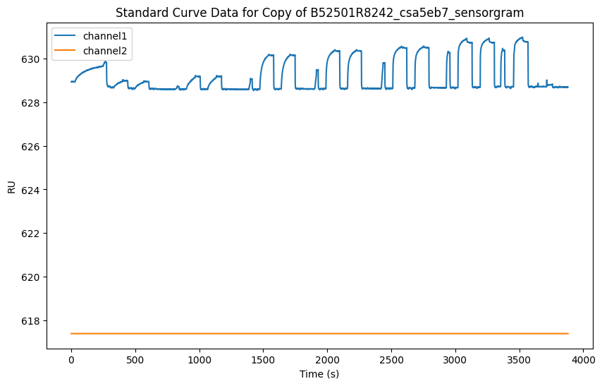
    


    
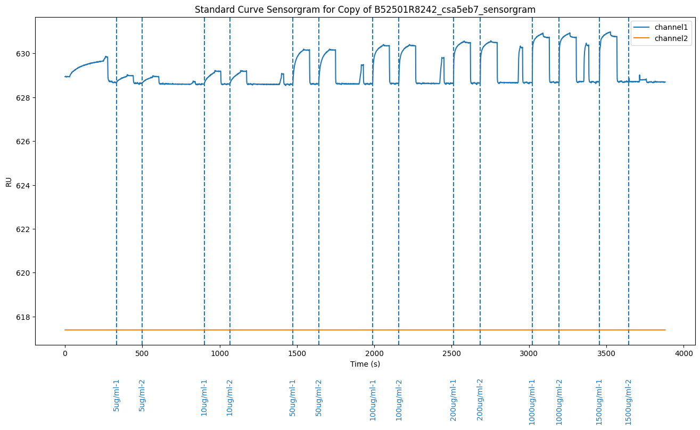
    


    
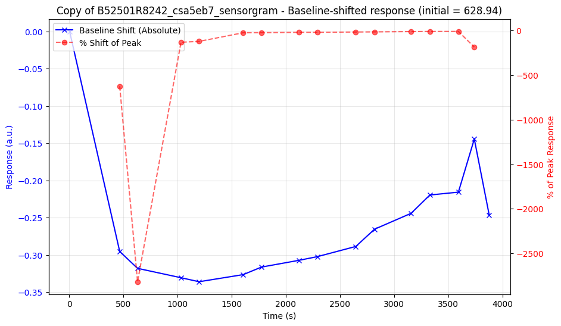
    


<div>
<style scoped>
    .dataframe tbody tr th:only-of-type {
        vertical-align: middle;
    }

    .dataframe tbody tr th {
        vertical-align: top;
    }

    .dataframe thead th {
        text-align: right;
    }
</style>
<table border="1" class="dataframe">
  <thead>
    <tr style="text-align: right;">
      <th></th>
      <th>Measurement Step</th>
      <th>Absolute Peak (RU)</th>
      <th>Absolute Baseline (RU)</th>
      <th>Baseline Shift (ΔRU)</th>
      <th>% Shift of Peak</th>
    </tr>
  </thead>
  <tbody>
    <tr>
      <th>0</th>
      <td>Initial Baseline</td>
      <td>NaN</td>
      <td>628.941</td>
      <td>0.000</td>
      <td>NaN</td>
    </tr>
    <tr>
      <th>1</th>
      <td>Baseline Window (5ug/ml / 5ug/ml)</td>
      <td>628.988</td>
      <td>628.645</td>
      <td>-0.296</td>
      <td>-626.031</td>
    </tr>
    <tr>
      <th>2</th>
      <td>Baseline Window (5ug/ml / 10ug/ml)</td>
      <td>628.952</td>
      <td>628.623</td>
      <td>-0.318</td>
      <td>-2817.408</td>
    </tr>
    <tr>
      <th>3</th>
      <td>Baseline Window (10ug/ml / 10ug/ml)</td>
      <td>629.189</td>
      <td>628.610</td>
      <td>-0.331</td>
      <td>-133.350</td>
    </tr>
    <tr>
      <th>4</th>
      <td>Baseline Window (10ug/ml / 50ug/ml)</td>
      <td>629.213</td>
      <td>628.605</td>
      <td>-0.336</td>
      <td>-123.788</td>
    </tr>
    <tr>
      <th>5</th>
      <td>Baseline Window (50ug/ml / 50ug/ml)</td>
      <td>630.169</td>
      <td>628.614</td>
      <td>-0.327</td>
      <td>-26.590</td>
    </tr>
    <tr>
      <th>6</th>
      <td>Baseline Window (50ug/ml / 100ug/ml)</td>
      <td>630.165</td>
      <td>628.624</td>
      <td>-0.317</td>
      <td>-25.852</td>
    </tr>
    <tr>
      <th>7</th>
      <td>Baseline Window (100ug/ml / 100ug/ml)</td>
      <td>630.362</td>
      <td>628.634</td>
      <td>-0.307</td>
      <td>-21.627</td>
    </tr>
    <tr>
      <th>8</th>
      <td>Baseline Window (100ug/ml / 200ug/ml)</td>
      <td>630.344</td>
      <td>628.638</td>
      <td>-0.302</td>
      <td>-21.564</td>
    </tr>
    <tr>
      <th>9</th>
      <td>Baseline Window (200ug/ml / 200ug/ml)</td>
      <td>630.499</td>
      <td>628.652</td>
      <td>-0.289</td>
      <td>-18.536</td>
    </tr>
    <tr>
      <th>10</th>
      <td>Baseline Window (200ug/ml / 1000ug/ml)</td>
      <td>630.504</td>
      <td>628.675</td>
      <td>-0.266</td>
      <td>-16.989</td>
    </tr>
    <tr>
      <th>11</th>
      <td>Baseline Window (1000ug/ml / 1000ug/ml)</td>
      <td>630.743</td>
      <td>628.697</td>
      <td>-0.244</td>
      <td>-13.560</td>
    </tr>
    <tr>
      <th>12</th>
      <td>Baseline Window (1000ug/ml / 1500ug/ml)</td>
      <td>630.744</td>
      <td>628.721</td>
      <td>-0.220</td>
      <td>-12.181</td>
    </tr>
    <tr>
      <th>13</th>
      <td>Baseline Window (1500ug/ml / 1500ug/ml)</td>
      <td>630.773</td>
      <td>628.725</td>
      <td>-0.216</td>
      <td>-11.782</td>
    </tr>
    <tr>
      <th>14</th>
      <td>Baseline Window (1500ug/ml / Final)</td>
      <td>629.018</td>
      <td>628.796</td>
      <td>-0.145</td>
      <td>-187.316</td>
    </tr>
    <tr>
      <th>15</th>
      <td>Final Baseline</td>
      <td>NaN</td>
      <td>628.694</td>
      <td>-0.246</td>
      <td>NaN</td>
    </tr>
  </tbody>
</table>
</div>


    
    --- Chip ID: B52501R8242 | Measurement ID: csda3af ---
    


    
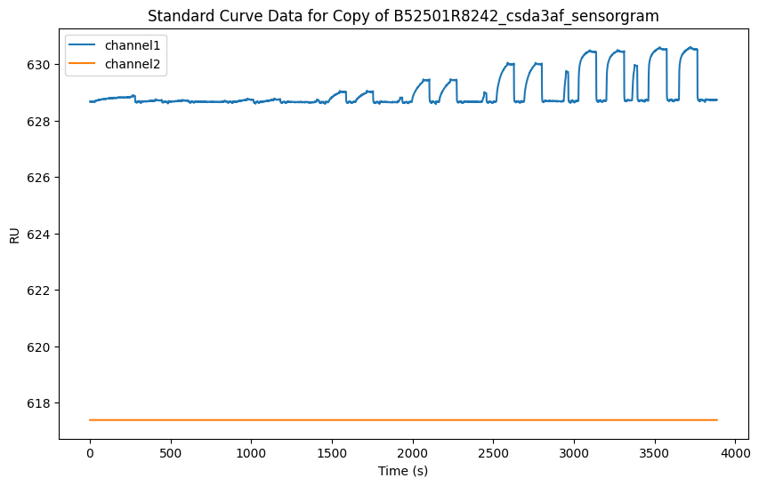
    


    
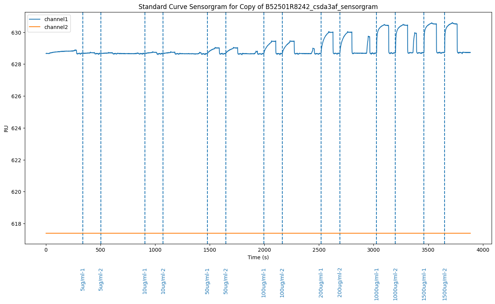
    


    
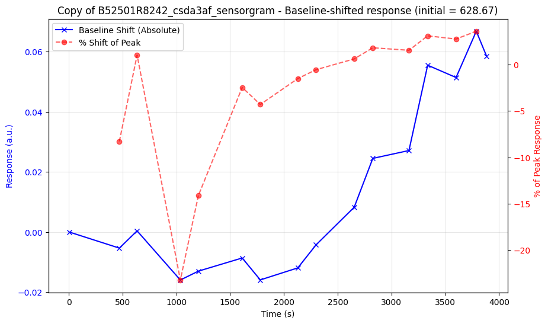
    


<div>
<style scoped>
    .dataframe tbody tr th:only-of-type {
        vertical-align: middle;
    }

    .dataframe tbody tr th {
        vertical-align: top;
    }

    .dataframe thead th {
        text-align: right;
    }
</style>
<table border="1" class="dataframe">
  <thead>
    <tr style="text-align: right;">
      <th></th>
      <th>Measurement Step</th>
      <th>Absolute Peak (RU)</th>
      <th>Absolute Baseline (RU)</th>
      <th>Baseline Shift (ΔRU)</th>
      <th>% Shift of Peak</th>
    </tr>
  </thead>
  <tbody>
    <tr>
      <th>0</th>
      <td>Initial Baseline</td>
      <td>NaN</td>
      <td>628.668</td>
      <td>0.000</td>
      <td>NaN</td>
    </tr>
    <tr>
      <th>1</th>
      <td>Baseline Window (5ug/ml / 5ug/ml)</td>
      <td>628.733</td>
      <td>628.663</td>
      <td>-0.005</td>
      <td>-8.280</td>
    </tr>
    <tr>
      <th>2</th>
      <td>Baseline Window (5ug/ml / 10ug/ml)</td>
      <td>628.705</td>
      <td>628.669</td>
      <td>0.000</td>
      <td>1.021</td>
    </tr>
    <tr>
      <th>3</th>
      <td>Baseline Window (10ug/ml / 10ug/ml)</td>
      <td>628.737</td>
      <td>628.652</td>
      <td>-0.016</td>
      <td>-23.216</td>
    </tr>
    <tr>
      <th>4</th>
      <td>Baseline Window (10ug/ml / 50ug/ml)</td>
      <td>628.760</td>
      <td>628.655</td>
      <td>-0.013</td>
      <td>-14.101</td>
    </tr>
    <tr>
      <th>5</th>
      <td>Baseline Window (50ug/ml / 50ug/ml)</td>
      <td>629.019</td>
      <td>628.660</td>
      <td>-0.009</td>
      <td>-2.464</td>
    </tr>
    <tr>
      <th>6</th>
      <td>Baseline Window (50ug/ml / 100ug/ml)</td>
      <td>629.038</td>
      <td>628.652</td>
      <td>-0.016</td>
      <td>-4.302</td>
    </tr>
    <tr>
      <th>7</th>
      <td>Baseline Window (100ug/ml / 100ug/ml)</td>
      <td>629.459</td>
      <td>628.656</td>
      <td>-0.012</td>
      <td>-1.507</td>
    </tr>
    <tr>
      <th>8</th>
      <td>Baseline Window (100ug/ml / 200ug/ml)</td>
      <td>629.445</td>
      <td>628.664</td>
      <td>-0.004</td>
      <td>-0.552</td>
    </tr>
    <tr>
      <th>9</th>
      <td>Baseline Window (200ug/ml / 200ug/ml)</td>
      <td>630.018</td>
      <td>628.676</td>
      <td>0.008</td>
      <td>0.610</td>
    </tr>
    <tr>
      <th>10</th>
      <td>Baseline Window (200ug/ml / 1000ug/ml)</td>
      <td>630.019</td>
      <td>628.693</td>
      <td>0.024</td>
      <td>1.812</td>
    </tr>
    <tr>
      <th>11</th>
      <td>Baseline Window (1000ug/ml / 1000ug/ml)</td>
      <td>630.426</td>
      <td>628.695</td>
      <td>0.027</td>
      <td>1.541</td>
    </tr>
    <tr>
      <th>12</th>
      <td>Baseline Window (1000ug/ml / 1500ug/ml)</td>
      <td>630.459</td>
      <td>628.724</td>
      <td>0.055</td>
      <td>3.096</td>
    </tr>
    <tr>
      <th>13</th>
      <td>Baseline Window (1500ug/ml / 1500ug/ml)</td>
      <td>630.533</td>
      <td>628.720</td>
      <td>0.051</td>
      <td>2.754</td>
    </tr>
    <tr>
      <th>14</th>
      <td>Baseline Window (1500ug/ml / Final)</td>
      <td>630.525</td>
      <td>628.735</td>
      <td>0.067</td>
      <td>3.595</td>
    </tr>
    <tr>
      <th>15</th>
      <td>Final Baseline</td>
      <td>NaN</td>
      <td>628.727</td>
      <td>0.058</td>
      <td>NaN</td>
    </tr>
  </tbody>
</table>
</div>


    
    Evaluating Folder: 2026-04-15
    
    --- Chip ID: B52501R8242 | Measurement ID: cs5dbc5 ---
    


    
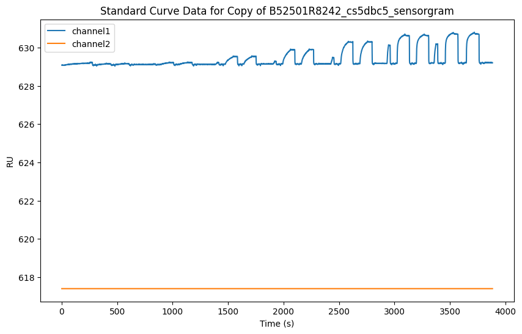
    


    
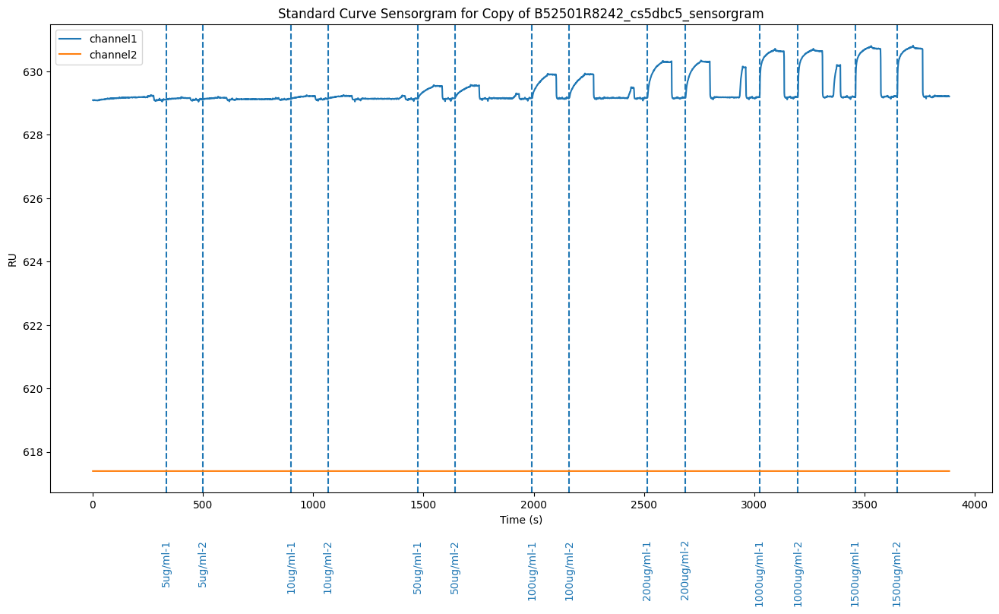
    


    
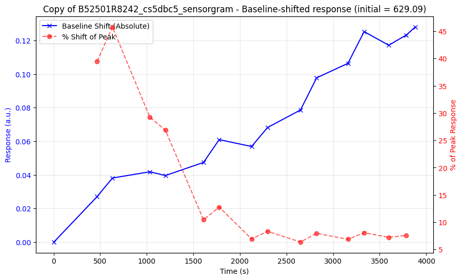
    


<div>
<style scoped>
    .dataframe tbody tr th:only-of-type {
        vertical-align: middle;
    }

    .dataframe tbody tr th {
        vertical-align: top;
    }

    .dataframe thead th {
        text-align: right;
    }
</style>
<table border="1" class="dataframe">
  <thead>
    <tr style="text-align: right;">
      <th></th>
      <th>Measurement Step</th>
      <th>Absolute Peak (RU)</th>
      <th>Absolute Baseline (RU)</th>
      <th>Baseline Shift (ΔRU)</th>
      <th>% Shift of Peak</th>
    </tr>
  </thead>
  <tbody>
    <tr>
      <th>0</th>
      <td>Initial Baseline</td>
      <td>NaN</td>
      <td>629.088</td>
      <td>0.000</td>
      <td>NaN</td>
    </tr>
    <tr>
      <th>1</th>
      <td>Baseline Window (5ug/ml / 5ug/ml)</td>
      <td>629.156</td>
      <td>629.115</td>
      <td>0.027</td>
      <td>39.479</td>
    </tr>
    <tr>
      <th>2</th>
      <td>Baseline Window (5ug/ml / 10ug/ml)</td>
      <td>629.171</td>
      <td>629.126</td>
      <td>0.038</td>
      <td>45.767</td>
    </tr>
    <tr>
      <th>3</th>
      <td>Baseline Window (10ug/ml / 10ug/ml)</td>
      <td>629.231</td>
      <td>629.130</td>
      <td>0.042</td>
      <td>29.230</td>
    </tr>
    <tr>
      <th>4</th>
      <td>Baseline Window (10ug/ml / 50ug/ml)</td>
      <td>629.235</td>
      <td>629.127</td>
      <td>0.040</td>
      <td>26.847</td>
    </tr>
    <tr>
      <th>5</th>
      <td>Baseline Window (50ug/ml / 50ug/ml)</td>
      <td>629.541</td>
      <td>629.135</td>
      <td>0.047</td>
      <td>10.445</td>
    </tr>
    <tr>
      <th>6</th>
      <td>Baseline Window (50ug/ml / 100ug/ml)</td>
      <td>629.565</td>
      <td>629.149</td>
      <td>0.061</td>
      <td>12.766</td>
    </tr>
    <tr>
      <th>7</th>
      <td>Baseline Window (100ug/ml / 100ug/ml)</td>
      <td>629.909</td>
      <td>629.145</td>
      <td>0.057</td>
      <td>6.922</td>
    </tr>
    <tr>
      <th>8</th>
      <td>Baseline Window (100ug/ml / 200ug/ml)</td>
      <td>629.907</td>
      <td>629.156</td>
      <td>0.068</td>
      <td>8.316</td>
    </tr>
    <tr>
      <th>9</th>
      <td>Baseline Window (200ug/ml / 200ug/ml)</td>
      <td>630.322</td>
      <td>629.166</td>
      <td>0.079</td>
      <td>6.370</td>
    </tr>
    <tr>
      <th>10</th>
      <td>Baseline Window (200ug/ml / 1000ug/ml)</td>
      <td>630.316</td>
      <td>629.186</td>
      <td>0.098</td>
      <td>7.958</td>
    </tr>
    <tr>
      <th>11</th>
      <td>Baseline Window (1000ug/ml / 1000ug/ml)</td>
      <td>630.637</td>
      <td>629.194</td>
      <td>0.106</td>
      <td>6.868</td>
    </tr>
    <tr>
      <th>12</th>
      <td>Baseline Window (1000ug/ml / 1500ug/ml)</td>
      <td>630.642</td>
      <td>629.213</td>
      <td>0.125</td>
      <td>8.059</td>
    </tr>
    <tr>
      <th>13</th>
      <td>Baseline Window (1500ug/ml / 1500ug/ml)</td>
      <td>630.708</td>
      <td>629.205</td>
      <td>0.117</td>
      <td>7.232</td>
    </tr>
    <tr>
      <th>14</th>
      <td>Baseline Window (1500ug/ml / Final)</td>
      <td>630.715</td>
      <td>629.211</td>
      <td>0.123</td>
      <td>7.573</td>
    </tr>
    <tr>
      <th>15</th>
      <td>Final Baseline</td>
      <td>NaN</td>
      <td>629.216</td>
      <td>0.128</td>
      <td>NaN</td>
    </tr>
  </tbody>
</table>
</div>


    
    Evaluating Folder: 2026-04-16
    
    --- Chip ID: B52501R8242 | Measurement ID: cs3142c ---
    


    
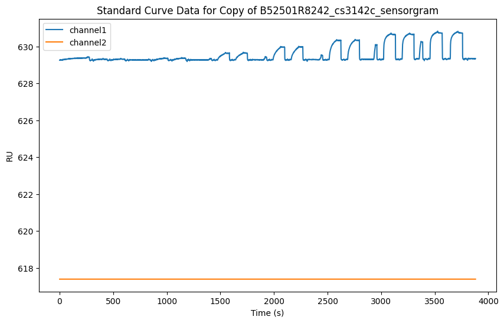
    


    

    


    
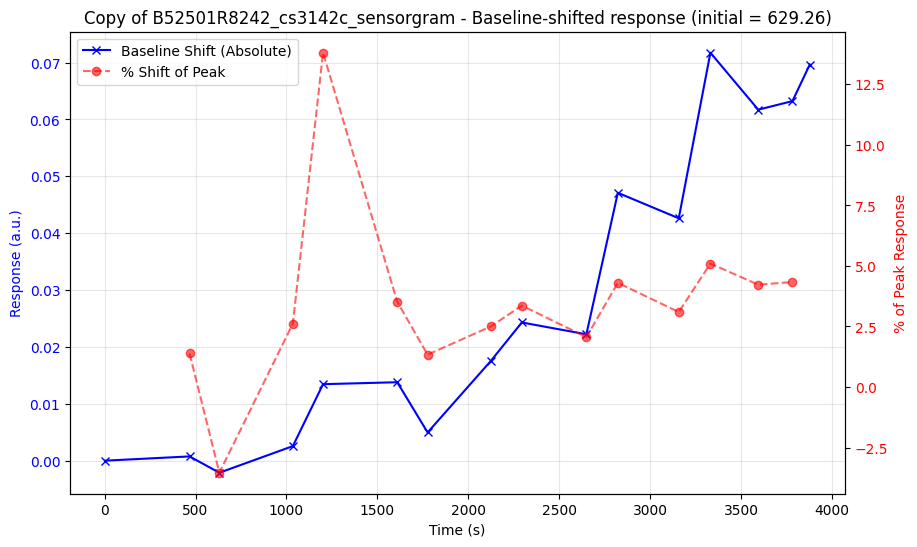
    


<div>
<style scoped>
    .dataframe tbody tr th:only-of-type {
        vertical-align: middle;
    }

    .dataframe tbody tr th {
        vertical-align: top;
    }

    .dataframe thead th {
        text-align: right;
    }
</style>
<table border="1" class="dataframe">
  <thead>
    <tr style="text-align: right;">
      <th></th>
      <th>Measurement Step</th>
      <th>Absolute Peak (RU)</th>
      <th>Absolute Baseline (RU)</th>
      <th>Baseline Shift (ΔRU)</th>
      <th>% Shift of Peak</th>
    </tr>
  </thead>
  <tbody>
    <tr>
      <th>0</th>
      <td>Initial Baseline</td>
      <td>NaN</td>
      <td>629.263</td>
      <td>0.000</td>
      <td>NaN</td>
    </tr>
    <tr>
      <th>1</th>
      <td>Baseline Window (5ug/ml / 5ug/ml)</td>
      <td>629.317</td>
      <td>629.264</td>
      <td>0.001</td>
      <td>1.385</td>
    </tr>
    <tr>
      <th>2</th>
      <td>Baseline Window (5ug/ml / 10ug/ml)</td>
      <td>629.323</td>
      <td>629.261</td>
      <td>-0.002</td>
      <td>-3.540</td>
    </tr>
    <tr>
      <th>3</th>
      <td>Baseline Window (10ug/ml / 10ug/ml)</td>
      <td>629.361</td>
      <td>629.266</td>
      <td>0.003</td>
      <td>2.617</td>
    </tr>
    <tr>
      <th>4</th>
      <td>Baseline Window (10ug/ml / 50ug/ml)</td>
      <td>629.361</td>
      <td>629.277</td>
      <td>0.013</td>
      <td>13.805</td>
    </tr>
    <tr>
      <th>5</th>
      <td>Baseline Window (50ug/ml / 50ug/ml)</td>
      <td>629.655</td>
      <td>629.277</td>
      <td>0.014</td>
      <td>3.520</td>
    </tr>
    <tr>
      <th>6</th>
      <td>Baseline Window (50ug/ml / 100ug/ml)</td>
      <td>629.635</td>
      <td>629.268</td>
      <td>0.005</td>
      <td>1.336</td>
    </tr>
    <tr>
      <th>7</th>
      <td>Baseline Window (100ug/ml / 100ug/ml)</td>
      <td>629.965</td>
      <td>629.281</td>
      <td>0.018</td>
      <td>2.502</td>
    </tr>
    <tr>
      <th>8</th>
      <td>Baseline Window (100ug/ml / 200ug/ml)</td>
      <td>629.986</td>
      <td>629.288</td>
      <td>0.024</td>
      <td>3.363</td>
    </tr>
    <tr>
      <th>9</th>
      <td>Baseline Window (200ug/ml / 200ug/ml)</td>
      <td>630.342</td>
      <td>629.286</td>
      <td>0.022</td>
      <td>2.060</td>
    </tr>
    <tr>
      <th>10</th>
      <td>Baseline Window (200ug/ml / 1000ug/ml)</td>
      <td>630.359</td>
      <td>629.311</td>
      <td>0.047</td>
      <td>4.301</td>
    </tr>
    <tr>
      <th>11</th>
      <td>Baseline Window (1000ug/ml / 1000ug/ml)</td>
      <td>630.639</td>
      <td>629.306</td>
      <td>0.043</td>
      <td>3.097</td>
    </tr>
    <tr>
      <th>12</th>
      <td>Baseline Window (1000ug/ml / 1500ug/ml)</td>
      <td>630.671</td>
      <td>629.335</td>
      <td>0.072</td>
      <td>5.098</td>
    </tr>
    <tr>
      <th>13</th>
      <td>Baseline Window (1500ug/ml / 1500ug/ml)</td>
      <td>630.724</td>
      <td>629.325</td>
      <td>0.062</td>
      <td>4.226</td>
    </tr>
    <tr>
      <th>14</th>
      <td>Baseline Window (1500ug/ml / Final)</td>
      <td>630.722</td>
      <td>629.327</td>
      <td>0.063</td>
      <td>4.335</td>
    </tr>
    <tr>
      <th>15</th>
      <td>Final Baseline</td>
      <td>NaN</td>
      <td>629.333</td>
      <td>0.070</td>
      <td>NaN</td>
    </tr>
  </tbody>
</table>
</div>


## $\color{yellow}{\text{Binding Kinetics}}$


```python
# Runs association and dissociation binding-kinetics analysis
kinetics_results = run_binding_kinetics_analysis(files)
```

    
    ========================================
    Kinetics Analysis: 2026-04-13
    ========================================
    


<div>
<style scoped>
    .dataframe tbody tr th:only-of-type {
        vertical-align: middle;
    }

    .dataframe tbody tr th {
        vertical-align: top;
    }

    .dataframe thead th {
        text-align: right;
    }
</style>
<table border="1" class="dataframe">
  <thead>
    <tr style="text-align: right;">
      <th></th>
      <th>File</th>
      <th>ka (ug/ml*s)^-1</th>
      <th>kd_intercept (s^-1)</th>
      <th>kd_dissoc_mean (s^-1)</th>
      <th>KD (ug/ml)</th>
      <th>kobs_fit_R2</th>
    </tr>
  </thead>
  <tbody>
    <tr>
      <th>0</th>
      <td>Copy of B52501R8242_csa5eb7_sensorgram</td>
      <td>0.000161</td>
      <td>0.067130</td>
      <td>1.108434</td>
      <td>416.729054</td>
      <td>0.543534</td>
    </tr>
    <tr>
      <th>1</th>
      <td>Copy of B52501R8242_csda3af_sensorgram</td>
      <td>0.000099</td>
      <td>0.015485</td>
      <td>1.054358</td>
      <td>155.742961</td>
      <td>0.992860</td>
    </tr>
  </tbody>
</table>
</div>


    
    --- Chip ID: B52501R8242 | Measurement ID: csa5eb7 ---
    


<div>
<style scoped>
    .dataframe tbody tr th:only-of-type {
        vertical-align: middle;
    }

    .dataframe tbody tr th {
        vertical-align: top;
    }

    .dataframe thead th {
        text-align: right;
    }
</style>
<table border="1" class="dataframe">
  <thead>
    <tr style="text-align: right;">
      <th></th>
      <th>Measurement</th>
      <th>Concentration (ug/ml)</th>
      <th>k_obs (s^-1)</th>
      <th>k_d (s^-1)</th>
      <th>k_a (calc)</th>
      <th>K_D</th>
      <th>R_eq</th>
      <th>Warning</th>
    </tr>
  </thead>
  <tbody>
    <tr>
      <th>0</th>
      <td>5ug/ml-1</td>
      <td>5.0</td>
      <td>0.022228</td>
      <td>0.501848</td>
      <td>-0.095924</td>
      <td>-5.231729</td>
      <td>0.341849</td>
      <td>kd &gt;= kobs (Negative k_a)</td>
    </tr>
    <tr>
      <th>1</th>
      <td>5ug/ml-2</td>
      <td>5.0</td>
      <td>0.024175</td>
      <td>0.548498</td>
      <td>-0.104865</td>
      <td>-5.230536</td>
      <td>0.346382</td>
      <td>kd &gt;= kobs (Negative k_a)</td>
    </tr>
    <tr>
      <th>2</th>
      <td>10ug/ml-1</td>
      <td>10.0</td>
      <td>0.023649</td>
      <td>0.685994</td>
      <td>-0.066235</td>
      <td>-10.357042</td>
      <td>0.629477</td>
      <td>kd &gt;= kobs (Negative k_a)</td>
    </tr>
    <tr>
      <th>3</th>
      <td>10ug/ml-2</td>
      <td>10.0</td>
      <td>0.023819</td>
      <td>1.192559</td>
      <td>-0.116874</td>
      <td>-10.203802</td>
      <td>0.634378</td>
      <td>kd &gt;= kobs (Negative k_a)</td>
    </tr>
    <tr>
      <th>4</th>
      <td>50ug/ml-1</td>
      <td>50.0</td>
      <td>0.055752</td>
      <td>0.966682</td>
      <td>-0.018219</td>
      <td>-53.060195</td>
      <td>1.438112</td>
      <td>kd &gt;= kobs (Negative k_a)</td>
    </tr>
    <tr>
      <th>5</th>
      <td>50ug/ml-2</td>
      <td>50.0</td>
      <td>0.056201</td>
      <td>1.706240</td>
      <td>-0.033001</td>
      <td>-51.703033</td>
      <td>1.471314</td>
      <td>kd &gt;= kobs (Negative k_a)</td>
    </tr>
    <tr>
      <th>6</th>
      <td>100ug/ml-1</td>
      <td>100.0</td>
      <td>0.093773</td>
      <td>0.977264</td>
      <td>-0.008835</td>
      <td>-110.613961</td>
      <td>1.487929</td>
      <td>kd &gt;= kobs (Negative k_a)</td>
    </tr>
    <tr>
      <th>7</th>
      <td>100ug/ml-2</td>
      <td>100.0</td>
      <td>0.092262</td>
      <td>0.611013</td>
      <td>-0.005188</td>
      <td>-117.785328</td>
      <td>1.463921</td>
      <td>kd &gt;= kobs (Negative k_a)</td>
    </tr>
    <tr>
      <th>8</th>
      <td>200ug/ml-1</td>
      <td>200.0</td>
      <td>0.156298</td>
      <td>1.944472</td>
      <td>-0.008941</td>
      <td>-217.481305</td>
      <td>1.704761</td>
      <td>kd &gt;= kobs (Negative k_a)</td>
    </tr>
    <tr>
      <th>9</th>
      <td>200ug/ml-2</td>
      <td>200.0</td>
      <td>0.151251</td>
      <td>1.790563</td>
      <td>-0.008197</td>
      <td>-218.453003</td>
      <td>1.545877</td>
      <td>kd &gt;= kobs (Negative k_a)</td>
    </tr>
    <tr>
      <th>10</th>
      <td>1000ug/ml-1</td>
      <td>1000.0</td>
      <td>0.423869</td>
      <td>1.437933</td>
      <td>-0.001014</td>
      <td>-1417.989858</td>
      <td>1.841526</td>
      <td>kd &gt;= kobs (Negative k_a)</td>
    </tr>
    <tr>
      <th>11</th>
      <td>1000ug/ml-2</td>
      <td>1000.0</td>
      <td>0.341921</td>
      <td>2.148509</td>
      <td>-0.001807</td>
      <td>-1189.263640</td>
      <td>2.183442</td>
      <td>kd &gt;= kobs (Negative k_a)</td>
    </tr>
    <tr>
      <th>12</th>
      <td>1500ug/ml-1</td>
      <td>1500.0</td>
      <td>0.234396</td>
      <td>1.006491</td>
      <td>-0.000515</td>
      <td>-1955.376472</td>
      <td>2.241214</td>
      <td>kd &gt;= kobs (Negative k_a)</td>
    </tr>
    <tr>
      <th>13</th>
      <td>1500ug/ml-2</td>
      <td>1500.0</td>
      <td>0.163246</td>
      <td>0.000007</td>
      <td>0.000109</td>
      <td>0.062683</td>
      <td>-0.075572</td>
      <td></td>
    </tr>
  </tbody>
</table>
</div>


    
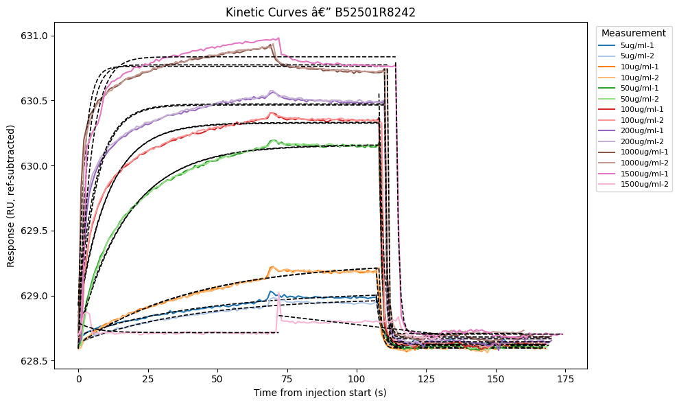
    


    
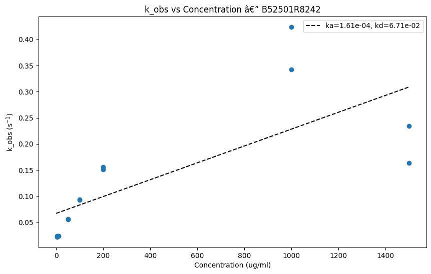
    


    
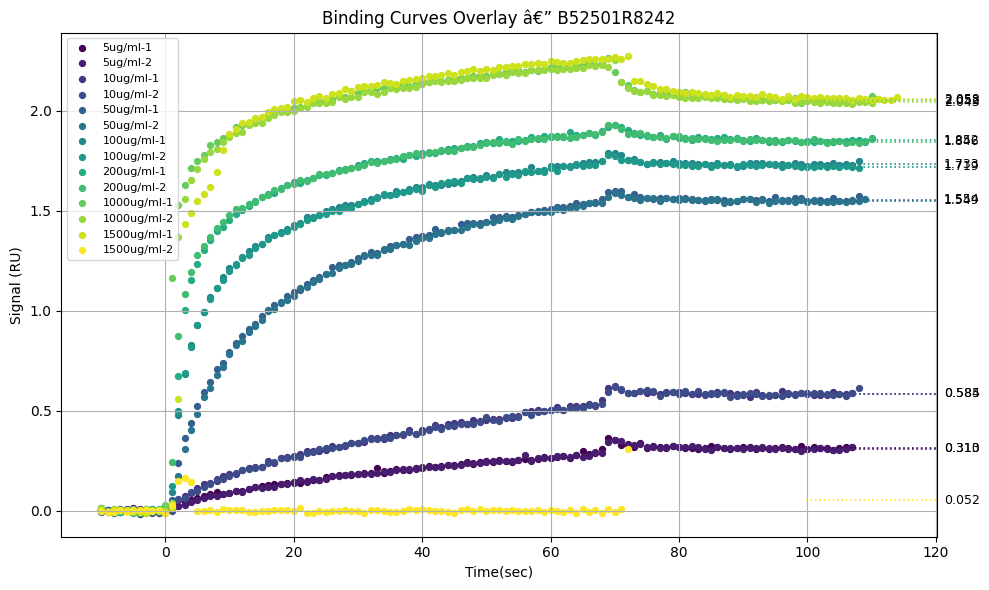
    


    
    --- Chip ID: B52501R8242 | Measurement ID: csda3af ---
    


<div>
<style scoped>
    .dataframe tbody tr th:only-of-type {
        vertical-align: middle;
    }

    .dataframe tbody tr th {
        vertical-align: top;
    }

    .dataframe thead th {
        text-align: right;
    }
</style>
<table border="1" class="dataframe">
  <thead>
    <tr style="text-align: right;">
      <th></th>
      <th>Measurement</th>
      <th>Concentration (ug/ml)</th>
      <th>k_obs (s^-1)</th>
      <th>k_d (s^-1)</th>
      <th>k_a (calc)</th>
      <th>K_D</th>
      <th>R_eq</th>
      <th>Warning</th>
    </tr>
  </thead>
  <tbody>
    <tr>
      <th>0</th>
      <td>5ug/ml-1</td>
      <td>5.0</td>
      <td>0.007486</td>
      <td>0.994207</td>
      <td>-0.197344</td>
      <td>-5.037933</td>
      <td>0.085513</td>
      <td>kd &gt;= kobs (Negative k_a)</td>
    </tr>
    <tr>
      <th>1</th>
      <td>5ug/ml-2</td>
      <td>5.0</td>
      <td>0.009422</td>
      <td>0.000050</td>
      <td>0.001874</td>
      <td>0.026430</td>
      <td>0.067871</td>
      <td></td>
    </tr>
    <tr>
      <th>2</th>
      <td>10ug/ml-1</td>
      <td>10.0</td>
      <td>0.017590</td>
      <td>0.466487</td>
      <td>-0.044890</td>
      <td>-10.391845</td>
      <td>0.101458</td>
      <td>kd &gt;= kobs (Negative k_a)</td>
    </tr>
    <tr>
      <th>3</th>
      <td>10ug/ml-2</td>
      <td>10.0</td>
      <td>0.013637</td>
      <td>0.922867</td>
      <td>-0.090923</td>
      <td>-10.149984</td>
      <td>0.116001</td>
      <td>kd &gt;= kobs (Negative k_a)</td>
    </tr>
    <tr>
      <th>4</th>
      <td>50ug/ml-1</td>
      <td>50.0</td>
      <td>0.023640</td>
      <td>0.890679</td>
      <td>-0.017341</td>
      <td>-51.363240</td>
      <td>0.393914</td>
      <td>kd &gt;= kobs (Negative k_a)</td>
    </tr>
    <tr>
      <th>5</th>
      <td>50ug/ml-2</td>
      <td>50.0</td>
      <td>0.022934</td>
      <td>1.192607</td>
      <td>-0.023393</td>
      <td>-50.980374</td>
      <td>0.396571</td>
      <td>kd &gt;= kobs (Negative k_a)</td>
    </tr>
    <tr>
      <th>6</th>
      <td>100ug/ml-1</td>
      <td>100.0</td>
      <td>0.025262</td>
      <td>1.373495</td>
      <td>-0.013482</td>
      <td>-101.873704</td>
      <td>0.829469</td>
      <td>kd &gt;= kobs (Negative k_a)</td>
    </tr>
    <tr>
      <th>7</th>
      <td>100ug/ml-2</td>
      <td>100.0</td>
      <td>0.025038</td>
      <td>1.025538</td>
      <td>-0.010005</td>
      <td>-102.502560</td>
      <td>0.828574</td>
      <td>kd &gt;= kobs (Negative k_a)</td>
    </tr>
    <tr>
      <th>8</th>
      <td>200ug/ml-1</td>
      <td>200.0</td>
      <td>0.039942</td>
      <td>1.401042</td>
      <td>-0.006806</td>
      <td>-205.869003</td>
      <td>1.339733</td>
      <td>kd &gt;= kobs (Negative k_a)</td>
    </tr>
    <tr>
      <th>9</th>
      <td>200ug/ml-2</td>
      <td>200.0</td>
      <td>0.039828</td>
      <td>1.506894</td>
      <td>-0.007335</td>
      <td>-205.429570</td>
      <td>1.308568</td>
      <td>kd &gt;= kobs (Negative k_a)</td>
    </tr>
    <tr>
      <th>10</th>
      <td>1000ug/ml-1</td>
      <td>1000.0</td>
      <td>0.122883</td>
      <td>0.681161</td>
      <td>-0.000558</td>
      <td>-1220.110687</td>
      <td>1.524371</td>
      <td>kd &gt;= kobs (Negative k_a)</td>
    </tr>
    <tr>
      <th>11</th>
      <td>1000ug/ml-2</td>
      <td>1000.0</td>
      <td>0.118797</td>
      <td>0.000014</td>
      <td>0.000119</td>
      <td>0.114170</td>
      <td>1.588324</td>
      <td></td>
    </tr>
    <tr>
      <th>12</th>
      <td>1500ug/ml-1</td>
      <td>1500.0</td>
      <td>0.159682</td>
      <td>2.015249</td>
      <td>-0.001237</td>
      <td>-1629.083519</td>
      <td>1.577798</td>
      <td>kd &gt;= kobs (Negative k_a)</td>
    </tr>
    <tr>
      <th>13</th>
      <td>1500ug/ml-2</td>
      <td>1500.0</td>
      <td>0.160377</td>
      <td>2.290721</td>
      <td>-0.001420</td>
      <td>-1612.923570</td>
      <td>1.639462</td>
      <td>kd &gt;= kobs (Negative k_a)</td>
    </tr>
  </tbody>
</table>
</div>


    
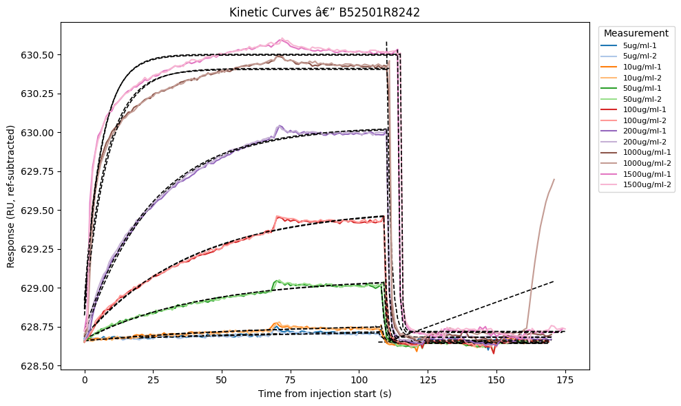
    


    
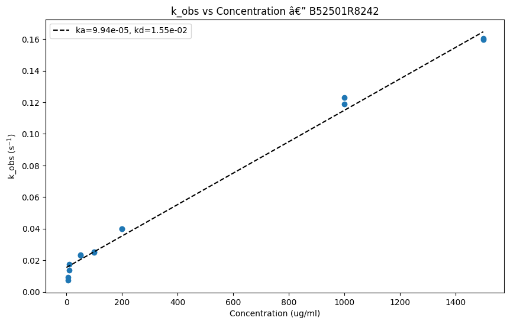
    


    
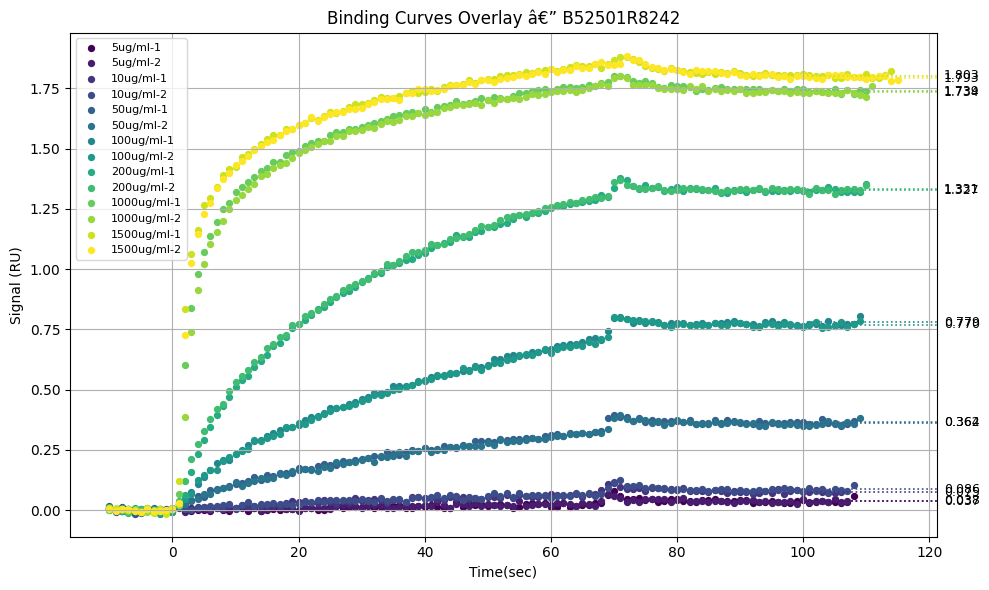
    


    
    ========================================
    Kinetics Analysis: 2026-04-15
    ========================================
    


<div>
<style scoped>
    .dataframe tbody tr th:only-of-type {
        vertical-align: middle;
    }

    .dataframe tbody tr th {
        vertical-align: top;
    }

    .dataframe thead th {
        text-align: right;
    }
</style>
<table border="1" class="dataframe">
  <thead>
    <tr style="text-align: right;">
      <th></th>
      <th>File</th>
      <th>ka (ug/ml*s)^-1</th>
      <th>kd_intercept (s^-1)</th>
      <th>kd_dissoc_mean (s^-1)</th>
      <th>KD (ug/ml)</th>
      <th>kobs_fit_R2</th>
    </tr>
  </thead>
  <tbody>
    <tr>
      <th>0</th>
      <td>Copy of B52501R8242_cs5dbc5_sensorgram</td>
      <td>0.000093</td>
      <td>0.024201</td>
      <td>0.578422</td>
      <td>261.032279</td>
      <td>0.99225</td>
    </tr>
  </tbody>
</table>
</div>


    
    --- Chip ID: B52501R8242 | Measurement ID: cs5dbc5 ---
    


<div>
<style scoped>
    .dataframe tbody tr th:only-of-type {
        vertical-align: middle;
    }

    .dataframe tbody tr th {
        vertical-align: top;
    }

    .dataframe thead th {
        text-align: right;
    }
</style>
<table border="1" class="dataframe">
  <thead>
    <tr style="text-align: right;">
      <th></th>
      <th>Measurement</th>
      <th>Concentration (ug/ml)</th>
      <th>k_obs (s^-1)</th>
      <th>k_d (s^-1)</th>
      <th>k_a (calc)</th>
      <th>K_D</th>
      <th>R_eq</th>
      <th>Warning</th>
    </tr>
  </thead>
  <tbody>
    <tr>
      <th>0</th>
      <td>5ug/ml-1</td>
      <td>5.0</td>
      <td>0.023976</td>
      <td>0.000057</td>
      <td>0.004784</td>
      <td>0.012001</td>
      <td>0.052325</td>
      <td></td>
    </tr>
    <tr>
      <th>1</th>
      <td>5ug/ml-2</td>
      <td>5.0</td>
      <td>0.021552</td>
      <td>0.000054</td>
      <td>0.004300</td>
      <td>0.012541</td>
      <td>0.052901</td>
      <td></td>
    </tr>
    <tr>
      <th>2</th>
      <td>10ug/ml-1</td>
      <td>10.0</td>
      <td>0.024365</td>
      <td>0.000051</td>
      <td>0.002431</td>
      <td>0.021152</td>
      <td>0.090476</td>
      <td></td>
    </tr>
    <tr>
      <th>3</th>
      <td>10ug/ml-2</td>
      <td>10.0</td>
      <td>0.025405</td>
      <td>0.703288</td>
      <td>-0.067788</td>
      <td>-10.374775</td>
      <td>0.090167</td>
      <td>kd &gt;= kobs (Negative k_a)</td>
    </tr>
    <tr>
      <th>4</th>
      <td>50ug/ml-1</td>
      <td>50.0</td>
      <td>0.027284</td>
      <td>0.666999</td>
      <td>-0.012794</td>
      <td>-52.132540</td>
      <td>0.422782</td>
      <td>kd &gt;= kobs (Negative k_a)</td>
    </tr>
    <tr>
      <th>5</th>
      <td>50ug/ml-2</td>
      <td>50.0</td>
      <td>0.026525</td>
      <td>0.860741</td>
      <td>-0.016684</td>
      <td>-51.589825</td>
      <td>0.420027</td>
      <td>kd &gt;= kobs (Negative k_a)</td>
    </tr>
    <tr>
      <th>6</th>
      <td>100ug/ml-1</td>
      <td>100.0</td>
      <td>0.029560</td>
      <td>0.425974</td>
      <td>-0.003964</td>
      <td>-107.456750</td>
      <td>0.785814</td>
      <td>kd &gt;= kobs (Negative k_a)</td>
    </tr>
    <tr>
      <th>7</th>
      <td>100ug/ml-2</td>
      <td>100.0</td>
      <td>0.029774</td>
      <td>0.610631</td>
      <td>-0.005809</td>
      <td>-105.125851</td>
      <td>0.775647</td>
      <td>kd &gt;= kobs (Negative k_a)</td>
    </tr>
    <tr>
      <th>8</th>
      <td>200ug/ml-1</td>
      <td>200.0</td>
      <td>0.048543</td>
      <td>1.873666</td>
      <td>-0.009126</td>
      <td>-205.319394</td>
      <td>1.098598</td>
      <td>kd &gt;= kobs (Negative k_a)</td>
    </tr>
    <tr>
      <th>9</th>
      <td>200ug/ml-2</td>
      <td>200.0</td>
      <td>0.048902</td>
      <td>0.951995</td>
      <td>-0.004515</td>
      <td>-210.829955</td>
      <td>1.083305</td>
      <td>kd &gt;= kobs (Negative k_a)</td>
    </tr>
    <tr>
      <th>10</th>
      <td>1000ug/ml-1</td>
      <td>1000.0</td>
      <td>0.124767</td>
      <td>0.673178</td>
      <td>-0.000548</td>
      <td>-1227.505125</td>
      <td>1.406547</td>
      <td>kd &gt;= kobs (Negative k_a)</td>
    </tr>
    <tr>
      <th>11</th>
      <td>1000ug/ml-2</td>
      <td>1000.0</td>
      <td>0.123278</td>
      <td>0.000010</td>
      <td>0.000123</td>
      <td>0.079970</td>
      <td>1.365806</td>
      <td></td>
    </tr>
    <tr>
      <th>12</th>
      <td>1500ug/ml-1</td>
      <td>1500.0</td>
      <td>0.160327</td>
      <td>0.700349</td>
      <td>-0.000360</td>
      <td>-1945.333319</td>
      <td>1.381452</td>
      <td>kd &gt;= kobs (Negative k_a)</td>
    </tr>
    <tr>
      <th>13</th>
      <td>1500ug/ml-2</td>
      <td>1500.0</td>
      <td>0.155784</td>
      <td>0.630911</td>
      <td>-0.000317</td>
      <td>-1991.816057</td>
      <td>1.518275</td>
      <td>kd &gt;= kobs (Negative k_a)</td>
    </tr>
  </tbody>
</table>
</div>


    
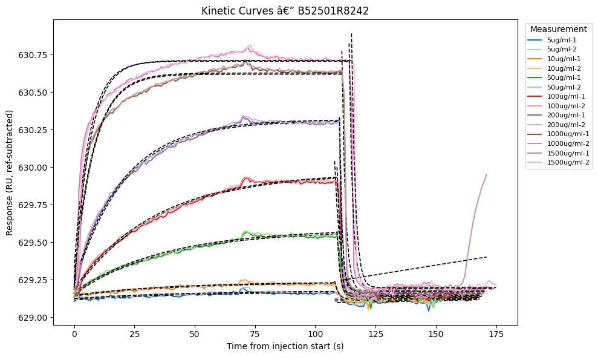
    


    
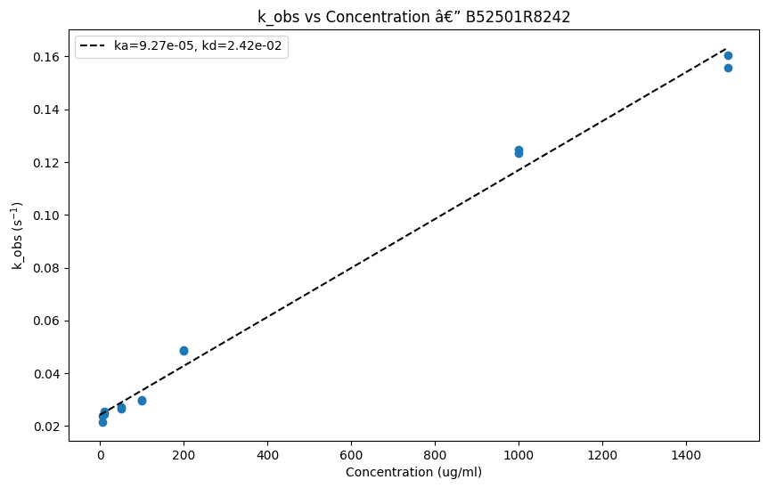
    


    
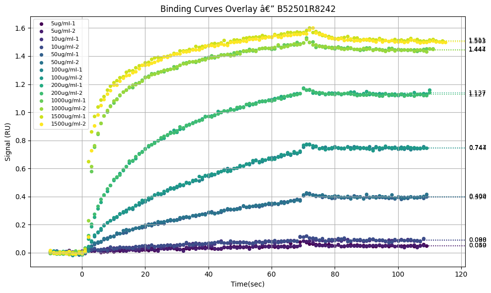
    


    
    ========================================
    Kinetics Analysis: 2026-04-16
    ========================================
    


<div>
<style scoped>
    .dataframe tbody tr th:only-of-type {
        vertical-align: middle;
    }

    .dataframe tbody tr th {
        vertical-align: top;
    }

    .dataframe thead th {
        text-align: right;
    }
</style>
<table border="1" class="dataframe">
  <thead>
    <tr style="text-align: right;">
      <th></th>
      <th>File</th>
      <th>ka (ug/ml*s)^-1</th>
      <th>kd_intercept (s^-1)</th>
      <th>kd_dissoc_mean (s^-1)</th>
      <th>KD (ug/ml)</th>
      <th>kobs_fit_R2</th>
    </tr>
  </thead>
  <tbody>
    <tr>
      <th>0</th>
      <td>Copy of B52501R8242_cs3142c_sensorgram</td>
      <td>0.000079</td>
      <td>0.026359</td>
      <td>0.597233</td>
      <td>335.229712</td>
      <td>0.979045</td>
    </tr>
  </tbody>
</table>
</div>


    
    --- Chip ID: B52501R8242 | Measurement ID: cs3142c ---
    


<div>
<style scoped>
    .dataframe tbody tr th:only-of-type {
        vertical-align: middle;
    }

    .dataframe tbody tr th {
        vertical-align: top;
    }

    .dataframe thead th {
        text-align: right;
    }
</style>
<table border="1" class="dataframe">
  <thead>
    <tr style="text-align: right;">
      <th></th>
      <th>Measurement</th>
      <th>Concentration (ug/ml)</th>
      <th>k_obs (s^-1)</th>
      <th>k_d (s^-1)</th>
      <th>k_a (calc)</th>
      <th>K_D</th>
      <th>R_eq</th>
      <th>Warning</th>
    </tr>
  </thead>
  <tbody>
    <tr>
      <th>0</th>
      <td>5ug/ml-1</td>
      <td>5.0</td>
      <td>0.029560</td>
      <td>0.000055</td>
      <td>0.005901</td>
      <td>0.009309</td>
      <td>0.033656</td>
      <td></td>
    </tr>
    <tr>
      <th>1</th>
      <td>5ug/ml-2</td>
      <td>5.0</td>
      <td>0.021024</td>
      <td>0.000051</td>
      <td>0.004195</td>
      <td>0.012187</td>
      <td>0.038738</td>
      <td></td>
    </tr>
    <tr>
      <th>2</th>
      <td>10ug/ml-1</td>
      <td>10.0</td>
      <td>0.026378</td>
      <td>0.000042</td>
      <td>0.002634</td>
      <td>0.015830</td>
      <td>0.076633</td>
      <td></td>
    </tr>
    <tr>
      <th>3</th>
      <td>10ug/ml-2</td>
      <td>10.0</td>
      <td>0.027768</td>
      <td>0.652916</td>
      <td>-0.062515</td>
      <td>-10.444188</td>
      <td>0.080363</td>
      <td>kd &gt;= kobs (Negative k_a)</td>
    </tr>
    <tr>
      <th>4</th>
      <td>50ug/ml-1</td>
      <td>50.0</td>
      <td>0.026237</td>
      <td>1.056391</td>
      <td>-0.020603</td>
      <td>-51.273440</td>
      <td>0.362336</td>
      <td>kd &gt;= kobs (Negative k_a)</td>
    </tr>
    <tr>
      <th>5</th>
      <td>50ug/ml-2</td>
      <td>50.0</td>
      <td>0.028391</td>
      <td>0.641539</td>
      <td>-0.012263</td>
      <td>-52.315172</td>
      <td>0.374679</td>
      <td>kd &gt;= kobs (Negative k_a)</td>
    </tr>
    <tr>
      <th>6</th>
      <td>100ug/ml-1</td>
      <td>100.0</td>
      <td>0.030231</td>
      <td>0.614057</td>
      <td>-0.005838</td>
      <td>-105.178132</td>
      <td>0.703538</td>
      <td>kd &gt;= kobs (Negative k_a)</td>
    </tr>
    <tr>
      <th>7</th>
      <td>100ug/ml-2</td>
      <td>100.0</td>
      <td>0.030379</td>
      <td>0.968450</td>
      <td>-0.009381</td>
      <td>-103.238401</td>
      <td>0.704078</td>
      <td>kd &gt;= kobs (Negative k_a)</td>
    </tr>
    <tr>
      <th>8</th>
      <td>200ug/ml-1</td>
      <td>200.0</td>
      <td>0.048397</td>
      <td>0.989036</td>
      <td>-0.004703</td>
      <td>-210.290312</td>
      <td>0.978075</td>
      <td>kd &gt;= kobs (Negative k_a)</td>
    </tr>
    <tr>
      <th>9</th>
      <td>200ug/ml-2</td>
      <td>200.0</td>
      <td>0.048052</td>
      <td>1.371668</td>
      <td>-0.006618</td>
      <td>-207.260706</td>
      <td>0.983301</td>
      <td>kd &gt;= kobs (Negative k_a)</td>
    </tr>
    <tr>
      <th>10</th>
      <td>1000ug/ml-1</td>
      <td>1000.0</td>
      <td>0.116774</td>
      <td>0.634648</td>
      <td>-0.000518</td>
      <td>-1225.487679</td>
      <td>1.152006</td>
      <td>kd &gt;= kobs (Negative k_a)</td>
    </tr>
    <tr>
      <th>11</th>
      <td>1000ug/ml-2</td>
      <td>1000.0</td>
      <td>0.109630</td>
      <td>0.000028</td>
      <td>0.000110</td>
      <td>0.254655</td>
      <td>1.057877</td>
      <td></td>
    </tr>
    <tr>
      <th>12</th>
      <td>1500ug/ml-1</td>
      <td>1500.0</td>
      <td>0.129288</td>
      <td>0.809216</td>
      <td>-0.000453</td>
      <td>-1785.225036</td>
      <td>1.032815</td>
      <td>kd &gt;= kobs (Negative k_a)</td>
    </tr>
    <tr>
      <th>13</th>
      <td>1500ug/ml-2</td>
      <td>1500.0</td>
      <td>0.147459</td>
      <td>0.623168</td>
      <td>-0.000317</td>
      <td>-1964.964965</td>
      <td>1.268545</td>
      <td>kd &gt;= kobs (Negative k_a)</td>
    </tr>
  </tbody>
</table>
</div>


    
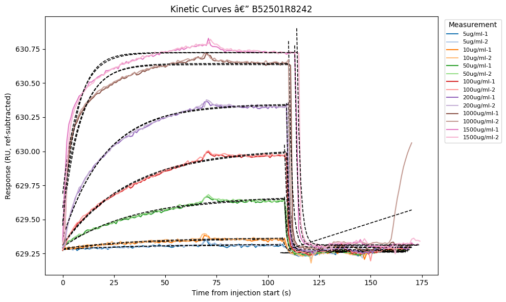
    


    
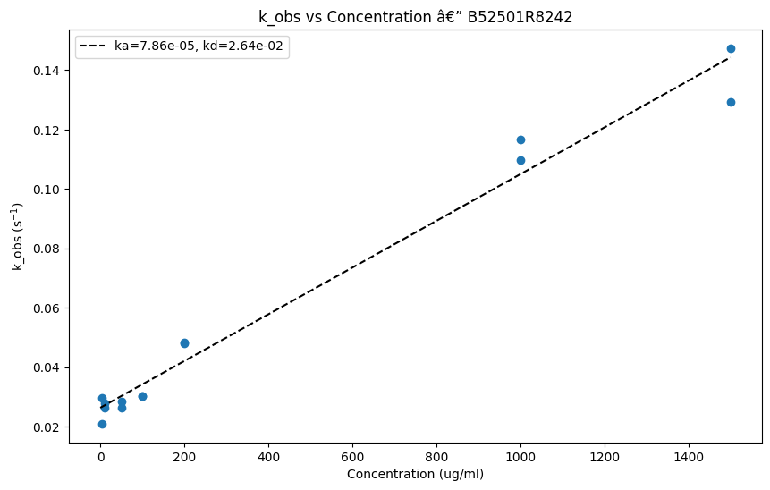
    


    
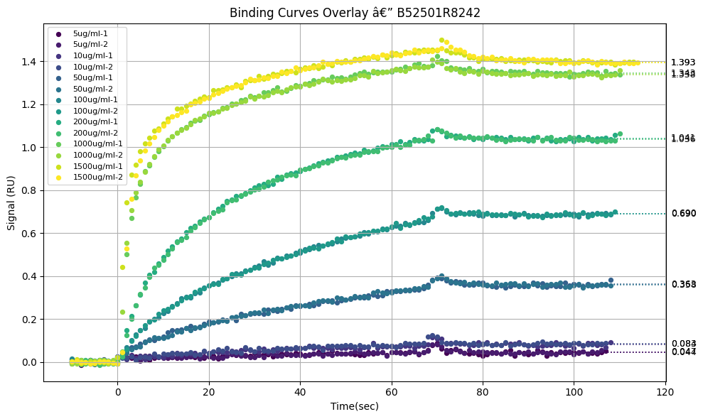
    


# $\color{cyan}{\text{Run Check}}$


```python
# Confirms that the primary analysis workflow has completed
print('run completed')
```

    run completed
    

## $\color{yellow}{\text{Seperate}}$


```python
# Counts the initial channel ordering across PEL sensorgram files
total_ch1_less = 0
total_ch2_less = 0
total_equal = 0

# Loops through each key and value in the dictionary
for file_name, file_data in bucket_data['Sensorgram'].items():

    if file_data['quad_ch1'].iloc[0] < file_data['quad_ch2'].iloc[0]:
        total_ch1_less += 1
    elif file_data['quad_ch1'].iloc[0] > file_data['quad_ch2'].iloc[0]:
        total_ch2_less += 1
    else:
        total_equal += 1

# Prints Summary
print('Ch1 < Ch2: ', total_ch1_less)
print('Ch1 > Ch2: ', total_ch2_less)
print('Ch1 = Ch2: ', total_equal)
```

    Ch1 < Ch2:  185
    Ch1 > Ch2:  9
    Ch1 = Ch2:  4
    


```python
# Counts the initial channel ordering across RefPoly4 immobilisation files
total_ch1_less = 0
total_ch2_less = 0
total_equal = 0

# Loops through each key and value in the dictionary
for file_name, file_data in bucket_data['RefPoly4'].items():

    if file_data['channel1'].iloc[0] < file_data['channel2'].iloc[0]:
        total_ch1_less += 1
    elif file_data['channel1'].iloc[0] > file_data['channel2'].iloc[0]:
        total_ch2_less += 1
    else:
        total_equal += 1

# Prints Summary
print('Ch1 < Ch2: ', total_ch1_less)
print('Ch1 > Ch2: ', total_ch2_less)
print('Ch1 = Ch2: ', total_equal)
```

    Ch1 < Ch2:  16
    Ch1 > Ch2:  12
    Ch1 = Ch2:  0
    

## $\color{yellow}{\text{Overall}}$


```python
# Initialises variables to track channel-order changes between matched records
total_less_more = 0
total_more_less = 0
total_less = 0
total_more = 0

# Initialises variables to count initial PEL channel ordering
pel_ch1_less = 0
pel_ch2_less = 0
pel_equal = 0

# Initialises variables to count initial immobilisation channel ordering
immob_ch1_less = 0
immob_ch2_less = 0
immob_equal = 0

# Initialises variables to track record matching success
total_not_matched = 0
total_matched = 0

# Initialises variables to count explained and unexplained channel swaps
crossovers_explained_by_chemistry = 0
crossovers_unexplained_true_swaps = 0

# Initialises lists to store affected chip identifiers
ch1_chemistry_chips = []
ch1_unexplained_chips = []
ch1_same_chips = []

# Loops through each row in the PEL upload dataframe
for index, pel_row in tables['pel_upload'].iterrows():

    # Extracts the chip, flag, and sensorgram identifiers
    chip_id = pel_row['chip_id']
    flags_id = pel_row['flags_id']
    sensorgram_file = pel_row['sensorgram']

    # Skips to the next record if the sensorgram file is not found in the bucket data
    if sensorgram_file not in bucket_data['Sensorgram'].keys():
        total_not_matched += 1
        continue
        
    # Retrieves the associated sensorgram data
    file_data = bucket_data['Sensorgram'][sensorgram_file]

    # Searches for a corresponding immobilisation record using the chip identifier
    refpoly4_match = tables['immob'][tables['immob']['chip_id'] == chip_id]

    # Checks whether the matched immobilisation dataframe contains data
    if refpoly4_match.empty:
        total_not_matched += 1
        continue

    # Extracts the matched immobilisation metadata
    immob_row = refpoly4_match.iloc[0]
    immob_flags_file = immob_row['amfFlags']
    
    # Retrieves the associated immobilisation flags
    immob_flags = bucket_data['AMF_FLAGS'].get(immob_flags_file, pd.DataFrame())

    # Sets a boolean flag to verify the presence of 'prg' reagent
    has_prg = False

    # Checks whether the immobilisation flags dataframe contains valid information
    if not immob_flags.empty and 'information' in immob_flags.columns:

        # Evaluates if any row contains the 'prg' identifier
        has_prg = any('prg' in str(row.information).lower() for row in immob_flags.itertuples())
        
    # Skips to the next record if 'prg' is not present
    if not has_prg:
        total_not_matched += 1
        continue

    # Retrieves the associated PEL flags
    pel_flags = tables['flags'][tables['flags']['flags_id'] == flags_id]

    # Checks whether the flag dataframes contain data
    if pel_flags.empty or immob_flags.empty:
        total_not_matched += 1
        continue

    # Increments the matched records counter
    total_matched += 1

    # Retrieves the associated RefPoly4 data
    refpoly4_file = immob_row['refPoly4']
    immob_data = bucket_data['RefPoly4'][refpoly4_file]

    # Extracts the relevant timing flags for comparison
    pel_start_time = pel_flags['Initial']
    pel_final_time = pel_flags['Final']
    immob_initial_time = immob_flags[immob_flags['information'].str.contains('initial', case=False, na=False)]['time'].iloc[0]

    # Interpolates PEL signal values at the start time
    pel_start_1 = np.interp(pel_start_time, file_data['t'], file_data['quad_ch1'])
    pel_start_2 = np.interp(pel_start_time, file_data['t'], file_data['quad_ch2'])
    
    # Interpolates PEL signal values at the final time
    pel_end_1 = np.interp(pel_final_time, file_data['t'], file_data['quad_ch1'])
    pel_end_2 = np.interp(pel_final_time, file_data['t'], file_data['quad_ch2'])
    
    # Interpolates immobilisation signal values at the initial time
    immob_start_1 = np.interp(immob_initial_time, immob_data['time'], immob_data['channel1'])
    immob_start_2 = np.interp(immob_initial_time, immob_data['time'], immob_data['channel2'])

    # Evaluates the initial channel order for the PEL record
    if pel_start_1 < pel_start_2:
        pel_ch1_less += 1
    elif pel_start_1 > pel_start_2:
        pel_ch2_less += 1
    else:
        pel_equal += 1

    # Evaluates the initial channel order for the immobilisation record
    if immob_start_1 < immob_start_2:
        immob_ch1_less += 1
    elif immob_start_1 > immob_start_2:
        immob_ch2_less += 1
    else:
        immob_equal += 1

    # Analyses instances where Channel 1 starts lower in PEL but higher in immobilisation
    if pel_start_1 < pel_start_2 and immob_start_1 > immob_start_2:
        total_less_more += 1
        
        # Checks if the crossover is explained by the chemistry (channels crossed during PEL)
        if pel_end_1 > pel_end_2:
            crossovers_explained_by_chemistry += 1
            ch1_chemistry_chips.append(chip_id)
            
        # Identifies true unexplained swaps
        elif pel_end_1 < pel_end_2:
            crossovers_unexplained_true_swaps += 1
            ch1_unexplained_chips.append(chip_id)
            
        # Categorises ambiguous cases where channels converge
        else:
            ch1_same_chips.append(chip_id)

    # Analyses instances where Channel 1 starts higher in PEL but lower in immobilisation
    elif pel_start_1 > pel_start_2 and immob_start_1 < immob_start_2:
        total_more_less += 1
        
    # Logs cases where the channel order is consistent across stages
    elif pel_start_1 < pel_start_2 and immob_start_1 < immob_start_2:
        total_less += 1
    else:
        total_more += 1

# Prints summary output regarding processed records and potential swaps
print(f'Number of matching PEL and Immob records for PrG: {total_matched}')
print(f'Number of unmatched records: {total_not_matched}')

print('\nPEL (at Start Flag)')
print(f'Ch1 < Ch2: {pel_ch1_less}')
print(f'Ch1 > Ch2: {pel_ch2_less}')
print(f'Ch1 = Ch2: {pel_equal}')

print('\nImmob (at Initial Flag)')
print(f'Ch1 < Ch2: {immob_ch1_less}')
print(f'Ch1 > Ch2: {immob_ch2_less}')
print(f'Ch1 = Ch2: {immob_equal}')

print('\nComparison')
print(f'Ch1 < → Ch1 >: {total_less_more}')
print(f'Ch1 > → Ch1 <: {total_more_less}')
print(f'Ch1 < → Ch1 <: {total_less}')
print(f'Ch1 > → Ch1 >: {total_more}')

print('\nCrossover Verification')
print(f'Total Crossovers (Ch1 started lower in PEL, but higher in Immob): {total_less_more}')
print(f'Explained by Chemistry (Ch1 overtook Ch2 by end of PEL): {crossovers_explained_by_chemistry}')
print(ch1_chemistry_chips)

print(f'Unexplained (True channel swaps between physical stages): {crossovers_unexplained_true_swaps}')
print(ch1_unexplained_chips)

print(f'Ch1 and Ch2 ended same: {len(ch1_same_chips)}')
print(ch1_same_chips)
```

    Number of matching PEL and Immob records for PrG: 26
    Number of unmatched records: 162
    
    PEL (at Start Flag)
    Ch1 < Ch2: 26
    Ch1 > Ch2: 0
    Ch1 = Ch2: 0
    
    Immob (at Initial Flag)
    Ch1 < Ch2: 16
    Ch1 > Ch2: 10
    Ch1 = Ch2: 0
    
    Comparison
    Ch1 < → Ch1 >: 10
    Ch1 > → Ch1 <: 0
    Ch1 < → Ch1 <: 16
    Ch1 > → Ch1 >: 0
    
    Crossover Verification
    Total Crossovers (Ch1 started lower in PEL, but higher in Immob): 10
    Explained by Chemistry (Ch1 overtook Ch2 by end of PEL): 0
    []
    Unexplained (True channel swaps between physical stages): 10
    ['B72604R8030', 'B72604R8039', 'B72604R8011', 'B72604R8037', 'B72604R8038', 'B72604R8047', 'B72604R8053', 'B72604R8057', 'B72604R8058', 'B72604R8117']
    Ch1 and Ch2 ended same: 0
    []
    

# h


```python
from scripts.setup_functions import plot_flags_on_sensorgrams
```


```python
for row in tables['pel_upload'].itertuples():

    if row.chip_id != 'B72604R8027':
        continue

    pel_sensorgram = bucket_data['Sensorgram'].get(row.sensorgram)

    flags_df = tables['flags'][tables['flags']['flags_id'] == row.flags_id]
    times = flags_df.iloc[0][1:].tolist()
    flags_list = flags_df.columns[1:].tolist()

    immob = tables['immob'][tables['immob']['chip_id'] == row.chip_id]

    if immob.empty:
        continue

    try:
        ref_key = immob['refPoly4'].iloc[0]
        amf_key = immob['amfFlags'].iloc[0]
        
        immob_sens = bucket_data['RefPoly4'].get(ref_key)
        immob_flags = bucket_data['AMF_FLAGS'].get(amf_key)
    except:
        print(f"Failed to get immob files for row {row.Index}: {e}")
        continue

    sc = tables['standard_curves'][tables['standard_curves']['chip_id'] == row.chip_id]

    if pel_sensorgram.empty or sc.empty or immob.empty:
        continue

    for i in range(len(times)):
        if flags_list[i] == 'Finish':
            if times[i] == times[i-1]:
                times = times[:-1]
                flags_list = flags_list[:-1]
                flags_list[-1] = 'Final / Finish'
                break

    plot_flags_on_sensorgrams(pel_sensorgram, times, flags_list, title = 'PEL Sensorgram for ' + row.chip_id)
    plot_flags_on_sensorgrams(immob_sens, immob_flags['time'], immob_flags['information'], title = 'Immobilisation Sensorgram for ' + row.chip_id, colours=['r' if 'Buffer' in str(lbl) else 'k' for lbl in immob_flags['information']])

    def parse_delimited(s):
        '''Parses a delimited string field into a list of numeric values.

        Args:
            s (str): Serialised list from a standard-curve record.

        Returns:
            list[float]: Parsed numeric values.
        '''

        sep = '|' if '|' in str(s) else ','
        return [float(v) for v in str(s).split(sep)]

    data_points_SC = {}

    # Loops through each row in the dataframe
    for row in sc.itertuples():

        x = parse_delimited(row.x_csv)
        y = parse_delimited(row.y_csv)

        # Checks for mismatched coordinates
        if len(x) != len(y):
            print(f'Row {row.Index}: mismatched x/y lengths ({len(x)} vs {len(y)})')

        # Standardises the time string format and converts it to a datetime object
        time_str = str(row.time).strip()

        if '-' in time_str and ':' not in time_str:
            time_str = time_str.replace('-', ':')

        dt = pd.to_datetime(f'{row.date} {time_str}', format='%Y-%m-%d %H:%M:%S', errors='coerce')

        data_points_SC[row.standard_curve_uuid] = {
            'x': x,
            'y': y,
            'chip_id': row.chip_id,
            'fit_model': row.fit_model,
            'a': row.a,
            'b': row.b,
            'c': row.c,
            'd': row.d,
            'e': row.e,
            'datetime': dt
        }

    for key, data in data_points_SC.items():
        # Generates logarithmic points to plot the smooth fitted curve
        x_pts = np.logspace(np.log10(min(data['x'])), np.log10(max(data['x'])), 1000)

        # Evaluates the five-parameter logistic model using stored parameters
        if data['fit_model'] == '5PL':
            y_pts = five_pl(x_pts, data['a'], data['d'], data['c'], data['b'], data['e']) 
        else:
            y_pts = four_pl(x_pts, data['a'], data['d'], data['c'], data['b'])

        # Plots measured standard-curve points against the stored fit parameters
        plt.figure(figsize=(10, 6))
        plt.scatter(data['x'], data['y'], label='Data', color='blue')
        plt.plot(x_pts, y_pts, color='red', label='Stored Fit')

        plt.xscale('log')
        plt.title(f"Standard Curve {key} (Chip: {data['chip_id']})")
        plt.xlabel('Concentration (ug/ml)')
        plt.ylabel('Signal')
        plt.legend()
        plt.show()
```


    
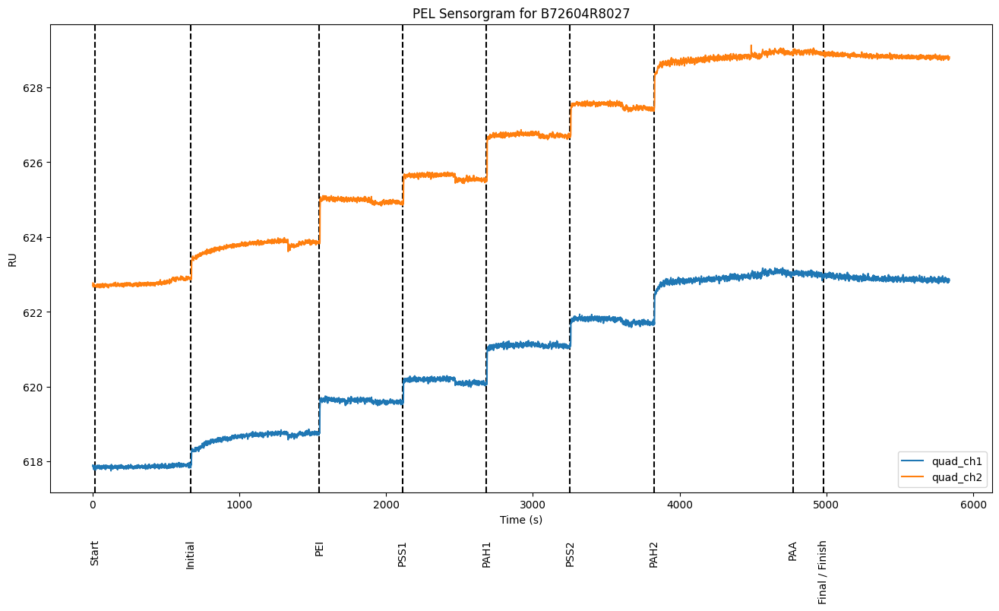
    


    
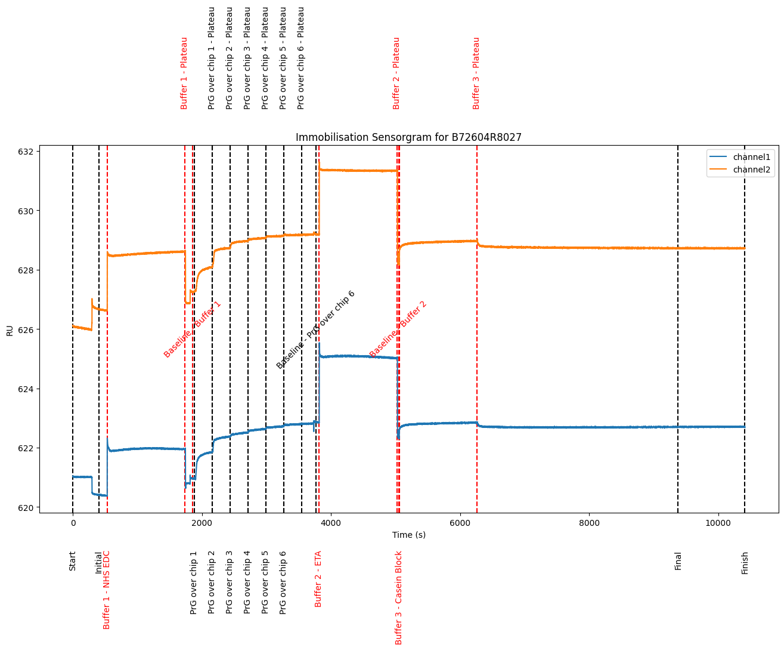
    


    
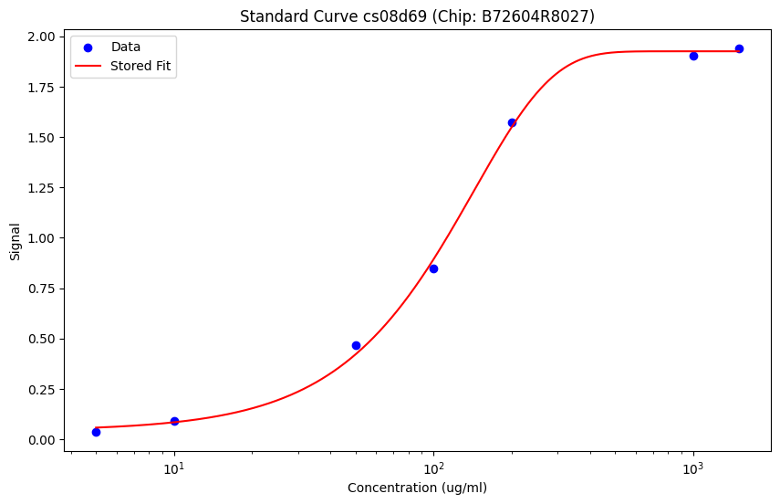
    


    
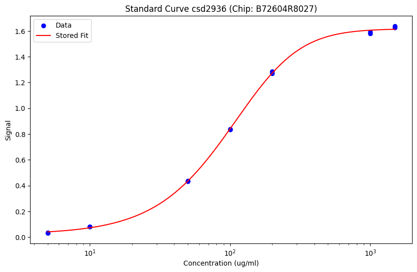
    


    
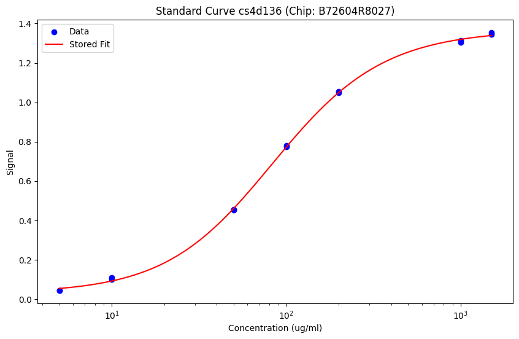
    


    
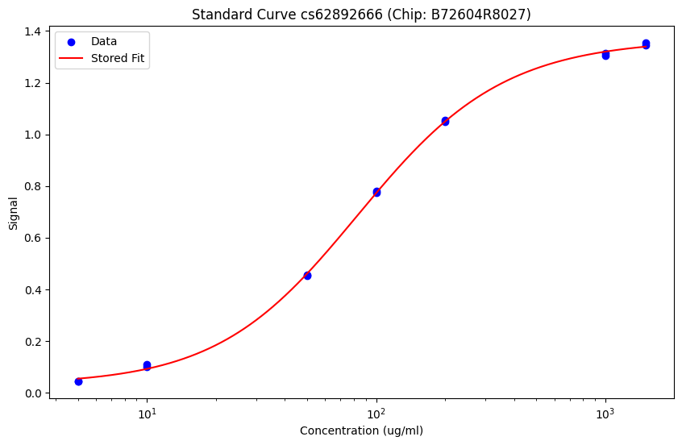
    

